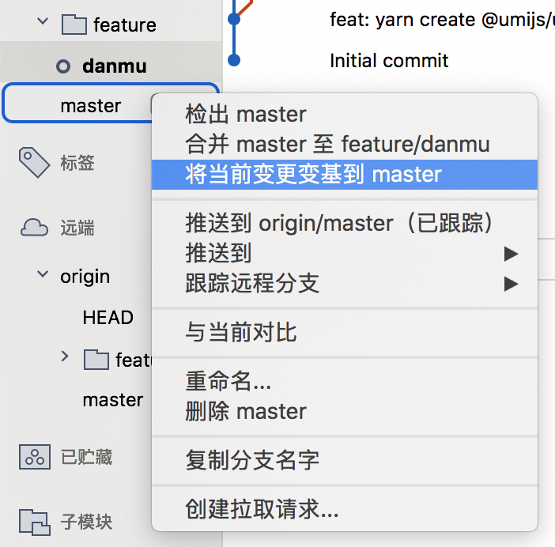

# 其他
> 这里会搜集一些有关项目的零碎笔记

[[toc]]


## [jQuery]源码
 - 首先，是从`闭包` + `立即执行函数`开始的（传入了window对象）
    - 目的：将`$`变量保存在内存中（单例模式）
 - 然后，`重载`很常用
    - 原因：单单为了实例化一个jQuery对象，就有9种不同的方法
 - 最后，`链式调用`实现原理
    - 原因：实现很简单。只需**在实现链式调用的方法的返回结果里，返回this即可**

### vue-cli 3.0的babel
在vue-cli 3.0根目录下，有`babel.config.js`（采用babel7的新配置格式）。
 - 里面预先配置了`preset`，它的值是`['@vue/app']`
 - 也可以配置`plugins`（引用插件来处理代码的转换。和`preset`平级。）

## [Axios] 源码解析
 `Axios`是一个基于`Promise`的http请求库。

 ```js
 function Axios() {
     this.interceptors = {
         request: new InterceptorManager(), // 请求拦截器
         response: new InterceptorManager() // 响应拦截器
     }
 }
 ```
 每个axios实例都有一个`interceptors`实例属性，同时这个`interceptors`对象上有两个属性`request`、`response`，它们都是`InterceptorManager`的实例。
 
 `InterceptorManager`构造函数是用来实现拦截器的，且这个构造函数原型上有3个方法：`use`、`eject`、`forEach`。

 一般我们最常用的是`use`，
  - 对于`request`，我们就在`use`里对`config`进行修改，随后会覆盖掉默认配置
  - 对于`response`，我们就在`use`里对后端返回的数据进行一个预处理再返回

 
## 重构的好处？
 - 实现前后端分离
 - 代码优化
 - 减少后期维护的学习成本


## 两个异步请求，若第二个比第一个先返回，对于第一个的结果如何cancel掉？
栈


## 通讯录搜索（按姓名查询、或按首拼音）
将各个汉字各自存起

## 把svg当做字体


## 如何限定只接收10个http响应？

## 对前后端分离的理解？


**部署方式：前后端分开部署，利用中间件（如Nginx）进行代理转发**

各端职责：
  - 前端
    - 负责控制页面的跳转、异步请求数据
    - 存放css、js等静态资源，并使用CDN加速；

  - 后端
    - 判断/接收请求
    - 组装并返回数据

优势：
  - 提升开发效率
  - 减少后端的负载压力
  - 增强项目代码的可读性和维护性

缺点：
  - 部署顺序（后端先部署）
  - 文档的重要性

## [web]前端项目搭建
 - 安装Node
 - npm init -y
  - 生成`package.json`
 - npm install --save-dev webpack
 - 安装插件（babel-core、loaders、vue...）
 - 进入webpack.config.js进行配置
  ```js
  module.exports = {
    entry: './index.js',
    devServer: {
      port: 8083,
      hot: true
    }
  }
  ```
 - 新建index.js、index.html
 - 进入package.json修改script
 ```json
 {
   start: "webpack-dev-server"
 }
 ```
 以下是结合vue的：
 - 新建src
  - 里面还有assets、pages、index.js、app.vue...
 - 配置webpack.config.js（特别是output、loaders）
 - 在index.html新增
 ```js
 <div id="root"></div>
 ```
 - 在app.vue新增
 ```js
 import vue from 'Vue'
 new Vue({...})
 ```
 - npm start

## [Vue.js]slot-scope


## [PC] keep-alive不能正常销毁
问题：设置了`<keep-alive>`组件的include属性后，keep-alive组件不能正常销毁，且会占用内存。

解决：
 - 1、给所有vue实例增加name实例选项（未解决）
 - 2、查看keep-alive源码：
 ```js
  // created时，创建cache对象
  created () {
    this.cache = Object.create(null)
    this.keys = []
  },

  // destroyed时，遍历cache对象
  destroyed () {
    for (const key in this.cache) {
      // pruneCacheEntry函数：将那些被缓存了的、但当前没有处于被渲染状态的组件都销毁掉
      pruneCacheEntry(this.cache, key, this.keys)
    }
  },
  
  // mounted时，会监听include、exclude这两个字段，然后实时地更新（删除）this.cache对象
  mounted () {
    this.$watch('include', val => {
      pruneCache(this, name => matches(val, name))
    })
    this.$watch('exclude', val => {
      pruneCache(this, name => !matches(val, name))
    })
  }
 ```
 通过断点，发现`destroyed`没有进入。查看该组件，发现是手动重写了this.$destroy方法，使得缓存组件无法正常摧毁。
 ```js
 // 错误示范
created() {
    let query = this.$route.query
    this.searchParams = { ...this.searchParams, ...query }

    window.parent.postMessage('fullscreen', '*')
    // 不要这样重写destroy
    this.$destroy = () => window.parent.postMessage('cancelfullscreen', '*')
}
 ```

 ## [pc]庞大数据的渲染、校验、保存问题
 问题：庞大的数据导致前端的渲染、保存，出现卡顿
 
 ### 解决方法
 #### 后端真分页、后端校验、单条保存
 缺点：HTTP请求增多；交互不友好
  
 #### 前端假分页、前端校验、整体保存
 优点：减少HTTP请求、校验快
 
 #### 利用vue-virtual-scroller
 优点：懒加载
 
 原理：将加载事件绑定在scroll事件上，并记录上次渲染item的startIndex、endIndex，利用一个buffer进行存储。

 目前方案：**前端假分页、前端校验、整体保存**
 
## 将一组下载URL打包成zip
有一组数据，需要将其下载，并打包&另存为到zip中：
```js
const LINKS = ['www.baidu.com/a1.pdf', 'www.baidu.com/a2.pdf']
```

推荐npm包：
```
jszip
jszip-utils
file-saver
```
[使用demo](./SaveAsZip.md)

## [web] SourceMap
因为大部分源码（尤其是各种函数库、框架）都要经过打包、压缩，才能投入生产环境。

好处：
 - 减小体积
 - 减少HTTP请求数

缺点：debug变得困难重重

解决方案：**使用`SourceMap`**

因为`SourceMap`记录着位置信息（即，转换后的代码的每一个位置，所对应的转换前的位置）

> 有了它，出错的时候，debug工具就直接显示 **开发代码** ，而不是转换后的代码，给开发者带来了极大的方便！

## Tree shaking
`Tree shaking`的本质是 **消除无用的JavaScript代码**，消除原理是依赖于ES6的模块特性。

它不支持动态导入（如：CommonJS的`require()`），只支持纯静态的导入（ES6的`import/export`）。

> 因为ES6模块依赖关系是确定的，可以在运行前进行 **可靠的静态分析**。

### ES6 module特点
 - 只能作为模块内的顶层语句出现
 - import的模块名只能是字符串常量


## Nginx
```js
server {
    server_name www.baidu.com;
    listen 80;

    location /api/auth {
        proxy_pass http://10.1.2.3:8800;
    }

    // 定位规则
    location /product.html {
        // 静态资源根目录
        root /home/static/baidu/build;
        // 首页
        index product.html
        // 重定向
        try_files $uri /product.html
    }
}
```

### Nginx实现负载均衡的4种模式
Nginx是一个非常高效的HTTP负载均衡器，它的作用是 **分发请求到各个应用服务器**，从而提高web应用性能。

#### 配置
```
#  首先，你要有两台或以上可以提供相同服务的Web服务器,不然这个负载均衡配置就没有意义！
#  在配置过程中只需要改代理服务器的配置就行，其他服务器不用管。
-    vim /usr/local/nginx/conf/nginx.conf
    #   在http下添加如下代码
        upstream item { # item名字可以自定义
            server 192.168.101.60:81 参数;
            server 192.168.101.77:80 参数;
            # 负载均衡模式(非必选项)
        }
    #   在server 80下添加如下代码
        location /{
            proxy_pass http://item;     # item是在上面命名的
        }
-   配置 'upstream' 的时候,可以把你的代理服务器也加在里面用来做 'web' 服务器, 但是端口就不用在用80了。
-   重启你的nginx组件，现在负载均衡就已经可以用了
```

#### 4种模式
 - 轮询（默认）：请求会随机分发到配置的服务器上
 - 权重分配：通过配置`weight`，权重越高，被分发到的概率也越高
 - 哈希分配：通过声明`ip_hash`，根据客户端IP来分发同一台服务器（可解决session共享）
 - 最少连接分配：通过声明`least_conn`，根据当前连接数最少的服务器进行分发

## keydown、keyup、keypress
`keydown`、`keyup`是捕获了键盘的按键操作

`keypress`反映了具体输入某个字符的值

> 键盘事件只能由`<input>`、`<textarea>`以及任何具有`contentEditable`或`tabindex="-1"`属性的组件触发

### 踩坑：在Windows、中文输入法下，输入全角符号keycode都为229
**现象：** 在Windows的中文输入法下，通过`keydown`监听到的符号输出（即英文字母上面那排数字搭配`Shift`），keycode皆为**229**

**原因：** 自 Firefox 65起,  `keydown` 与 `keyup` 事件会在 IME（输入法编辑器）复合事件 中被触发，目的是为了提升CJKT（中日韩台地区）用户跨浏览器性能。
> [MDN - Element: 键盘按下事件](https://developer.mozilla.org/zh-CN/docs/Web/API/Element/keydown_event)

**解决方案：**
 - 利用`onInput`事件，监听`nativeEvent.data`（该值为输入值）
 - 对要更新的字段进行手动“修饰”

```js
onInput = (ev) => {
    const { nativeEvent, target } = ev;
    const key = nativeEvent.data;

    // 若输入为"@"，弹出选人弹框
    if (key === '@') {
        this.popoverFromKeyBoard = true; // 通过这个字段来“手动修饰”
        this.handleVisibleSelectPerson(true);
    }
}
```

## git rebase
场景：当 `dev分支` 开发过程中，`master`也发生了其他commit。需要把这些同步到到 `dev` 上

操作：
 - 切换到`dev分支`
 - 右键`master` - “将当前变更变基到 master”
 - 逐步变基，解决冲突
 - `dev分支`上即可获得最新的`master`




## Android下line-height文字垂直居中偏移问题
在移动端开发，Android的单行文字无法在容器中完美垂直居中。
> 常见于一些 tag 和 按钮

问题根源：设定同一`font-size`的文字，**在不同字体里的高度是不一样的**。

### 调研
 - 所有内联元素都有两个高度：`content-area`（基于字体度量）、`virtual-area`（有效高度，即line-height）
 - `content-area`在内部渲染时已经发生偏移，而css的居中方案只会控制整个`content-area`的居中
 - `line-height: normal`是基于字体度量计算出来的

### 分析
需要针对`content-area`、`virtual-area`两类高度进行垂直居中。

### 解决方案
针对`content-area`的居中（二选一）：
 - 方案1：`line-height: normal`
 - 方案2：设置`<html lang="zh-cmn-Hans">`、`font-family: sans-sarif`（sans-sarif表示黑体）

针对`virtual-area`的居中（二选一）：
 - 方案1：父容器`position: relative`，子元素`position: absolute; left: 50%; top: 50%; transtorm: translate(-50%, -50%);`
 - 方案2：父容器声明为Flex容器，并`align-items: center`

## iOS：position: fixed滑动不固定
范围： 部分iOS机型（目前发现iOS<=13.6）

在滚动容器内，子元素使用了`position: fixed`，出现滑动不固定

### 解决
 - 法一：在使用了`position: fixed`元素上加上`transform: translateZ(0)`
 - 法二：将`fixed`元素移出 滚动视图 外
 
## 在vue-cli中引入Prettier
[查看](./prettier-vue-cli)
