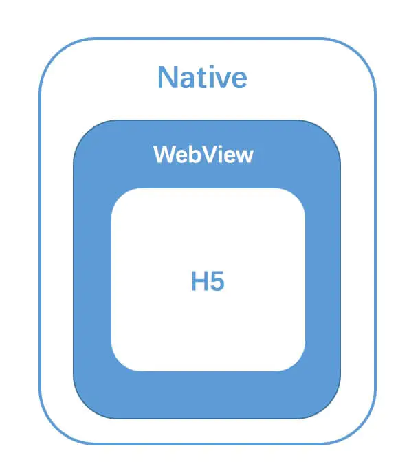

# 小程序

## 整体架构
```js
+--------------+    +---------------+
|     View     |    |  App Service  |
+----^---+-----+    +-----^---------+
     |   |                |   |
data |   | event    event |   | data
     |   |                |   |
+----+---v----------------+---v-----+
|              JSBridge             |
+-----------------------------------+
```
`View`对应视图层，`App Service`对应我们的逻辑层

`View`和`App Service`分别跑在两个线程中，通过 `JSBridge` 进行 **数据和事件** 的通信

## 生命周期
  - beforeCreate
  - created
    - 所有页面created会在项目加载的时候一起被调用，进入页面不会被调用，一般用onLoad代替
--------
  - onLoad，页面加载
  - onShow，页面显示
  - onReady，页面初次渲染完成
  - onHide，页面隐藏
  - onUnload，页面卸载
--------
  - beforeMount
  - mounted
    - 从B返回到A，A的mounted不会被触发，因为页面没有被重新加载，一般用onShow代替
  - beforeDestroy
  - destroyed

## 跳转区别
 `navigateTo`，跳转到指定页，**并将原页面加入堆栈，可回退**

 `redirectTo`，直接重定向到指定页，**不能回退到原页面**
 
 `switchTab`，只能用于跳转到tab页面，并关闭其他非tab bar页

### fly.js
因为小程序是在 **JSCore环境下** 执行，在这个环境下并没有`window`，也没有`XMLHttpRequest对象`。

而 `fly.js` 可以在底层切换不同的 **Http Engine** 来实现多环境支持。


## 登录过程
  - 微信
    - 小程序端调用`wx.login()`获取`code`
    - 带着`code`，传递给开发者后端
    - 开发者后端带着`code + appid + appsecret`跟微信后端换取`session_key + openid`
    - 开发者后端将`自定义登录态`与`session_key + openid`关联，并响应给小程序`登录态`
      - 并将session_key和openid存到redis里，过期后会重新请求
    - 小程序把`登录态`写入Storage，等到下次有需要登录权限时，从Storage获取
    - 开发者后端通过`自定义登录态`去查询`session_key + openid`，返回业务数据

  - 支付宝
    - 小程序端调用`getAuthCode`，向支付宝App获取`auth_code`
    - 小程序端携带`auth_code`给开发者后端，发起登录验证请求
    - 开发者后端通过`auth_code`与支付宝授权平台获取`token`和`uid`
    - 开发者将`token`和`uid`种到session里，并响应给小程序端验证成功
    - 在session有效期内，不需重复授权

## 开发遇到的问题

### HTML
 - `<text>`组件能识别`\n`
 - 调用子组件时，短横线、驼峰都失效
    - 解决方法：大写字母开头 + 下划线(`<Detail_date>`)

### CSS
 - transform的rotate是-180到180
 - background-image不支持本地资源，只支持线上图片（或base64）

### 资源
 - 微信会缓存静态资源，如何修改图片
    - 解决方法：改资源url地址

## JSBridge
首先，JavaScript是运行在一个单独的JS Context（例如：WebView的webkit引擎、JSCore）

JSBridge主要是给 JavaScript 提供调用 Native 功能的接口，让混合开发中的“前端部分”可以方便地使用地理位置、摄像头、支付等Native功能。

通过JSBridge，Web可以和Native进行交互。

核心是构建 Native 和 非Native之间的消息通信通道，而且是双向通信通道。
> 双向通信指的是：
> 
> JS 向 Native 通信：调用功能、通知 Native 当前JS的相关状态
>
> Native 向 JS 通信：消息推送、通知 JS 当前 Native的相关状态


## WebView
移动操作系统都包含可运行JavaScript的容器，例如WebView、JSCore

## Hybrid
Hybrid App指的是混合模式移动应用（混合了 Native技术 与 Web技术 来开发移动应用）

> 简单来说，APP里内置了Web网页

### 三种混合方案
 - 基于WebView UI
 - 基于Native UI
 - 小程序

