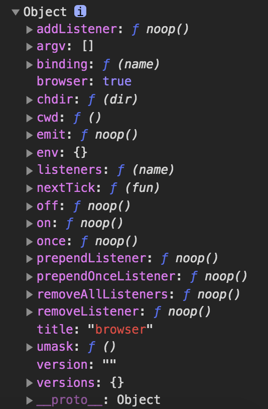

## webpack使用笔记
[[toc]]

### 使用
不同环境下全局安装的webpack版本可能不符合这个项目，所以还是用局部依赖（或npx webpack）。
```
./node_modules/.bin/webpack `input.js` `output.js`
```

### path.resolve(__dirname, './src)和path.join()
有两个知识点:
 - path.resolve()
 - __dirname

#### path.resolve()
> 作用：将路径片段解析成绝对路径；


参数：`String`（逗号分割）

返回值：`String`（绝对路径）

使用说明：
 - **从右向左**解析，`一旦遇到绝对路径，就不继续`
    - path.resolve('/foo', '/bar', 'baz') => '/bar/baz'

#### __dirname
> 指的是当前文件所在目录的路径


如图，`__dirname`的值为`C:\Users\GaoKai\Desktop\test`

以上两个可以解决`“虽然各个文件所在目录不同，但可以访问某个指定目录下的文件更方便”`（可以不使用`../../`），如下例子：
```js
// 修改前：
import foo from '../../../util/foo'
```
```js
// 修改后：
import foo from 'util/foo'

// webpack.config.js
resolve: {
    extensions: ['.js', 'vue'],
    alias: {
        // 快捷访问入口
        'util': path.resolve(__dirname, './src/util')
    }
}
```

#### path.join()
参数：`String`（逗号分割）

返回值：`String`

使用说明:
 - **从左到右**解析，将`所有路径片段都`拼接起来
 - 每个片段之间用`/`链接（片段之间最多只能存在1个`/`）
 ```js
 path.join('a', 'b', 'c') => 'a/b/c'
 path.join('a', 'b', '/c') => 'a/b/c'

 path.join('/a', 'b', '/c') => '/a/b/c'
 path.join('/a', '/b', '/c') => '/a/b/c'
 ```

### process.env.NODE_ENV
在node环境，全局变量`process`表示**当前node进程**。其中`process.env`表示**当前系统环境的信息。**
> 实际上，process.env里并不存在NODE_ENV这个变量，是用户自定义的。

在node环境下，`console.log(process)`会得到：


在浏览器环境下，`console.log(process)`会得到：



#### 设置node环境下的process.env.NODE_ENV
通过**cross-env**来配置环境变量（支持跨平台）
```json
"scripts": {
    "start": "cross-env NODE_ENV=development webpack-dev-server --open --config config/webpack.config.dev.js",
    "build": "cross-env NODE_ENV=production webpack --config config/webpack.config.prod.js"
}
```
这样，在node环境下，`process.env.NODE_ENV`就有值了。

#### 设置浏览器环境下的process.env.NODE_ENV
平时我们会**在项目的运行过程中**去判断当前环境，比如在`@/axios/config.js`里配置了环境变量：
```js
export const isDev = process.env.NODE_ENV === 'development'
```
这里的`process.env.NODE_ENV`指的是**浏览器环境下的环境变量**。
> 和node环境一样，默认是没有NODE_ENV这个变量的。

通过**DefinePlugin**来配置环境变量
```js
// webpack.base.js
module.exports = {
    plugins: [
        new webpack.DefinePlugin({ 'process.env.NODE_ENV': JSON.stringify(process.env.NODE_ENV) })
    ]
}
```
这样，在浏览器环境下，`process.env.NODE_ENV`就有值了。

#### webpack的配置模式mode
```js
// webpack.config.dev.js
module.exports = {
    mode: 'development' // 或'production'
}
```
根据官网描述，配置`mode`值会**自动开启某些优化配置**（笔者并未达到**DefinePlugin**效果）


### webpack中运用externals
一些类似包体积比较大的包（如：lodash），可以通过CDN的形式在`index.html`引入后，再通过`webpack.config.js`里加一个`externals`配置。

```html
<!-- index.html -->
<script src="https://cdn.jsdelivr.net/npm/lodash@4.17.15/lodash.min.js"></script>
```

```js
// webpack.config.js
module.exports = {
    externals: {
        lodash: '_'
    }
}
```
### “对象里的条件属性”的写法
```js
const plugin = new HtmlWebpackPlugin({
    template: paths.appHtml,
    ...(env.isProduction
        ? {
                minify: {
                    removeComments: true,
                    collapseWhitespace: true,
                    removeRedundantAttributes: true,
                    useShortDoctype: true,
                    removeEmptyAttributes: true,
                    removeStyleLinkTypeAttributes: true,
                    keepClosingSlash: true,
                    minifyJS: true,
                    minifyCSS: true,
                    minifyURLs: true
                }
            }
        : {})
})
```


 ### 区分环境变量（待补充）
 ```js
 new webpack.DefinePlugin({
     NODE_ENV: JSON.stringify(process.env.NODE_ENV)
 })
 ```


### IE8不能使用webpack？
 - IE8不怎么兼容ES5
 - 不支持__proto__
 - 不支持default关键字
 


## webpack插件：style-loader和mini-css-extract-plugin的区别？
### 起因
在mrc上开发组件时，编写Demo发现：在js里import的样式没有生效。
> 组件脚手架：[reactcomponent-templatetool](https://g.hz.netease.com/NeteaseMusicUI/reactcomponent-templatetool)、[webpack.config.js](https://g.hz.netease.com/NeteaseMusicUI/reactcomponent-templatetool/-/blob/master/template/demo/webpack.config.js)

```js
<!-/demo/app.js-->
import 'antd-mobile/dist/antd-mobile.css'; // 无效
import './index.less'; // 无效
```

### 配置
webpack.config.js
```js
const config = {
    module: {
        rules: [
            {
                test: /\.(less|css)$/,
                use: [
                    // 原始配置：无其它配置
                    // 现象：样式引入不正常
                    MiniCssPlugin.loader,
                    
                    // 改进配置：引入style-loader，移除mini-css-extract-plugin
                    // 现象：样式正常
                    {
                        loader: 'style-loader'
                    }
                    
                    // 疑问配置：
                    // 现象：样式引入不正常
                    // {
                    //     loader: 'style-loader'
                    // },
                    // MiniCssPlugin.loader,

                    {
                        loader: 'css-loader'
                    },
                    {
                        loader: 'postcss-loader'
                    },
                    {
                        loader: 'less-loader'
                    }
                ]
            }
        ]
    }
}
```
通过调研发现：脚手架目前的配置仅仅是将`.css`抽离，并最终未插入到页面中，导致样式未生效。

##### 深入调研
**style-loader**、**mini-css-extract-plugin**都可用于处理“在`.js`中import导入的样式文件”。

不同点：

**style-loader**：
 - 打包机制：打包到“声明'import样式文件'的同一个`.js`文件”中。
 - 调用时机：页面运行js时，样式会自动插入到`<style>`


总结：需运行`.js`时才插入样式，无法抽离/压缩css代码

**mini-css-extract-plugin**
 - 打包机制：将同一个`.js`里所有`通过import导入的样式文件`都打包到同一个`.css`文件
   > 这里css的文件名可通过`plugins`下实例插件时，传入配置项`filename`进行定义。
 - 调用时机：需结合`html-webpack-plugin`使用，最后会以`<link>`形式将样式插入到页面。
 


总结：
 - 可以将`样式`从`.js`中抽离，也可结合`optimization.splitChunks.cacheGroups`压缩css，并合并到一个`.css`上；
 - 插入样式到页面。需结合`html-webpack-plugin`
 - 开启HMR。需对loader进行配置`hrm: true`

```js
const HtmlWebpackPlugin = require('html-webpack-plugin');

new HtmlWebpackPlugin({
    template: path.join(__dirname, '../demo/index.html'),
    filename: 'index.html',
    chunks: ['test'] // <-- 打包文件名
}),
```

