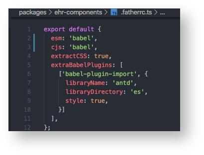

# 基于Antd的业务组件库
> 主要技术：react(16.9.0) + antd(3.23.3) + dumi(1.0.8) + lerna(3.20.2)
>
<!-- > 项目地址：https://github.com/netease-frontend-institute/ehr -->

[[toc]]

## 关于开发流程
当新增一个组件：

 - 在 src 下新建组件文件夹，和往常一样开发组件
 - 在 src/index.ts 将组件输出
 - 找到 docs/components 下，撰写组件相关文档即可
    > 在撰写文档DEMO时，可直接以用户的身份，直接从我们的库（@netease-ehr/ui） 引入组件。
    > 
    > 这是因为在 dumi内置机制、搭配 tsconfig.json 的 alias 、 作了特殊处理。dumi的alias处理

## 关于发布流程
### 项目打包
 - 进入组件库项目
 - 执行 npm login，登录 npm 账号。若已登录可跳过
 - 提升 package.json 的 version
 - 执行 yarn build
 - 最后执行 npm publish

### 文档打包
 - 执行 yarn run docs:build
 - 最后执行 yarn run docs:deploy
> 注意：
> 
> 1、文档打包 应该在 项目打包 之后进行，因为它们共用同一个dist文件
> 
> 2、对于组合指令（yarn run release、yarn run deploy）无法实现，可后续调研是什么原因

## 注意事项
### 1、组件中antd样式丢失问题
#### 问题：之前出现过 组件库发布到npm上，被其他项目引用时，组件里用到的Antd样式丢失问题

原因：原先采用的是 rollup 打包，采用的是 umd 形式，css会与js分离，导致不会css不会被打包进。

解决：现采用 babel方式 进行打包，且搭配 babel-plugin-import 对 antd 样式进行按需加载

### 2、文档部署到 github.io 后，页面资源问题
#### 问题一：刷新页面导致404
原因：猜测 dumi 内置使用的是browser history，导致页面刷新后真实地去向服务器查找资源，导致的404

解决：在 .umirc.ts 配置 exportStatic 字段。作用是将所有路由输出为 HTML 目录结构

### 问题二：路由根路径不正确
原因：我们组件库的 github.io 地址是https://netease-frontend-institute.github.io/ehr/，所以对于组件库内部路由的 baseUrl 实际上是 /ehr/

解决：在 .umirc.ts 配置 base、publicPath 这两个字段，分别定义路由、静态资源的根路径。
