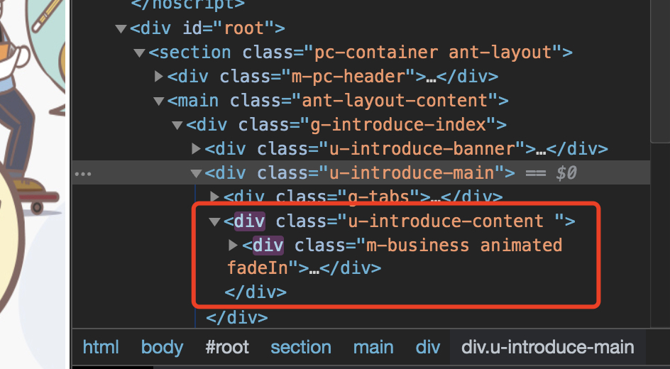

# React-Router自动化渲染

[[toc]]

笔者在使用[react-router](https://github.com/ReactTraining/react-router)时，发现：要实现在指定页面去渲染其下子路由渲染时，需要在父路由页面指定`<Switch>`以及渲染的组件（或定义路由表要跟随业务）；若使用动态导入，还需多次将类似`react-loadable`处理动态导入的包引入到业务（或跟随业务的路由表）中，这样会导致可维护性不高。

所以封装了一套 **自动化渲染Routes的逻辑**。
> 大致实现原理：递归查找 + 路由表统一配置。

## 使用方法
### 路由封装的工具方法
```js
/**
 * 路由自动化配置（支持响应式）
 * @desc 路由自动化配置的使用方法：
 *         1、在路由表（src/router/index.ts）中配好相应的父子路由关系
 *         2、在需要使用渲染出口的父组件中使用<Routes {...props} />。（注：顶层出口需注明origin={true}）
 *
 * 一个内部方法：
 * @function _init 处理路由表中的component
 *
 * 三个暴露方法：
 * @function getRouteInfo 根据props，查找指定路由及其父路由信息；
 * @function getRouteLine 根据path，查找当前路由在路由表中的层级关系；
 * @function Routes 渲染出口生成
 *
 * @author heshiyu
 * @date 2019-11-25
 * @update 2020-06-09
 */

import React from 'react';
import { Route, Switch, Redirect } from 'react-router-dom';
import Loadable from 'react-loadable';
import ULoading from '@/components/common/u-loading';
import allRoutes from '@/router';
import { IS_MOBILE } from '@/constants/common.js';

export const getRouteInfo = props => {
    // matchPath：当前处理的路由所对应的path（会随渲染层级改变而改变）
    // path：当前浏览器URL地址
    const [matchPath, path] = [props.match.path || '', props.location.pathname];
    const inMatchPath = matchPath === path; // 表示当前URL位于props.match.path（考虑重定向使用）
    let targetParent = { sub: [] },
        target = {};

    const _find = routes => {
        for (let i = 0; i < routes.length; i++) {
            if (routes[i].link === matchPath) {
                targetParent = { ...routes[i] };
                target = inMatchPath ? targetParent : (targetParent.sub || []).find(route => route.link === path);
                break;
            }
            // 若当前层不匹配，且当前路由还有下级路由，往下查找
            else if ((routes[i].sub || []).length) {
                _find(routes[i].sub);
            }
        }
    };

    _find(allRoutes);

    return { target, targetParent };
};

export const getRouteLine = path => {
    let navList = [];

    const _get = list => {
        list.forEach(item => {
            if (path.includes(item.link)) {
                navList.push(item);
                (item.sub || []).length && _get(item.sub || []);
            }
        });
    };

    _get(allRoutes);
    return navList;
};

export const Routes = props => {
    const _buildRoutes = () => {
        let routes = [], // 即将要渲染的路由表
            currentRoute, // 当前路由
            hasRedirect, // 当前路由是否带重定向
            fromApp = props.origin; // 是否为顶层App.js渲染

        // 类型1：未指定渲染的路由（用于顶层路由App.js渲染子路由）
        if (fromApp) {
            // 获取整张路由表
            routes = allRoutes;
        }
        // 类型2：已指定渲染的路由（用于组件内渲染子路由）
        else {
            let { targetParent, target } = getRouteInfo(props);

            currentRoute = target; // 取当前路由，用作生成Redirect
            hasRedirect = (currentRoute || {}).redirect;
            routes = targetParent.sub;
        }
        return [routes, currentRoute, hasRedirect];
    };

    // 渲染组件
    const _renderComponent = ({ link, redirect, component: Component }, routeProps) => {
        let responsiveView = typeof Component !== 'function'; // 该路径是否为响应式视图
        // 若为响应式视图，则进而判断pc/mobile对应视图是否为懒加载
        if (responsiveView) {
            Component = IS_MOBILE ? Component.mobile : Component.pc;
        }

        let { origin, ...propsFromParent } = props;
        // propsFromParent包括：上一级的所有props（除了origin）
        // routeProps包括当前路由的：match、location、history
        // 所以，每个组件中的props都会包含两部分：1、来自父亲的props；2、当前的路由信息
        return <Component {...propsFromParent} {...routeProps} />;
    };

    // 渲染路由（不设exact，约定父路由路径为子路由的前缀）
    const _renderRoute = r => <Route key={r.link} path={r.link} render={routeProps => _renderComponent(r, routeProps)} />;

    let [routes, currentRoute, hasRedirect] = _buildRoutes();
    let myRoutes = <Switch>{routes.map(r => _renderRoute(r))}</Switch>;
    let myRedirect = hasRedirect && <Route exact path={currentRoute.link} render={() => <Redirect to={currentRoute.redirect} push />} />;

    return (
        <Switch>
            {myRedirect}
            {myRoutes}
        </Switch>
    );
};

const _init = routes => {
    const load = loader =>
        Loadable({
            name: '',
            loader: loader,
            loading: ULoading
        });

    // 若组件为() => import()格式导入，则其.name为'component'、'pc'、'mobile'其一
    const isDynamic = component => ['component', 'pc', 'mobile'].includes(component.name);

    for (let i = 0; i < routes.length; i++) {
        // 当前路由组件为动态导入
        if (isDynamic(routes[i].component)) {
            routes[i].component = load(routes[i].component);
        }
        // 当前路由是响应式视图
        else if (!!routes[i].component.pc && !!routes[i].component.mobile) {
            isDynamic(routes[i].component.pc) && (routes[i].component.pc = load(routes[i].component.pc));
            isDynamic(routes[i].component.mobile) && (routes[i].component.mobile = load(routes[i].component.mobile));
        }

        // 存在子路由
        const hasChild = (routes[i].sub || []).length;
        hasChild && _init(routes[i].sub);
    }
};

_init(allRoutes);

export default Routes;
```

### 路由表配置
```js
/**
 * component参数说明：
 * 写法1、React Element；（非懒加载，不推荐）
 * 写法2、Function: () => import(path/to/component)；（懒加载）
 * 写法3、Object: { pc, mobile }；（支持多端页面展示，其中pc/mobile也遵循懒加载规则，参考写法1/2）
 *
 * 注意：以下一级路由的"link"值必须与"menus.js"中的"key"对应（用作PC端顶部Nav的状态记录）
 */

import Home from('@/view/pc/home');

const routes = [
    {
        link: '/app/index',
        title: '首页',
        component: Home // 静态导入
    },
    {
        link: '/app/intro',
        title: '介绍',
        redirect: '/app/intro/company',
        component: () => import('@/view/intro'), // 动态导入
        sub: [
            {
                link: '/app/intro/company',
                title: '公司介绍',
                // 响应式导入
                component: {
                    pc: () => import('@/view/pc/intro/company'),
                    mobile: () => import('@/view/mobile/intro/company')
                }
            },
            {
                link: '/app/intro/bu',
                title: '业务介绍',
                component: {
                    pc: () => import('@/view/pc/intro/bu'),
                    mobile: () => import('@/view/mobile/intro/bu')
                }
            }
        ]
    }
];

export default routes;
```

### 业务层引入
#### 顶级入口
```js
// App.js
{/* 需声明origin */}
<Routes origin />
```

#### 普通父路由
```jsx
import React from 'react';
import Routes from '@/router/tools'; // 从tools里引入Routes

const Index = props => {
    return (
        <div className="container m-personal-page">
            {/* 需传入props */}
            <Routes {...props} />
        </div>
    );
};

export default Index;
```

## 问题发现
### 1、切换路由时，App会渲染多次
普通的`react-router`不会导致App重新渲染，[查看DEMO](https://codesandbox.io/s/sweet-bose-3i9le?file=/src/App.js:295-302)

该工具类会导致App重复渲染。怀疑原因是由于**动态生成`<Switch>`组导致**的，是无法避免的。但好在React的Diff算法可以减轻一些损耗，只更新要更新的地方

### 2、为何不用React.lazy
起初是使用`React.lazy`，但`lazy`搭配`suspense`来处理自动化生成的路由，会将整个`<Switch>`组都卸载掉：

假设切换较深层级的子路由时，渲染的范围不一样：
 - 使用`lazy`：


 - 使用`react-loadable`：

