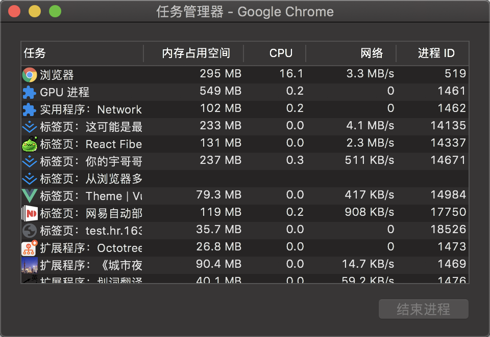

# 单处理器进程的调度策略

## 先来先服务（First-Come-First-Served，FCFS）
**选择等待处理器时间最长的进程。**
 > 换句话就是谁先来，就执行谁。如果中间某些进程因为I/O阻塞，这些进程会挂起并移到就绪队列。

### 缺点
 - 对`短进程`不利
 - 对`I/O密集型的进程`不利


## 轮转
**使用时间片来限制“任何正在执行的进程”只能使用一段处理器时间，并在所有就绪进程中轮转。（是一种基于时钟的抢占策略）**
> 以一个周期性间隔来产生时钟中断，当中断发生时，“当前正在运行的进程”会被挂起并置于就绪队列中，然后基于FCFS策略选择下一个就绪的作业进行。
>
> 这种技术也称为时间片（time slicing），因为每个进程在被抢占前都被给定一片时间。

### 难点
难点是**时间片的长度**，因为时间片最好**略大于**`一次典型的交互所需要的时间`（否则大多数进程都需要2个时间片）

### 优点
 - 减少了在FCFS策略下对短进程的不利情况


## 最短进程优先（Shortest Process Next，SPN）
**选择预期处理时间最短的进程，并且不抢占该进程。（是一种非抢占的策略）**
> 其原则是下一次选择预计处理时间最短的进程。因此短进程将会越过长进程，跳到队列头

### 难点
难点是**需要估计每个进程所需要的处理时间**

### 优点
 - 减少FCFS固有的对长进程的偏向

### 缺点
 - 如果持续不断地提供更短的进程，长进程就有可能饥饿
 - 由于缺少抢占机制，一旦长进程得到CPU，得等它执行完，可能导致后面的进程得不到响应

## 最短剩余时间（Shortest Remaining Time，SRT）
**选择预期的剩余处理时间最短的进程。当另一个进程就绪时，这个进程可能会被抢占。**
> 针对**SPN**增加了抢占机制，通过比较**刚添加的新进程**和**正在执行的老进程**的`剩余时间`，如果新进程剩余时间更短，新进程就会抢占老进程的执行权。

### 优点
 - 不像FCFS那样偏向长进程（SRT下，相对于正在执行的长进程，短进程可以立即被选择执行）
 - 不像轮转那样会产生额外的中断

### 缺点
 - 要记录进程的历史执行时间（即服务时间），从而增加了开销
 - **长进程饥饿的问题还是没有解决**

## 最高响应比优先（HRRN）
**调度策略基于对归一化周转时间的估计。**
> 为了**解决长进程饥饿问题**，同时提高进程的响应速率，HRRN策略会选择**响应比最高**的进程优先执行。

```
响应比 = （等待处理器时间 + 预计执行时间） / 预计执行时间
```

 - 对于短进程来说，因为`预计执行时间`很短，分母小，所以响应比比较高，会被优先执行
 - 对于长进程来说，因为`预计执行时间`较长，一开始响应比小，但随着等待时间增加，它的优先级会越来越高，最终可以被执行

 ## 反馈法
 **建立一组调度队列，基于每个进程的执行历史和其他一些准则，把它们分配到各个队列中（通过轮转（基于时间片抢占） + 动态优先级机制）**
 > 因为如果没有关于各个进程相对长度的任何信息，则SPN、SRT和HRRN都不能使用。如果不能获得剩余的执行时间，那就关注已经执行了的时间
 >
 > 这种策略下：每个进程一开始都有相同的优先级，每次被抢占（需要配合其他抢占策略使用，如轮转），优先级就会降低一级（因为执行太长，要“受惩罚”）。因此这种策略通常会根据优先级划分多个队列。

 ### 缺点
  - 仍然可能导致长进程饥饿（有一种补救方法是当一个进程在它的当前队列中等待处理器时间超过一定的阈值后，把它提升到一个优先级较高的队列中）

## 总结
没有一种调度策略是万能的，它需要考虑很多因素：
 - 响应速率。进程等待处理器的时间
 - 公平性。兼顾短进程、长进程、I/O进程

这两者在某些情况下是对立的，提高了响应速率，可能会降低公平性，导致饥饿。短进程、长进程、I/O进程之间要取得平衡也非常难。

**调度算法的选择**取决于：`预期的性能`和`实现的复杂度`。

## 浏览器里的“单处理器调度”
我们可以**把浏览器中JavaScript执行环境（即Renderer进程）当作是一台单处理器**。

打开Chrome-任务管理器，可以发现：


1、浏览器是**多进程**的，且其下各个进程的职责如下：
```
主进程（Browser进程）：
    - 浏览器的界面交互（前进、后退等）
    - 负责各个页面的管理（创建、销毁其它进程）
    - 将Renderer进程得到的内存中的Bitmap，绘制到界面上
    - 静态资源下载

浏览器内核（Renderer进程）：
    - JS引擎线程：JS解析和执行；维护微任务
    - GUI渲染线程：布局/绘制
    - 事件触发线程：事件处理；维护宏任务

GPU进程：最多一个，用于3D绘制等

第三方插件进程：每种类型的谷歌浏览器插件对应一个进程，仅当使用了该插件时才创建
```
> "Browser进程"和"Renderer进程"之间可以通过 `RendererHost接口` 取得联系。

2、JS引擎是**单线程运行**（在Renderer进程下）；

3、JS引擎线程、GUI渲染线程**互斥**；

4、如果**JS引擎中的某个任务**长期霸占CPU，浏览器会出现卡死状态。


## 参考链接
 - [这可能是最通俗的 React Fiber(时间分片) 打开方式](https://juejin.im/post/5dadc6045188255a270a0f85#heading-0)
 - 《操作系统——精髓与设计原理（第七版）》
 