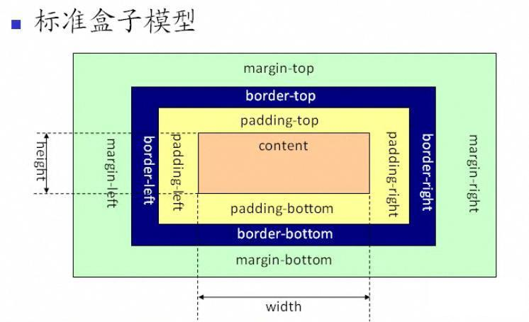
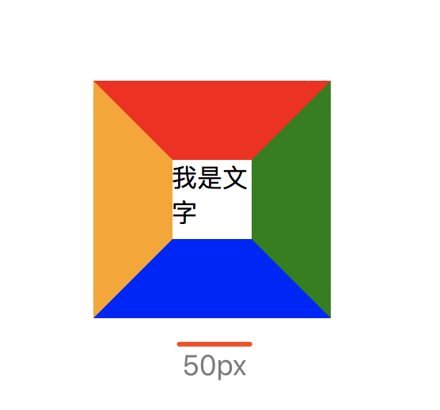
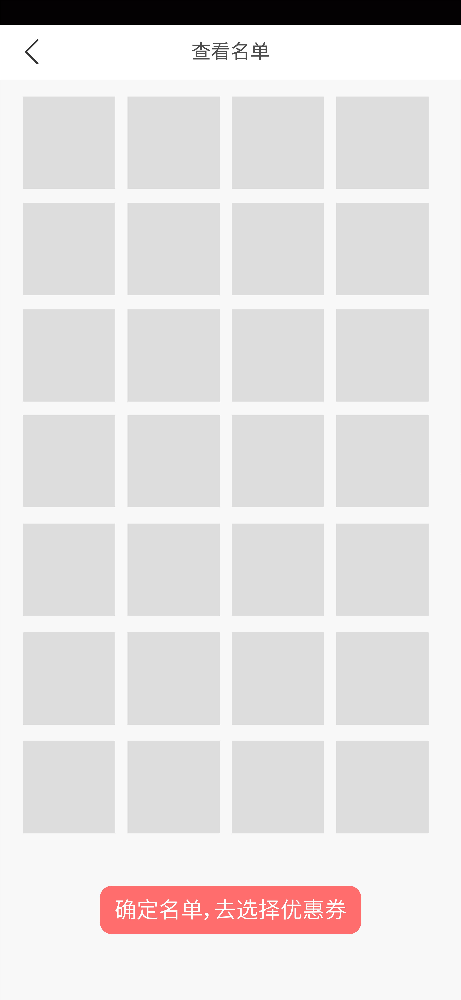

# 其他
> 这里会搜集一些有关CSS的零碎知识

[[toc]]

## 重排（reflow）和重绘（repain）
**重排**：页面布局、几何属性发生改变；

**重绘**：由于元素的样式发生改变（或者由于重排）。

关系：**重排必定导致重绘，但重绘不一定导致重排。**

## CSS3的新属性
CSS3样式提纲：
 - 圆角（border-radius）、阴影（box-shadow）、滤镜（filter）、文字省略（text-overflow）、渐变（gradient）、
 - 动画（animation）
 - 过渡（transition）、变换（transform）
 - 新增盒模型——弹性盒模型（Flexbox）
 - 新增box-sizing：content-box（即标准盒模型）、border-box（即IE盒模型）

## 盒模型
### 标准盒模型
width、height、padding、border、margin 五个独立，所设及所得。



> 让浏览器只支持标准盒模型：`box-sizing: content-box`

### IE盒模型
width（height）包括了padding、border，（`margin依旧独立`），故**实际width可能会小一些**


> 让浏览器只支持IE盒模型：`box-sizing: border-box`

### 弹性盒模型

[查看详细](./../flex-box)

## 完美居中的方案
### 行内元素
 - 水平居中：
```css
/* A1 */
.parent {
    text-align: center;
}
```
 - 垂直居中：
```css
/* B1 */
.parent {
    height: 100px;
    line-height: 100px;
}

/* B2 */
.parent {
    display: table-cell;
    vertical-align: middle;
}
```
 - 水平垂直居中：
 ```css
 /* 不兼容flexbox */
    /* `A1` 与 `B1/B2`混合搭配  */
 
 /* 兼容flexbox */
    .parent {
        display: flex;
        justify-content: center;
        align-items: center;
    }
 ```

### 块级元素
 - 水平居中：
 ```css
 /* C1 */
 .child {
     margin: 0 auto;
 }
 /* C2 */
 .child {
     position: relative;
     margin: auto;
     left: 0;
     right: 0;
 }
 /* C3 */
 .parent {
     display: flex;
     justify-content: center;
 }
 ```
 - 垂直居中：
 ```css
 /* D1 */
 .parent {
     display: table-cell;
     vertical-align: middle;
 }
 ```
 - 水平垂直居中：
 ```css
 /* 不兼容flexbox */
    /* `C1/C2/C3` 与 `D1`混合搭配  */
 
 /* 兼容flexbox */
    .parent {
        display: flex;
        justify-content: center;
        align-items: center;
    }
 ```


## 粘性定位（Sticky）
 `Sticky`是position的粘性属性。它是在`static`和`fixed`中切换，具体看是否要移出`viewPort`。
 ```css
 div.sticky {
     position: sticky;
     top: 10px;
 }
 ```
 也就是说：当滚动时，这个元素有移出的倾向，则切换为`fixed`（通过**阈值**来进行一些buff的作用）
 - 阈值是：`top`、`bottom`、`left`、`right`，必须设置四者之一
 - 若设定了阈值为`top: 10px`，则表示：当距离`viewPort的顶部`提前到`10px`的位置就切换`fixed`

> 注：该元素遵循`标准文档流`，**仍然保留**元素原本在文档流中的位置

## Css-Hack
`Css Hack`指的是：**当不同浏览器对某些css属性做解析，并出现差异的时候，去弥补这些差异的过程。**

大致分为**3种**：
 - 条件hack
 ```html
 <!--[if le IE 8]>
 <style>
    .test2 {
        width: 100px;
    }
 </style>
 <![endif]--

 /* 上面是表示当浏览器是小于ie8以下的 */
 ```
 - 选择器hack
 ```css
 * html .test {
     color: red; /* For IE6 and earlier */
 }
 * + html .test {
     color: yellow; /* For IE7 */
 }
 .test:lang(zh-cn) {
     color: white; /* For IE8+ and not IE */
 }
 .test:nth-child(1) {
     color: black; /* For IE9+ and not IE */
 }
 ```
 - 属性值hack
 ```css
 #test {
     color: #c30; /* For Firefox */
     color: red\0; /* For Opera */
     color: yellow\9; /* For IE8 */
     *color: blut; /* For IE7 */
     _color: #ccc; /* For IE6 */
 }
 ```

## 设置元素不可见的方法
```css
/* 1 */
.child {
   display: none;
}

/* 2 */
.child {
   position: absolute;
   top: -999999px;
}

/* 3 */
.child {
   visibility: hidden;
}

/* 4 */
.child {
   opacity: 0;
}
```

## display: none与visibility: hidden的区别

| 区别 | `display: none` | `visibility: hidden` |
| ----- |:---:|:---:|
| 占据空间 | 不占据 | 占据 |
| 重排、重绘 | 重排又重绘 | 仅重绘 |
| 子孙元素 | 都不可见 | 可设置部分可见<br>（`visibility: visible`） |
| transition效果 | 影响 | 不影响 |


## z-index和position的关系
`z-index`用于设置元素的堆叠顺序，堆叠顺序大 会处于 堆叠顺序小 的前面

> 它只在`position`为`absolute`、`relative`或`fixed`的元素上有效

## 纯CSS画三角形
 原理：
  - 1、看清`border`的四条边界
  ```css
  .child {
    width: 50px;
    height: 50px;
    border-top: 50px solid red;
    border-right: 50px solid green;
    border-bottom: 50px solid blue;
    border-left: 50px solid orange;
  }
  ```
 

  - 2、去除中间内容
  ```css
  .child {
    width: 0;
    height: 0;
    border-top: 50px solid red;
    border-right: 50px solid green;
    border-bottom: 50px solid blue;
    border-left: 50px solid orange;
  }
  ```
 

  - 3、再去除一部分（例如：将左边颜色设置`transparent`）
  ```css
  .child {
    width: 0;
    height: 0;
    border-top: 50px solid red;
    border-right: 50px solid green;
    border-bottom: 50px solid blue;
    border-left: 50px solid transparent;
  }
  ```
 

  - 4、可以利用这个特性，画出`三角形`、`直角三角形`、`梯形`等等
 ```css
 .child {
    width: 0;
    height: 0;
    /* border-top: 50px solid red; */
    border-right: 50px solid transparent;
    border-left: 50px solid transparent; /* 去掉这行，是个直角三角形（直角边为左下角） */
    border-bottom: 50px solid blue;
 }
 ```
 

## 【布局题】利用margin/padding实现宽高自适应
如图：实现一个**宽度、高度、间隙**随屏幕大小**自适应**的布局：

 

```html
<div id="app">
    <div class="top-wrapper">
        <div class="user-wrapper" v-for="item in arr" :key="item.id"></div>
    </div>
    <div class="bottom-wrapper">
        <div class="btn">底部按钮</div>
    </div>
</div>
```
```scss
.top-wrapper {
    display: flex;
    flex-wrap: wrap;
    justify-content: space-between;
    padding: 10px;

    .user-wrapper {
        display: inline-block;
        width: 23%; // 相对于父容器（即top-wrapper）宽度
        margin-top: 2.67%; // 相对于父容器（即top-wrapper）宽度
        background: green;
        overflow: hidden; // 触发BFC条件，撑开该容器

        &::after{
            content: '';
            display: block;
            margin-top: 100%; // 相对父容器（即user-wrapper）宽度
        }

        &:nth-child(1),
        &:nth-child(2),
        &:nth-child(3),
        &:nth-child(4) {
            margin-top: 0;
        }

        .user-text {
            position: absolute; // 文字需额外放到一个脱离标准流的容器中
        }
    }
}
```
大致思路：把`参照物`都设置成`父容器的宽度`
 - 对于小方块的宽度自适应：
    - 每行4个小方块，它们各自的宽度百分比`（相对于父容器top-wrapper宽度）`，单个为`23%`，所以父容器（top-wrapper）还剩余`8%`的宽度。

 - 对于小方块的高度自适应：
    - 因为每个小方块的高度参考物不是父容器宽度，不能直接设置百分比（因为画正方形，可`将高度的百分比参考物`设置为`也相对于父容器top-wrapper的宽度`，可用`margin/padding百分比`）。
    - 又因为每个小方块里面没有内容，所以需要用一个`伪类after`把父容器高度撑开（`此时每个小方块就是伪类的父容器`），将伪类设为`margin-top: 100%`，这时伪类相对父容器（即小方块）宽度`100%`，自动撑开高度，数值和宽度一样。
    - 有个要注意的点是，要触发小方块的BFC特性，才能把高度撑开。

 - 对于小方块的水平间距：
    - 可以通过`justify-content: space-between`来实现块与块之间的水平间距。

 - 对于小方块的垂直间距：
    - 因为每一行有3条间隙，平分上面算的剩余`8%`的宽度，算得约每条`2.67%`
    - 因为`高度不能直接设置百分比`。把参考物换成`父容器top-wrapper`可以通过`margin-top`实现，即每个小方块`margin-top: 2.67%`（也是相对于父容器top-wrapper宽度），实现垂直间距


## CSS选择器
### >（子选择器）
 - 注意：不包括 **孙元素**
 ```html
 <div id="a">
    <p>11111111111111</p>
    <p>22222222222222</p>
    <div>
　　　　<p>333333333</p><!--该<p>在<div>中-->
　　</div>
</div>

<style>
    #a>p
    {
        background-color: red; 
    }
</style>
 ```
 

### +（相邻选择器）
 - 注意：`紧密`、`且后跟着的`那`一个`元素
 ```html
 <div id="a">
    <h1>11111111111111</h1>
    <p>22222222222222</p>
    <p>33333333333333</p><!--只会选择第一个相邻的匹配元素-->
    <div>
      <p>44444444444</p>
    </div>
</div>

<style>
    h1+p {
        background-color: red;
    }
</style>
 ```
 

### ~（匹配选择器）
 - 注意：**后面的**、且**同级的**元素
 ```html
 <div id="a">
    <p>1111</p>
    <h1>2222</h1>
    <p>3333</p>
    <p>4444</p>
    <div>
      <p>5555</p>
    </div>
</div>

<style>
    h1~p {
        background-color: red;
    }
</style>
 ```
 
