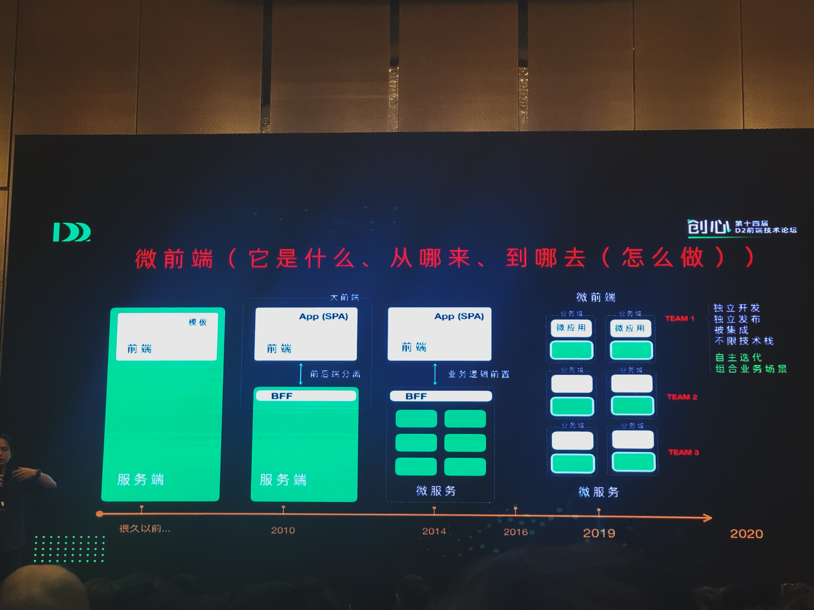

# D2-2019
> 2019年12月14日，我在杭州和达希尔顿逸林酒店参加了第十四届D2前端技术论坛。虽然现在已过去半年多，最近认识到部分内容（如微前端）可能需要进行实践，所以把部分内容作重新回顾。

那天听了三部分内容：**微前端**、**Serverless**、**wasm**。

<!-- :::tip
**微前端：**
 - 云生态新物种—微前端架构体系
 - 标准微前端架构在蚂蚁的落地实践
 - 微前端沙盒体系

**Serverless：**
 - Serverless 赋能前端应用开发
 - 前端新思路：组件即函数和 Serverless SSR 实践
 - Serverless 下函数应用架构升级

**wasm：**
 - 基于 wasm 的H265播放器及在 NOW 直播中的应用
::: -->

## 微前端
**微前端是一套前端架构体系，是 分治思想 和 望楼系统 的组合**。
> “微前端”最初是在2016年由 ThoughtWorks 提出。

### 微前端体系构成
 - **基础设置**
    - 微应用的注册、消息机制、隔离机制
 - **配置中心**
    - 版本管理、发布策略
 - **观察工具**
    - 运维方面的可观察性工具。除了监控，可以方便查看系统运行状态，对问题进行跟踪、调试

### “微应用容器”应该具有的能力
`主应用` 会通过一个 `微应用容器` 把 `微应用` 异步加载进来。

其中的 `微应用容器` 应该具备以下能力：

 - **安全性**
 - **隔离性**
    - 隔离样式（ShadowDOM）
    - 隔离JavaScript/DOM入侵
 - **可通讯**
    - 路由管理：主应用配置路由，对应映射微应用
    - 消息机制：微应用注册事件、主应用下发事件（微应用之间不允许通讯）
 - **可见性**
    - 埋点监控、性能检测
 - **容错性**
    - 加载失败的Fallback、容错、Error上报

### 微前端的价值
| 方面 | 优点 | 缺点 |
| --- | --- | --- |
| 工程价值 | 1、单独构建、单独发布、热升级 2、不限技术栈 3、大型单页应用无限扩展 4、多团队合作  | 1、体验有折损 2、维护成本高 3、管理版本/依赖复杂 4、粒度要合适  |
| 业务价值 | 对于ToB -> 功能性强 -> 客户定制化需求 -> 需要更灵活的业务整合能力 | / |

### 微前端需要关注的问题
1、微应用的注册、异步加载和生命周期管理

2、微应用和主应用之间的消息机制
> - 微应用之间不允许通讯；
> - 微应用注册事件、主应用下发事件

3、微应用之间的隔离

4、公共依赖的库、版本管理

5、微应用独立调试

### 衡量一个微前端是否友好的标准
 - 技术无关：无论是子应用还是主应用，都应该做到框架无感知
 - 接入友好：子应用接入应该跟接入一个Iframe一样轻松自然

<!-- 

下午听的是有关serverless和音视频编解码的知识。两者都比较抽象所以感觉听不太懂，和同事讨论一番后达成共识：两者都是以降低成本为目的。
前者是降低服务端部署/运维成本。将服务器部署到云平台上，可以更好地专注业务层开发。前端也可以直接在serverless.xml指定functions实现接口读写。同时业界还有更好的serverless规范和框架可以解决不同云厂商之间配置差异的问题（如Midway for faas）。也期待演讲者说的“互联网（前台）工程师”诞生

后者是介绍了H.264和H.265两代视频编码标准的效果/兼容性的区别，为了H.265在各大主流浏览器不兼容情况而借助webassembly来实现较低的带宽成本。虽然听不太懂但感觉干货满满，可能是因为演讲者一听就是我们广东来的，自称颜值主播的小陈
总的来说今天有刷新对前端的认知，不知道自己理解的对不对，也坐等社区大牛们的笔记分享出来再回来看看吧！ -->
