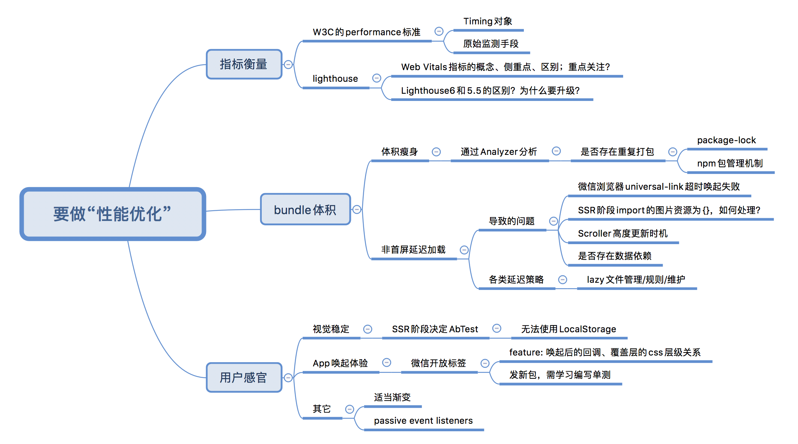

# 2020-Q3

## 优势
 - 能快速适应云音乐节奏
 - 在持续项目压力下能自驱地保持每周的体验优化技术任务的思考和尝试，也取得了明显进展
 - 执行力、过程管理较好

## 短板
技术成熟度/深度略显不足。

## 发展建议
 - 在日常开发中，关注“点”层面的问题；并在 **核心方向** 更专业投入
 - 不要为了学而学（如：学习React源码、SSR等较为宽泛的内容）
 - 以**解决业务问题**为出发点，以**提高日后业务效率（技术产出）**为目的
 - **[扩展]** 从开发侧的角度，为产品作出想法/体验/市场指标等贡献

## 思路推荐
比如，要做“性能优化”，就从**解决问题的角度**开始。

> 开始于“大的方向”：（“性能优化”可以从哪些方向切入？）

从左到右，会慢慢发现更多问题。

这样比“为了学习而学习”，效率更高，也会少走一些弯路。

## Q4
### 业务
#### 有声书制作工具
可能需要深入的点：
 - Canvas相关
 - 数据流的传递与共享

### 技术
####

#### M站（系统性）梳理
可能需要深入的点：
 - 深入逻辑（SSR、Router）
 - 规则/规范产出（让新手能够Get Started）
 - 尝试全面优化

#### 上线后优化指标跟进
可能需要深入的点：
 - Web Vitals指标的概念、侧重点
 - 单曲页在优化前后的性能分析、趋势

#### 开发问题的过程管理
养成习惯，将“开发疑难点（或问题）的分析、解决方法”记录在案（周报）
 - 将开发中遇到的问题通过 **精炼Demo/言语** 寻求解决方案/同事帮助。
 - [扩展] 阅读同组人的周报

## And...
和主管谈话后，感觉自己有种恨铁不成钢的体会。

借用主管的话，就是“明年就要跨入工作第3个年头，也是个3-5年的老员工了”。

但目前的软实力上，还不足以达到这个水准，同时也应该更担心以后的个人竞争力。

幸运的是，本科毕业，当下的年纪还比较年轻，还有学习/进步的余地，

好好利用起来吧。
