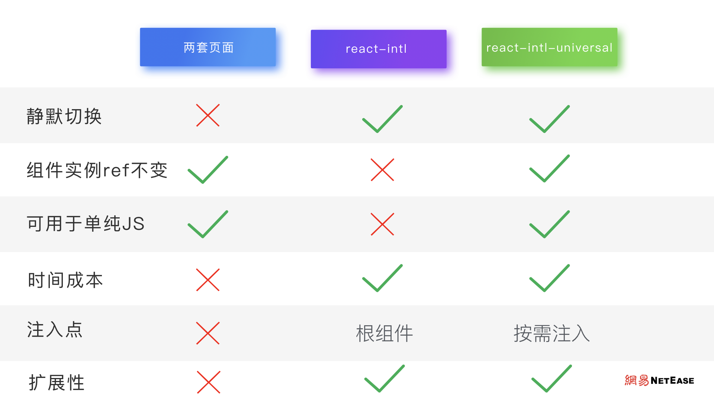

# 官网
> 项目时间：2019-10 ~ 2020-01

[[toc]]

## 职责
 - 项目搭建（前端脚手架）
 - 国际化调研/配置
 - 首页开发（轮播组件）
 - 兼容性处理
 - Nginx配置

## 亮点
 - 多页应用。（编译、打包速度快）
 - 兼容多端、多浏览器
 - 语言切换支持静默刷新

## 难点
 <!-- - [多页应用配置](#多页应用配置) -->
 - [兼容性处理](#兼容性处理)
 - [国际化处理](#国际化处理)
 - [react-router封装](#react-router封装)
 - [跑马灯思路](#跑马灯思路)

### 兼容性处理
**PC**

【HTML方面】
 - FireFox不兼容Video标签：
    在`FireFox`上无法通过`<video>`标签播放视频：
    ```html
    <!-- before -->
    <video data-id="2" data-prime="true" data-time="5000" loop preload="none" playsInline autoPlay>

    <!-- after -->
    <video data-id="2" data-prime="true" data-time="5000" loop preload="none" playsInline autoPlay muted={true}>
    ```
    解决方法：添加一个`muted`属性，值为`true`即可。
    > `muted`属性用来设置该段视频是否被静音

【CSS方面】
 - 不同浏览器下，默认margin、padding、列表缩进不同
    - 引入 `全局css reset` 文件

 - IE浏览器不兼容filter滤镜
    - 解决：设置`filter:progid:DXImageTransform.Microsoft.`（.后面是紧跟各种滤镜，约十几种）

【JS方面】
 - IE9及以下不兼容`requestAnimationFrame`
    ```js
        window.requestAnimationFrame = window.requestAnimationFrame || function(a){return setTimeout(a, 1000 / 60)};//时间刻自行设置
        window.cancelAnimationFrame = window.cancelAnimationFrame || clearTimeout;
    ```
 - IE9以下的事件绑定
    - 解决：判断是否支持`window.addEventListener`（用柯里化可提前返回`window.addEventListener`）
    
**H5**

【HTML方面】
 - 在微信IOS下，**不支持自动播放视频**
    - 原因：Apple解释是为了节省流量。
    - 解决办法：页面加载后，获取Video的dom节点，模拟`play()`

【CSS方面】
 - 安卓低版本（4.4）**line-height**不居中
    - 初步怀疑：字体大小为奇数、使用 `rem` 单位造成（由于根元素会动态改变）
    - 解决：把用到 `line-height` 设置垂直居中的标签都换成`button`
 
 - 点击元素时出现**背景色**
    - 解决：`-webkit-tap-hightlight-color: rbga(0, 0, 0, 0)`；换成`<div>`

【JS方面】
 - 安卓低版本（4.4）页面空白
    - 初步怀疑：css属性漏掉autoprefixer前缀的兼容问题
    - 进一步怀疑：（VConsole控制台显示**Promise is undefined**）
    - 解决：引入全局polyfill -> babel对polyfill的按需引入（`useBuiltIns: usage`）
 
 - 微信内置浏览器的**键盘遮住**输入框
    - 解决：对输入框绑定click事件，再通过一个setTimeout，取得DOM节点，用它执行`Element.scrollIntoView()`

[查看](/skill/project/compatibility/h5/)


### 国际化处理
主要问题：
 - **[语言工具]** 考虑代码维护性、兼容性、静默刷新
 - **[语言方案]** 页面内容、Ant组件（提示）、登录组件、后端接口部分

解决方案：
 - **语言工具**
    - 两套页面
        - 维护性差，时间成本高。
    - react-intl
        - 原理：通过HOC，来向当前组件包裹注入intl对象；调用这个对象的方法，根据id从语言包取值
        - 缺点：1、只能应用于`React.Component`（无法用于纯JS的工具方法文件）；2、组件实例的ref会改变；3、因为组件被HOC包裹，组件的属性不会被子类继承；
    - react-intl-universal
        - 优点：1、对于`React.Component`、`JS工具方法`都能应用；2、组件实例不会改变；3、使用简单（3个API和一些可选属性）；3、可以按需注入

 - **语言方案**
    - 根组件声明语言种类`lang`，并注入到context
    - 页面、业务组件
        - 【intl对象】编写独立locale跟随业务文件，在页面中按需引入intl对象
    - Antd组件
        - 给最外层`ConfigProvider`组件的`locale`属性传入`Aantd语言包`
    - 登录组件（输入控件、验证码）
        - 在 初始化URS登录控件 时传参 `lang` 指定语言
    - 后端接口部分
        - 请求：统一配置，请求头 `lang` 字段
        - 响应：统一拦截，读取msg
        - 字典数据：同一字段在不同语言下的命名格式（`name`、`en_name`），前端根据`lang`取相应内容



### react-router封装
特点：
 - 实现路由配置化
 - 统一管理路由表
 - 避免组件命名冲突
 - 自动实现组件懒加载

**内部方法**：
 - **SuspenseComponent**
    - 实现组件懒加载

**暴露方法**：
 - **getRouteInfo**：获取当前路由信息、上级路由信息
    - 根据路由表、当前路径，获取当前路由信息，以及上级路由信息

 - **getRouteLine**：获取路由的渲染路径（常用于`面包屑`）
    - 根据路由表、当前路径，利用递归查找

 - **Routes**：渲染出口（类似`<router-view>`）
    - 根据当前渲染路由，自动生成`<Switch>`组

### 跑马灯思路
**使用：**

【业务层】
 - 编写`useMarquee`，暴露`startTime`、`stopTime`、`<MarqueeWrapper>`
 - 分别用`<MarqueeWrapper>`包裹两组一样的图片，后者设置offset
 - `useMarquee`内封装了`_move`方法，用来改变特定的dom节点的`transform`属性
 - 利用定时器，执行两组图片的`move`

```js
// _move代码
const _move = (dom, order, { speed, offset }) => {
    const width = dom.clientWidth; // 每一组的宽度
    // 计算该节点translateX坐标
    let coord = document.defaultView.getComputedStyle(dom, null).transform.split(',');
    let x = coord[coord.length - 2] || 0;
    let newX = x <= -width * (order + 1) ? -width * (order - 1) : x;
    // 设置该节点的translateX坐标
    dom.style.transform = `translate(${newX - speed - offset}px, 0)`;
};
```

### 其他配置
  - 单入口启动

  - DLL动态链接库

  - ts的类型检查（【开发时监听】`tsc --noEmit -w`；【打包时】`tsc --noEmit`）

  - Nginx配置：
      - 因为是个多页应用（BrowserRouter）。**手动刷新**浏览器会尝试从服务器取资源。
      - 需通过以下Nginx配置将资源 **重定向到前端静态资源** 去寻找。
        ```js
            location /test.html {
                root /home/appops/my-static/myProject/build;
                index test.html;
                try_files $uri /test.html;
            }
        ```
