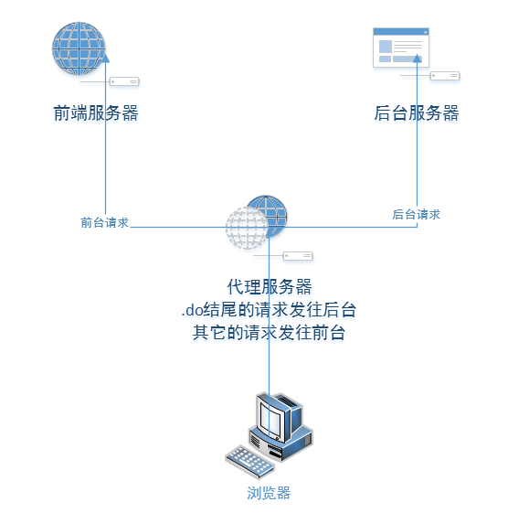

# 其他
> 这里会搜集一些有关项目的零碎笔记

[[toc]]

## [Vue.js]Vue.js的优势与不足：
 - 优势（特点）
    - 从`React`那里借鉴了`组件化`、`prop`、`单向数据流`、`虚拟DOM`、`性能`、`状态管理`
    - 从`Angular`那里借鉴了`模板`、`双向数据绑定`
    - 单文件组件（.vue）
        - 将html/js/css存在于一个文件内，然后通过`webpack + vue-loader`进行编译，让浏览器识别
        - 好处1：Style的作用域
        - 好处2：预加载器（在template、style中的lang属性）
 - 不足
    - 模板的`运行时错误`描述不够直观（**异常堆栈信息**总是指向Vue.js的内部方法）

## [Vue.js]如何实现Vue.js的响应式数据绑定？
Vue实例初始化的过程中，实现依赖管理。大致总结如下：

 - `initState`过程中，把`props、data、computed`等属性通过`Object.defineProperty`来改造其`getter/setter`属性，并为每一个响应式属性去实例化一个`observer`观察者；
 - `observer`观察者内部的`dep`对象会记录这个响应式属性的所有依赖；
 - 当响应式属性调用`setter`函数时，通过`dep.notify()`方法去通知所有依赖进行改变，然后会通过diff算法来计算出更新了的虚拟节点，最后patch到真实dom上

## [Vue.js]render做了什么？
`render`函数会返回一棵VNode树。在挂载之前，会通过`createElem`、`createChildren`的相互调用，遍历整棵VNode树，来生成真实DOM节点。

## [Vue.js]$attrs 和 $listeners
**$attrs** 是一个对象，存着由父组件传递给子组件、但是没有在子组件里prop的特性

**$listeners** 也是一个对象，存着在`父作用域中的v-on事件监听器`
 - 通过`$listeners`，子组件可以向孙组件去传递那些emit事件，由孙组件去触发“爷组件”的方法
```html
<!-- u-search-type.vue -->
<u-input @keypress.enter="goSearch"></u-input>

<!-- u-input.vue -->
<input v-on="$listeners" />
```

## [Vue.js]改变prop值的方法
> Vue一般防止子组件改变父组件的状态，所以不应该在子组件内部改变prop

### 不改变父组件
 - data（利用prop作为初始值，后续修改本地data）
 - computed（“听父从命”，当父通知prop值改变，子组件computed）

### 改变父组件（.sync）
 - .sync（当子组件改变了prop值，这个变化也同步到父组件中）
 
 ```js
 // parent.vue
 <child :inputValue.sync="name"></child>
```

```js
 // child.vue
 props: {
     inputValue: { type: 'String', default: '' }
 },
 data() {
     return {
         iValue: this.inputValue
     }
 },
 watch: {
     iValue(val) {
         this.$emit('update:inputValue', val) // 当子组件需要更新inputValue时，
     },
     inputValue(val) {
         this.iValue = val
     }
 }
 ```
 实际上，`.sync`代表的是

 ```js
 model: {
     prop: 'inputValue', // 子组件的prop值
     event: 'update' // 子组件的prop值绑定的事件
 }
 ```
 `v-model`代表的是
 ```js
 model: {
     prop: 'value',
     event: 'input'
 }
 ```

## [Vue.js]Vue里面的继承
### extend（单继承）
 - Vue的全局方法
 ```js
 Vue.extend(...) // 传递Vue实例选项
 ```
 - Vue的实例选项
 ```js
 export default {
     extends: myExtend
 }
 ```
### mixin（多继承）
`混入` 可以接受 对象数组，所以类似多继承。

当使用“混入对象”时，所有“混入对象”的选项，都将适当地 **合并** 到该组件本身的选项
 - Vue的全局方法
 ```js
 Vue.mixin({
     created() {
         // ...
     }
 })
 ```
 - Vue的实例选项
 ```js
 export default {
    mixins: [ ... ]
 }
 ```

 ### 继承的合并规则
  - 对象（只覆盖掉冲突的属性，`不冲突的属性会保留下来，且合并`）
    - 优先级：组件内部 > 混入对象（数组最右最优） > Extend对象

  - 钩子函数（先调用 -> 后调用）
    - 调用顺序：Extend对象 > 混入对象（数组最右最优） > 组件内部

```js
var mixin = {
  data: function () {
    return {
      person: {
        age: 22
      }
    }
  }
}

new Vue({
  mixins: [mixin],
  data: function () {
    return {
      person: {
        name: 'heshiyu'
      }
    }
  },
  created: function () {
    console.log(this.person)
    // => { name: 'heshiyu', age: 22 }
  }
})
```

## [VueConf]Make Your Vue App Accessible
[Make_Your_Vue-App_Accessible（演讲者：勾三股四）](/make-your-vue-app-accessible.pdf)

## [vuelidate]表单校验
 ### 调研思路：
  - 基于数据模型
  - 支持自定义函数
  - 支持嵌套
  - 支持Promise
  - 引入方式（可全局、可局部）
 
 ### 源码实现（数据响应）
  - 当实例化一个vue时，会通过`this.$options`获取该vue实例选项里的`validations`
  - 再把选项里的`配置规则`转化为`$v`属性
  - 将`$v`的代理通过`mixin`的方式，加入到Vue实例中的`computed`选项
  - 默认是通过`input`事件进行校验。作者也推荐开发者可以通过给`v-model`定义`.lazy`修饰符，使得校验器可以进行懒校验
 
## [Vue.js]生命周期
首先，从`new Vue()`开始
 - 初始化生命周期、事件系统
 - `beforeCreate`
 - 初始化State（props、data、computed...）、watcher
 - `Created`
 - 有el选项吗？
    - 没有的话，等待 **vm.$mount(el)** 被执行时，才开始编译
 - 有template选项吗？
    - 有，将template编译到render函数
    - 没有，将el的outerHTML整个内容作为template，编译到render函数
 - `beforeMount`（此时已准备好render函数了）
 - 将render函数返回的VNode树渲染到真实DOM上
 - `mounted`（挂载成功！）

----
 - 当data发生变化（未重绘）
 - `beforeUpdate`
 - 执行diff算法，更新虚拟DOM，并将变化的部分patch到真实DOM
 - `updated`
----
 - 当调用vm.$destroy()时
 - `beforeDestroy`
 - 摧毁子组件、事件绑定、数据监听
 - `destroyed`（摧毁成功！）


## vuex

## [jQuery]源码
 - 首先，是从`闭包` + `立即执行函数`开始的（传入了window对象）
    - 目的：将`$`变量保存在内存中（单例模式）
 - 然后，`重载`很常用
    - 原因：单单为了实例化一个jQuery对象，就有9种不同的方法
 - 最后，`链式调用`实现原理
    - 原因：实现很简单。只需**在实现链式调用的方法的返回结果里，返回this即可**

## [js]Babel将ES6转换成ES5的原理
 `Babel`是一个转译器，它是将`JavaScript的高版本规则`转移成`低版本规则`的一个工具。

 它的原理分三个部分：
  - parsing（解析）
    - 把ES6代码生成AST
  - transforming（转译）
    - 把AST遍历，优化成新的AST
  - generating（生成）
    - 按照新的AST生成ES5代码

 ### plugins和presets 
 `plugins`应用于整个转译过程（尤其是`transforming`）

 `presets`是官方提供的一些预设的插件集

 ### babel-polyfill和babel-runtime
 `Babel`默认只转换js的新语法，而不转换新的API。为了弥补这个不足，需提供一个`polyfill`

 `babel-polyfill`能够`加载整个polyfill库`

 引入方法：
 ```js
 // 第一种：在main.js里
 import 'babel-polyfill'

 // 第二种：在webpack.config.js中
 module.exports = {
     entry: ['babel-polyfill', './app/js']
 }
 ```

 问题：
  - 导致污染全局环境
  - 重复代码过多
 
 解决：使用`babel-runtime`（它可以提供一些`转译模块的工具函数`）

### vue-cli 3.0的babel
在vue-cli 3.0根目录下，有`babel.config.js`（采用babel7的新配置格式）。
 - 里面预先配置了`preset`，它的值是`['@vue/app']`
 - 也可以配置`plugins`（引用插件来处理代码的转换。和`preset`平级。）

## [工具]npm和和yarn的区别
`yarn`是Facebook和Google联合推出的`新的JS包管理工具`

`npm`是Node.js中`默认的包管理工具`

`yarn`有以下优点：
 - 速度快
    - 并行安装、离线模式
 - 版本锁定
    - yarn.lock
 - 更简洁的输出
 - 语义化的命令

## [小程序]登录过程
  - 微信
    - 小程序端调用`wx.login()`获取`code`
    - 带着`code`，传递给开发者后端
    - 开发者后端带着`code + appid + appsecret`跟微信后端换取`session_key + openid`
    - 开发者后端将`自定义登录态`与`session_key + openid`关联，并响应给小程序`登录态`
      - 并将session_key和openid存到redis里，过期后会重新请求
    - 小程序把`登录态`写入Storage，等到下次有需要登录权限时，从Storage获取
    - 开发者后端通过`自定义登录态`去查询`session_key + openid`，返回业务数据

  - 支付宝
    - 小程序端调用`getAuthCode`，向支付宝App获取`auth_code`
    - 小程序端携带`auth_code`给开发者后端，发起登录验证请求
    - 开发者后端通过`auth_code`与支付宝授权平台获取`token`和`uid`
    - 开发者将`token`和`uid`种到session里，并响应给小程序端验证成功
    - 在session有效期内，不需重复授权


## [小程序]生命周期
  - beforeCreate
  - created
    - 所有页面created会在项目加载的时候一起被调用，进入页面不会被调用，一般用onLoad代替
--------
  - onLoad，页面加载
  - onShow，页面显示
  - onReady，页面初次渲染完成
  - onHide，页面隐藏
  - onUnload，页面卸载
--------
  - beforeMount
  - mounted
    - 从B返回到A，A的mounted不会被触发，因为页面没有被重新加载，一般用onShow代替
  - beforeDestroy
  - destroyed

## [小程序]跳转区别
 `navigateTo`，跳转到指定页，**并将原页面加入堆栈，可回退**

 `redirectTo`，直接重定向到指定页，**不能回退到原页面**
 
 `switchTab`，只能用于跳转到tab页面，并关闭其他非tab bar页

### [小程序]fly.js
因为小程序是在jsCore环境下执行，在这个环境下并没有`window`，也没有`XMLHttpRequest对象`。

而`fly.js`它是通过 **自定义http engine** 来实现不同的adapter，来支持不同环境的。

## [Axios] 源码解析
 `Axios`是一个基于`Promise`的http请求库。

 ```js
 function Axios() {
     this.interceptors = {
         request: new InterceptorManager(), // 请求拦截器
         response: new InterceptorManager() // 响应拦截器
     }
 }
 ```
 每个axios实例都有一个`interceptors`实例属性，同时这个`interceptors`对象上有两个属性`request`、`response`，它们都是`InterceptorManager`的实例。
 
 `InterceptorManager`构造函数是用来实现拦截器的，且这个构造函数原型上有3个方法：`use`、`eject`、`forEach`。

 一般我们最常用的是`use`，
  - 对于`request`，我们就在`use`里对`config`进行修改，随后会覆盖掉默认配置
  - 对于`response`，我们就在`use`里对后端返回的数据进行一个预处理再返回

## [MVC] 什么是MVC？
`M`指的是Model层
   - 用于封装和业务逻辑相关的数据、以及对数据处理的方法

`V`指的是View层
   - 监听模型层上的数据改变，并实时更新页面

`C`指的是Controller层
   - 负责接收用户的操作，然后调用模型或视图去完成用户的操作

 本质是：将**数据展示** 和 **数据** 进行隔离，提高代码的复用性和扩展性；

 特点：职责明确、相互分离；
 
## [MVVM] 什么是MVVM？
 `M`：Model层，存放数据

 `V`：View层，视图层

 `VM`：ViewModel层，负责：
   - 将Model层的数据`同步`到View层，进行呈现
   - 将View层的修改`同步`到Model层，进行存储

 
## 重构的好处？
 - 实现前后端分离
 - 代码优化
 - 减少后期维护的学习成本


## 两个异步请求，若第二个比第一个先返回，对于第一个的结果如何cancel掉？
栈


## 通讯录搜索（按姓名查询、或按首拼音）
将各个汉字各自存起

## 把svg当做字体


## 为什么IE8不能使用webpack？
 - IE8不怎么兼容ES5
 - 不支持__proto__
 - 不支持default关键字


## 如何限定只接收10个http响应？

## 对前后端分离的理解？


**部署方式：前后端分开部署，利用中间件（如Nginx）进行代理转发**

各端职责：
  - 前端
    - 负责控制页面的跳转、异步请求数据
    - 存放css、js等静态资源，并使用CDN加速；

  - 后端
    - 判断/接收请求
    - 组装并返回数据

优势：
  - 提升开发效率
  - 减少后端的负载压力
  - 增强项目代码的可读性和维护性

缺点：
  - 部署顺序（后端先部署）
  - 文档的重要性

## [web]前端项目搭建
 - 安装Node
 - npm init -y
  - 生成`package.json`
 - npm install --save-dev webpack
 - 安装插件（babel-core、loaders、vue...）
 - 进入webpack.config.js进行配置
  ```js
  module.exports = {
    entry: './index.js',
    devServer: {
      port: 8083,
      hot: true
    }
  }
  ```
 - 新建index.js、index.html
 - 进入package.json修改script
 ```json
 {
   start: "webpack-dev-server"
 }
 ```
 以下是结合vue的：
 - 新建src
  - 里面还有assets、pages、index.js、app.vue...
 - 配置webpack.config.js（特别是output、loaders）
 - 在index.html新增
 ```js
 <div id="root"></div>
 ```
 - 在app.vue新增
 ```js
 import vue from 'Vue'
 new Vue({...})
 ```
 - npm start

## [Vue.js]slot-scope
## [weppack]webpack常用的loader和plugins
loader:
 - vue-loader、sass-loader、babel-loader、url-loader

plugins:
 - html-webpack-plugin
    - 用于生成一个html文件，并将最终生成的js、css以及一些静态资源以`script`、`link`的形式动态插入其中。
 - webpack-dev-middleware
    - 生成一个和webpack的compiler绑定的中间件
 - webpack-dev-server
    ```js
    // 配置 webpack-dev-server 行为
    devServer: {
        open: process.platform === 'darwin',
        host: '0.0.0.0',
        port: 8081,
        https: false,
        proxy: null
    }
    ```

## [webpack]webpack插件是怎么实现的
webpack插件有以下特点：
 - 独立的JS模块，暴露相应函数
 - 函数原型上的apply方法会注入compiler对象
 - compiler对象上挂载了相应的webpack事件钩子
 - 事件钩子的回调函数里能拿到编译后的compilation对象（如果是异步钩子还能拿到相应的callback）

### 为什么要定义apply方法？
底层源码是通过`plugin.apply()`调用插件的。

### compiler对象
开发插件时，可以从`compiler`对象里拿到`所有和webpack主环境相关`的内容。

### webpack常见的事件钩子
 - after-plugins
    - 设置完一组插件的初始化之后
 - run
    - 在读取记录之前
 - compile
    - 在创建新的compilation之前
 - emit
    - 在生成资源、并输出到目录之前
 - after-emit
    - 在生成资源、并输出到目录之后
 - done
    - 完成编译

## [PC] keep-alive不能正常销毁
问题：设置了`<keep-alive>`组件的include属性后，keep-alive组件不能正常销毁，且会占用内存。

解决：
 - 1、给所有vue实例增加name实例选项（未解决）
 - 2、查看keep-alive源码：
 ```js
  // created时，创建cache对象
  created () {
    this.cache = Object.create(null)
    this.keys = []
  },

  // destroyed时，遍历cache对象
  destroyed () {
    for (const key in this.cache) {
      // pruneCacheEntry函数：将那些被缓存了的、但当前没有处于被渲染状态的组件都销毁掉
      pruneCacheEntry(this.cache, key, this.keys)
    }
  },
  
  // mounted时，会监听include、exclude这两个字段，然后实时地更新（删除）this.cache对象
  mounted () {
    this.$watch('include', val => {
      pruneCache(this, name => matches(val, name))
    })
    this.$watch('exclude', val => {
      pruneCache(this, name => !matches(val, name))
    })
  }
 ```
 通过断点，发现`destroyed`没有进入。查看该组件，发现是手动重写了this.$destroy方法，使得缓存组件无法正常摧毁。
 ```js
 // 错误示范
created() {
    let query = this.$route.query
    this.searchParams = { ...this.searchParams, ...query }

    window.parent.postMessage('fullscreen', '*')
    // 不要这样重写destroy
    this.$destroy = () => window.parent.postMessage('cancelfullscreen', '*')
}
 ```

 ## [pc]庞大数据的渲染、校验、保存问题
 问题：庞大的数据导致前端的渲染、保存，出现卡顿
 
 ### 解决方法
 #### 后端真分页、后端校验、单条保存
 缺点：HTTP请求增多；交互不友好
  
 #### 前端假分页、前端校验、整体保存
 优点：减少HTTP请求、校验快
 
 #### 利用vue-virtual-scroller
 优点：懒加载
 
 原理：将加载事件绑定在scroll事件上，并记录上次渲染item的startIndex、endIndex，利用一个buffer进行存储。

 目前方案：**前端假分页、前端校验、整体保存**
 
## 将一组下载URL打包成zip
有一组数据，需要将其下载，并打包&另存为到zip中：
```js
const LINKS = ['www.baidu.com/a1.pdf', 'www.baidu.com/a2.pdf']
```

推荐npm包：
```
jszip
jszip-utils
file-saver
```
[使用demo](./SaveAsZip.md)