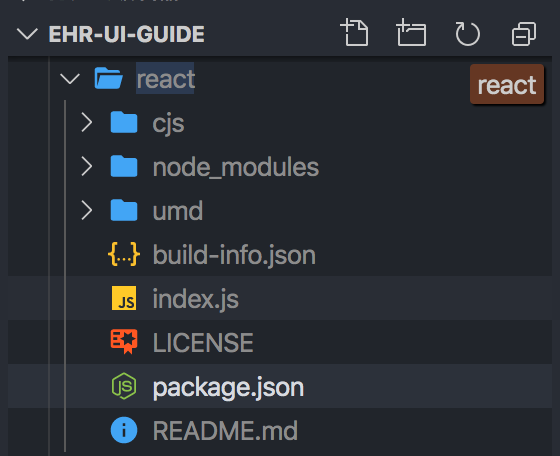
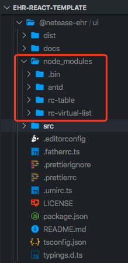

# package.json
> 记录package.json文件里的一些知识

[[toc]]


## peerDependencies
在`npm3`中，项目中不会自动安装某第三方库里的`peerDependencies`所指定得到依赖。

### 例子：
存在一个第三方库（@netease-ehr/ui），指定了`peerDependencies`里的依赖
```json
  "peerDependencies": {
    "react": ">=16.12.0"
  }
```

 - 在第三方库开发时，执行`yarn`，**会安装这个依赖**；



 - 在正式项目上，引用了第三方库（@netease-ehr/ui），执行`yarn`时，**不会安装这个依赖**


## 版本号
主版本号.次版本号.修补版本号

 - 主版本号：新的架构调整，不兼容老版本
 - 次版本号：新增功能，兼容老版本
 - 修补版本号：兼容老版本

### 版本号规则
主要是`^`、`~`。

#### 对于^
**最左边的第一个非0的下一位**起可以任意

如：^1.1.2，表示>=1.1.2 < 2.0.0

如：^0.2.3，表示>=0.2.3 < 0.3.0

#### 对于~
一般用于**指定次版本号**

如：~1.1.2，表示>=1.1.2 < 1.2.0

:::tip
建议使用~来标记版本号，这样可以保证项目不会出现大的问题，也能保证包中的小bug可以得到修复。

例如：声明^1.5.7，若升级到v1.6.0可能与现有代码不兼容
:::


## yarn create
`yarn create`可以完成：从任何`create-*`初学者工具包创建新项目
```
yarn create react-app my-app

等价于：

yarn global add create-react-app
create-react-app my-app
```
注意上面的`create位置`


## 有关scripts
有时会在在 scripts 里声明一些指令。

### 并发和继发地执行指令
```
// 并发（同时执行）
npm run dll & npm start

// 继发（相继执行）
npm run dll && npm start
```