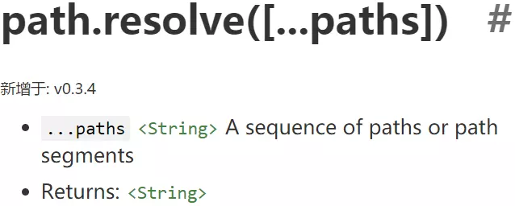

# [工具] webpack
> `webpack`是模块打包的机制，它是通过`loader`、`plugins`对资源进行处理，最后打包成浏览器能识别的js等文件。

[[toc]]

**原理：**
 - 识别入口文件
 - 分析模块依赖（`Tree Shaking`）
 - 解析模块（通过不同`Loader`）
 - 编译模块，生成抽象语法树`AST`
 - 循环遍历`AST`
 - 打包成`bundle.js`

## Loader
`Loader`是对加载的文件进行**解析处理**。

### 常用的loader
sass-loader、less-loader、css-loader、style-loader、babel-loader、vue-loader

### 和Plugins的区别
 - `Loader`是在打包构建过程中，用来处理源文件的（JSX、SCSS...），一次处理一个；
 - `Plugins`并不是直接操作单个文件，而是会**对整个构建过程都起作用**


## Plugins
`Plugins`是用来扩展webpack功能的，**会在整个构建过程中生效**，执行相关的任务。

### 常用的plugins
 - html-webpack-plugin：用于生成一个HTML文件，并将webpack最终生成的JS、CSS以及一些静态资源以`script`、`link`的形式插入到其中。
 - happypack：把任务分解给多个子进程去并发执行。

### Plugins的特点
`plugins`其实是一个具有 `apply`方法 的对象，需要在webpack.plugins里注册；

当webpack调用插件时，`apply`方法会被注入 `compiler对象`，其中挂载了相应的webpack事件钩子

webpack会在 **整个构建过程中** 调用这些事件钩子。

> `compiler`对象里拥有 `所有和webpack主环境相关` 的信息。

### Plugins中常见的事件钩子
（按触发顺序：）
 - **afterPlugins**
    - 初始化插件之后
 - **compile**
    - 在创建新的compilation之前
 - **afterCompile**
    - 创建完新的compilation
 - **emit**
    - 在 生成资源 之前
 - **afterEmit**
    - 在 生成资源 之后
 - **done**
    - 完成本次编译

#### 示例插件：保存时clear日志
```js
class CleanTerminalPlugin {
    constructor(options = {}) {
        this.time = 0;
    }

    apply(compiler) {
        this.useCompilerHooks(compiler);
    }

    useCompilerHooks(compiler) {
        // 在创建完新的compilation后，清空控制台
        compiler.hooks.afterCompile.tap('CleanTerminalPlugin', () => this.clearConsole());
    }

    clearConsole() {
        if (this.time > 2) {
            console.clear();
        } else {
            this.time++;
        }
    }
}
```

## bundle.js
`bundle.js`实际上是一个`立即执行的匿名函数`。
 - 函数的参数是一个数组，数组中的每一项都是一个`function`
 - 每个`function`就对应每个`模块`的内容，会按照`require`的顺序排列，
 - 每个模块都有一个唯一的id（从0递增）


[查看bundle.js](/bundle.js)

## gulp与webpack的区别
`gulp`强调的是**前端开发流程**。

**用法：** 定义一系列的task，再定义它处理的事物、顺序，最后让gulp执行task，从而构建前端项目。

4个常用的方法：
 - **src（）**：获取流
 - **dest（）**：写文件
 - **task（）**：定义任务
 - **watch（）**：用来监听事件

 IE8下最好用`gulp`，IE9用`webpack`

## 代码分割
三种手段：
 - 不同Entry
 - SplitChunksPlugin（webpack4以前是CommonsChunkPlugin）
 - 动态导入

### 通过Entry划分
相同的模块在不同入口的bundle里重复存在。

### 通过SplitChunkPlugin
需要配置：
```js
module.exports = {
    entry: {
        index: './src/index.js',
        another: './src/another.js',
    },
    output: {
        filename: '[name].bundle.js',
        path: path.resolve(__dirname, 'dist')
    },
    // 新增以下：
    optimization: {
        splitChunks: {
            chunks: 'all'
        }
    }
}
```
> 可以通过`mini-css-extract-plugin`来分割CSS

### 通过动态导入
其实是通过`import()`，它内部会调用Promise来实现。

```js
module.exports = {
    entry: {
        index: './src/index.js',
        another: './src/another.js',
    },
    output: {
        filename: '[name].bundle.js',
        // 需在`output`下新增`chunkFilename`，用来定义那些没有入口的chunk文件的命名规则。
        chunkFilename: 'static/js/[name].[chunkhash:8].chunk.js',
        path: path.resolve(__dirname, 'dist')
    }
}
```
与其配合的，是在`import()`时，进行 **魔术注释** 指定`webpackChunkName`


动态导入前：


动态导入后：


## 使用笔记
### 使用
不同环境下全局安装的webpack版本可能不符合这个项目，所以还是用局部依赖（或npx webpack）。
```
./node_modules/.bin/webpack `input.js` `output.js`
```

### path.resolve(__dirname, './src)和path.join()
有两个知识点:
 - path.resolve()
 - __dirname

#### path.resolve()
> 作用：将路径片段解析成绝对路径；



参数：`String`（逗号分割）

返回值：`String`（绝对路径）

使用说明：
 - **从右向左**解析，`一旦遇到绝对路径，就不继续`
    - path.resolve('/foo', '/bar', 'baz') => '/bar/baz'

#### __dirname
> 指的是当前文件所在目录的路径


如图，`__dirname`的值为`C:\Users\GaoKai\Desktop\test`

以上两个可以解决`“虽然各个文件所在目录不同，但可以访问某个指定目录下的文件更方便”`（可以不使用`../../`），如下例子：
```js
// 修改前：
import foo from '../../../util/foo'
```
```js
// 修改后：
import foo from 'util/foo'

// webpack.config.js
resolve: {
    extensions: ['.js', 'vue'],
    alias: {
        // 快捷访问入口
        'util': path.resolve(__dirname, './src/util')
    }
}
```

#### path.join()
参数：`String`（逗号分割）

返回值：`String`

使用说明:
 - **从左到右**解析，将`所有路径片段都`拼接起来
 - 每个片段之间用`/`链接（片段之间最多只能存在1个`/`）
 ```js
 path.join('a', 'b', 'c') => 'a/b/c'
 path.join('a', 'b', '/c') => 'a/b/c'

 path.join('/a', 'b', '/c') => '/a/b/c'
 path.join('/a', '/b', '/c') => '/a/b/c'
 ```

### process.env.NODE_ENV
在node环境，全局变量`process`表示**当前node进程**。其中`process.env`表示**当前系统环境的信息。**
> 实际上，process.env里并不存在NODE_ENV这个变量，是用户自定义的。

在node环境下，`console.log(process)`会得到：


在浏览器环境下，`console.log(process)`会得到：


#### 设置node环境下的process.env.NODE_ENV
通过**cross-env**来配置环境变量（支持跨平台）
```json
"scripts": {
    "start": "cross-env NODE_ENV=development webpack-dev-server --open --config config/webpack.config.dev.js",
    "build": "cross-env NODE_ENV=production webpack --config config/webpack.config.prod.js"
}
```
这样，在node环境下，`process.env.NODE_ENV`就有值了。

#### 设置浏览器环境下的process.env.NODE_ENV
平时我们会**在项目的运行过程中**去判断当前环境，比如在`@/axios/config.js`里配置了环境变量：
```js
export const isDev = process.env.NODE_ENV === 'development'
```
这里的`process.env.NODE_ENV`指的是**浏览器环境下的环境变量**。
> 和node环境一样，默认是没有NODE_ENV这个变量的。

通过**DefinePlugin**来配置环境变量
```js
// webpack.base.js
module.exports = {
    plugins: [
        new webpack.DefinePlugin({ 'process.env.NODE_ENV': JSON.stringify(process.env.NODE_ENV) })
    ]
}
```
这样，在浏览器环境下，`process.env.NODE_ENV`就有值了。

#### webpack的配置模式mode
```js
// webpack.config.dev.js
module.exports = {
    mode: 'development' // 或'production'
}
```
根据官网描述，配置`mode`值会**自动开启某些优化配置**（笔者并未达到**DefinePlugin**效果）


### webpack中运用externals
一些类似包体积比较大的包（如：lodash），可以通过CDN的形式在`index.html`引入后，再通过`webpack.config.js`里加一个`externals`配置。

```html
<!-- index.html -->
<script src="https://cdn.jsdelivr.net/npm/lodash@4.17.15/lodash.min.js"></script>
```

```js
// webpack.config.js
module.exports = {
    externals: {
        lodash: '_'
    }
}
```

## Happypack
在webpack里，loaders都是单个解析、编译，不能同时处理多个任务。利用Happypack可以让它交给多个子进程去并发执行。执行完后，子进程再将结果发送给主进程。

```js
// 共享进程池：多个Happypack实例都使用同一个共享进程池的子进程去处理任务，防止资源占用过多。
const Happypack = require('happypack');
const happyThreadPool = Happypack.ThreadPool({ size: 5 });

modules.exports = {
    plugins: [
        new HappyPack({
            id: 'babel',
            loaders: ['babel-loader'],
            threadPool: happyThreadPool
        })
    ]
}
```

## DllPlugin
将复用性较高的第三方模块，打包到动态链接库里。
> 很多产品都用到螺丝，但并不是每次生产产品都需要把生产螺丝的过程重新执行。而是螺丝单独生产，侧面也加快了产品的生产速度。

使用Dll，分为DLL构建、主项目构建。
 - 在DLL构建文件里指定要打包的第三方库、接入DllPlugin
    - 执行DLL构建打包后，会生成：`x.dll`、`x.manifest.json`
    - `x.dll`：类似bundle.js，用数组保存模块，索引值作为id
    - `x.manifest.json`：描述对应dll文件里的模块信息
 - 在主项目构建文件引入动态库文件
    - `webpack.DllReferencePlugin`
 - 在入口文件引入dll

和CDN区别：
 - CDN需要配置externals、业务层去掉import
 - DLL放在本地，比较稳定、业务层引用不变

## 链接
[webpack的配置模式mode](https://www.webpackjs.com/concepts/mode/)

[理解webpack之process.env.NODE_ENV详解(十八)](https://www.cnblogs.com/tugenhua0707/p/9780621.html)