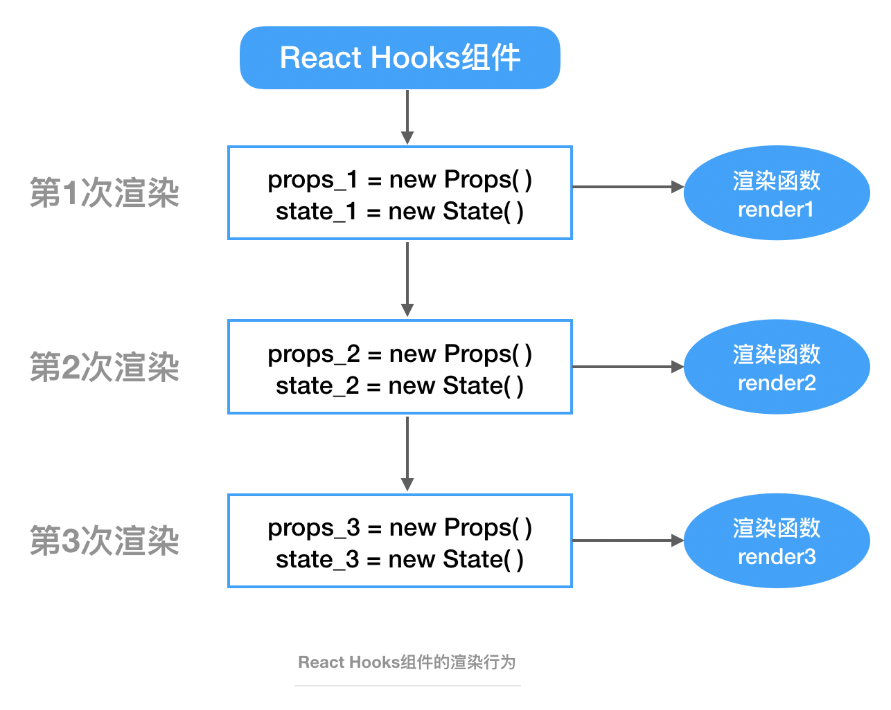

# React Hooks
> Hook是React 16.8的新特性。它可以让你在不编写class的情况下使用state以及其他的React特性。
> 
> —— React官网

[[toc]]

:::tip
相对于Class组件
 - 没有复杂的生命周期
 - 没有Class组件的this指向
 - 没有类似于HOC、render props等复用模式
:::

## 【引言】React两种组件的渲染行为
### Hooks组件
Hooks组件每次render都是调用不同的渲染函数，所以每次都会**拥有完全独立的函数作用域**。
> 后续的render每次都会生成全新且独立的props、state



### 类组件
类组件每次render都是调用同一个渲染函数。
> 后续的渲染只会改变this.props、this.state的值，而不是引用地址（唯一的this.props、this.state只在初始化时的构造函数中生成）


## Hooks组件内部的使用注意
由上面的渲染行为可知，Hooks组件的**每次render都会拥有独立的作用域**。所以利用Hooks开发时，有一些需要我们注意的使用方式。他们分别是：
 - 函数、变量的声明位置
 - useRef —— 不变常量的声明方式
 - useEffect —— 副作用的声明方式

### 函数、变量的声明位置
组件内部的函数、变量在每次render时都会**重新声明**，因此我们应该减少在Hooks组件内部声明函数、变量。

#### 1、函数与组件内state、props无相关性
这种函数的返回结果一般仅供展示：
```js
function formatName(name) {
    return `Hello, your name is ${name}`
}

function App(props) {
    const [name, setName] = useState('heshiyu');

    return (
        <div>
            <div>{formatName(name)}</div>
            <button onClick={() => setName('new life')}>Click Me!</butotn>
        </div>
    )
}
```

#### 2、函数与组件内state、props强相关性

### useRef —— 不变常量的声明方式
如果我们需要一个对象，希望它**从一开始到之后的每次render**都是不变的。
> “不变”指的是不会重新生成，**可变其值，但不可变其址**

这时候，**useRef**就派上用场了！

----
#### 以下引自 React官方文档📚
```js
const refContainner = useRef(initialValue);
```
`useRef`会返回一个可变的ref对象（`refContainner`），其`.current`属性被初始化为传入的参数（`initialValue`）。返回的ref对象在组件的整个生命周期内保持不变。

----
#### 项目中使用useRef的常见情况
:::tip
 - 需给自定义hooks传入参数时
 - 引用某个指定的dom实例时
:::

 - 需给自定义hooks传入参数时
```js
function App(props) {
     // 使用useRef，返回一个稳定状态的引用值，避免死循环
    let ref = useRef({ resumeAll: true });
    // 此处useFetch是一个用于获取后端数据、且依赖于传入的请求参数的自定义Hooks（第二个参数表示接口请求参数）
    const { data = {}, isLoading } = useFetch(getResumeInfo, ref.current);
}
```

 - 引用某个指定的dom实例时

例子1（待补充）：
```jsx
function App(props) {
    const videoRef = useRef();
    const start = () => {
        videoRef.current.play();
    };
    
    return (
        <div>
            <video ref={videoRef}>
                <source src="https://www.163.com/happy.mp4" type="video/mp4" />
                你的浏览器不支持该视频格式
            </video>
            <button onClick={start}>Play!</button>
        </div>
    )
}
```

例子2：
```jsx
// 1、有一个自定义Form表单：CustomizedForm
class CustomizedForm extends React.Component { ... }

// 2、经过 Form.create 包装后，组件EnhancedForm会自带 this.props.form 属性（该属性拥有各种对该form表单的各种操作方法）
const EnhancedForm =  Form.create()(CustomizedForm);

// 3、有一个App组件，调用了这个EnhancedForm表单组件...
function App(props) {
    let formRef = useRef();

    const onSubmit = () => {
        const { form } = formRef.current;
        form.validateFields((err, values) => {
            if (err) return;

            addData({ moduleType, [option.key]: formatParam(values) }).then(data => {
                formValueCache.current = {};
                setVisible(false);
                dispatch();
            });
        });
    };
    
    // 4、对被 Form.create 包装过的组件，可通过 wrappedComponentRef 这个属性拿到它的ref
    return <EnhancedForm wrappedComponentRef={(form) => (formRef.current = form)} />
}
```
这样之后，`formRef.current`指向的就是CustomizedForm表单的实例了。

### useEffect —— 副作用的声明方式
虽然Hooks组件没有生命周期，但我们需要在某些指定时段执行一些事情。

> 可以通过useEffect来实现和之前（`componentDidMount`、`componentDidUpdate`、`componentWillUnmount`）这3种钩子相近的逻辑。

这时候，**useEffect**就派上用场了！

----
#### 以下引自 React官方文档📚
```js
useEffect(didUpdate);
```
因为在React组件的**渲染阶段**，不应该有任何副作用（如：*改变DOM、添加订阅、设置定时器*等）。一般来说，在这里执行操作都太早了，还可能会产生bug并破坏UI的一致性。

若要进行一些副作用操作，可以使用`useEffect`在**渲染结束后**进行。
> 传给`useEffect`的函数叫作`effect`，它会在浏览器完成布局与绘制后、在下一轮渲染前延迟执行。

----
无论如何，`effect`总是**位于同步执行队列的最后面**执行（即在dom更新或者渲染函数返回之后）。

#### effect的执行时机
`effect`的执行时机可概括为以下2种情况：
 - 不传依赖项、或为空数组`（[]）`时，`effect`将在**每轮渲染结束后**执行
 - 传入依赖项时，`effect`将在**每轮渲染结束后，且“在依赖项中至少存在一个元素改变”时**才执行。

> 1、依赖项中应该包含：**所有外部作用域中，会随时间变化的、并且在effect中有用到的变量**。
>
> 2、官方推荐通过`eslint-plugin-react-hooks`来自动绑定依赖。 [eslint-plugin-react-hooks](#eslint-plugin-react-hooks)


<!-- #### 每轮渲染的effect都是独立的
上面提到，Hooks组件每次render都会拥有独立的函数作用域，所以传给`useEffect`的`effect`函数也是独立的。
```js
// 代码1：
function Counter() {
  const [count, setCount] = useState(0);

  useEffect(() => {
    setTimeout(() => {
      console.log(`You clicked ${count} times`);
    }, 3000);
  });

  return (
    <div>
      <p>You clicked {count} times</p>
      <button onClick={() => setCount(count + 1)}>
        Click me
      </button>
    </div>
  );
}
```
```js
// 代码2:
function Counter() {
  const [count, setCount] = useState(0);
  
  setTimeout(() => {
      console.log(`You clicked ${count} times`);
  }, 3000);

  return (
    <div>
      <p>You clicked {count} times</p>
      <button onClick={() => setCount(count + 1)}>
        Click me
      </button>
    </div>
  );
}
```
以上两段代码，在3s内点击N次按钮（间隔随意），输出的结果都是一样的。因为每次render都会重新执行setTimeout，生成一个独立全新的计时器。

由上可知，每次render后的都会生成新的`effect`，并且都是独立的。 -->

#### effect还有哪些特点？
下面有个例子，我们来初探effect的特点。
```jsx
function App(props) {
    const [counter, setCounter] = useState(0); // 数量
    const [money, setMoney] = useState(0); // 总消费
    const [integral, setIntegral] = useState(0); // 总积分

    useEffect(() => {
        console.log('我是第一个effect');

        return () => console.log('我是第一个effect的清除函数');
    });

    useEffect(() => {
        console.log('我是第二个effect');
        setIntegral(counter * 100);

        return () => console.log('我是第二个effect的清除函数');
    }, [counter]);

    useEffect(() => {
        console.log('我是第三个effect');
        setMoney(counter * 10);
        setIntegral(counter * 200);

        return () => console.log('我是第三个effect的清除函数');
    }, [counter]);

    console.log('render渲染');

    return (
        <div className="App">
            <button onClick={() => setCounter(counter + 1)}>苹果+1</button>
            <div>总消费：{money}</div>
            <div>总积分：{integral}</div>
        </div>
    );
}
```
输出结果如下：
```js
// 首次渲染
render渲染
我是第一个effect
我是第二个effect
我是第三个effect
```
可见，“首次渲染”会先执行render函数同步代码，随后**从上往下依次执行**`effect`。

```js
// 点击“+1”后
render渲染
我是第一个effect的清除函数
我是第二个effect的清除函数
我是第三个effect的清除函数
我是第一个effect
我是第二个effect
我是第三个effect
render渲染
我是第一个effect的清除函数
我是第一个effect
```
可见，“点击+1”后也会先执行render函数同步代码 -> 从上往下依次执行`“有效的”effect`的清除函数 -> 依次执行`“有效的”effect`。

此处因为effect在执行后需触发render更新视图（`两个setState操作`），所以会紧接着触发下一次render。在下次render中再判断各个effect的“有效性”，以此类推。

:::tip
由以上代码，可知useEffect有以下特点：

 - React将按照**effect的声明顺序**依次调用组件中的每一个effect

 - React会在调用一个新的effect之前对前一个effect进行**清理**（若存在清理函数）

 - 各个effect会把**副作用累积**，在下次render时渲染。
:::

#### effect总结图


## 一些常用的Hooks

## 一些笔记
### eslint-plugin-react-hooks
React官方推荐启用`eslint-plugin-react-hooks` 中的 `exhaustive-deps` 规则。
> 此规则会在添加错误依赖时发出警告并给出修复建议。

启用方式：
```
yarn add eslint-plugin-react-hooks -D
```
```js
// .eslintrc.js
module.exports = {
    // ...
    plugins: ['react-hooks'],
    rules: {
        // ...
        "react-hooks/rules-of-hooks": "error",
        "react-hooks/exhaustive-deps": "warn",
    }
}
```


## 参考链接
[React Hooks工程实践总结](https://juejin.im/post/5de4e47f6fb9a07160543ebb)

[React Hook](https://zh-hans.reactjs.org/docs/hooks-intro.html)