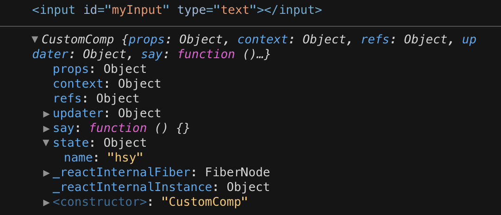

# React基础知识
> 收录了v15、v16通用的基础知识点（轻量级）。

[[toc]]

## 单向数据流
**单向数据流**：把整个react应用看作一个瀑布，那props就是瀑布水流的额外水源。
```jsx
<Component data={this.state.data}>
```
 - `Component`组件内部不知道`data`来源
 - 任何state总是 所属于某个特定的组件，而且 从该state派生的任何数据 或 UI（Any data or UI derived from that state）只能影响在它们下方的组件

## 受控组件与非受控组件
### 受控组件
由 `state` 管理 value，由 `事件处理函数` 去修改 state。

```jsx
<input 
    value="myValue"
    onChange={ev => this.setState({ myValue: ev.target.value })}
/ >
```
因为 `value` 受控于 state(`myValue`)，所以如果 `myValue` 不变化，则 `<input>` 的值就不会改变。

<!-- `<input type="text">`、`<textarea>`这类标签都接受一个`value`属性，可以利用它实现受控组件。 -->


### 非受控组件
定义一个`defaultValue`而不是`value`，来给组件赋予初始值，但**不控制后续更新**。

我们可以使用`ref`去获取DOM节点的value值。
> you can use a `ref` to get from values from the DOM.

```js
this.input = React.createRef()

console.log(this.input.current.value) // this.input.current拿到DOM节点

<input ref={this.input} />
```
由上，可以通过ref来读取当前input的value。

> 不需要像 **受控组件** 一样去定义state挂在value上、编写onChange事件去取value从而改变state

### 受控组件 vs 非受控组件
在受控组件中，表单数据是由`React组件`来管理

在非受控组件中，表单数据是由`DOM节点`来处理。


## React.Context
Context可以用来共享“全局”（一个组件树）的数据。

### 创建Context对象
```js
const MyContext = React.createContext();
```


### 定义Context.Provider
```jsx
<MyContext.Provider value={myValue}>
    /* ... */
</MyContext.Provider>
```
`Provider` 的 `value`属性 会传递给 `Consumer`组件。

> 当 value 值变化时，它内部的所有 `Consumer`组件 都会**重新渲染**。


### 订阅Context
订阅 context 的方法(3种)：
 - `<Context.Consumer>`
 - `Class.contextType`（Class组件）
 - `useContext`（Hook组件）
> 它们都不会受到中间组件 周期`shouldComponentUpdate` 的影响，即子组件依旧能触发更新。

#### <Context.Consumer>
```jsx
<MyContext.Consumer>
    {value => /* */}
</MyContext.Consumer>
```
指定子组件为一个 函数 。回调里的 `value` 对应最近的 `<Context.Provider>` 提供的 `value`。

#### Class.contextType
对于 Class组件，可以通过 `contextType`，可以将 `Context对象` 挂载到 class 上，以订阅 context 变更。

这样就可以通过 `this.context` 取到 `<Context.Provider>` 提供的 `value`

以下 Way1、Way2 是等价的：
```js
class MyClass extends React.Component {
  static contextType = MyContext;

  render() {
    let value = this.context;
  }
}
```


#### useContext
对于 函数式组件，可以通过 `useContext` 订阅到 context 变更：

```js
function ThemedButton(props) {
    const value = useContext(MyContext); // 把Context对象传入useContext
}
```

### 最佳实践
**withContext.js**：
```js
import React from 'react';

// 1. 创建 Context 对象
const Context = React.createContext({}); 

// 2. 获取 Provider、Consumer 组件
const { Provider, Consumer } = Context;

// 3. 定义 HOC，使用 Consumer 包裹
const withContext = Component => props => (
    <Consumer>{value => <Component {...props} {...value} />}</Consumer>
);

// 4. 导出 Provider组件 以及 HOC 组件，分别给 顶层组件、消费组件 使用。
export { Provider, withContext };
```

**app.js（顶层组件）**：
```js
import { Provider } from '@/components/withContext';

ReactDOM.render(
    <Provider
        value={{
            userInfo,
            currentId,
            setCurrentId
        }}>
        <Index />
    </Provider>,
    document.getElementById('app')
);
```

**my-component.js（消费组件）**：
```js
import { withContext } from '@/components/withContext';

function MyComponent(props) {} // 经过 HOC，props内可读取到 <Context.Provider> 提供的 value

export default withContext(MyComponent);
```


## 合成事件
**React合成事件** 返回的是 `SyntheticEvent实例`，能够**兼容不同浏览器**。

**触发时机：** 冒泡阶段（如：onClick、onChange）
> 如果**需要注册 捕获阶段 的事件处理函数**，可以在事件名后紧接`Capture`（如：onClickCapture）

### 合成事件、原生事件的区别 
| 特点 | 原生事件 | 合成事件 |
| --- | ------- | ------ |
| 兼容性 | 不兼容跨浏览器 | 返回的是`SyntheticEvent实例`，能够兼容不同浏览器 |
| 绑定事件处理函数 | 传入字符串 | 传入函数 |
| 阻止默认行为 | 返回`false` | 显式调用 `ev.preventDefault()` |

### SyntheticEvent实例
 - 兼容所有浏览器
 - 拥有原生事件接口（`stopPropagation` 、 `preventDefault`）
 - 由于合并而来，可能会被重用 **（即在事件回调触发完毕后，所有属性都会失效）**


## 触发Render的方式
 - 首次加载（`ReactDOM.render()`）
 - setState()
 - props发生改变
 - forceUpdate()

其中，`setState`、`props`发生改变都可以通过 `shouldComponentUpdate` 决定 **是否执行render**。
> 注意：`shouldComponentUpdate` 只能决定是否执行 render ，但数据依然是会被更新的


## 函数内部的this绑定
当调用一个组件内部 且 没有绑定到组件 `this` 上的方法时，这个方法内部读取到的 `this` 将为 `undefined`。
### 利用bind
```jsx
class HomeIndex extends Component {
    constructor(props) {
        super(props);
        // 调用 .bind，将 addCount 绑定到 this 上
        this.addCount = this.addCount.bind(this);
    }

    addCount() {}

    render() {
        return <button onClick={this.addCount}>Click</button>;
    }
}
```

### 利用箭头函数
```jsx
class HomeIndex extends Component {
    constructor(props) {
        super(props);
    }

    // 利用 箭头函数，将 addCount 绑定到 this 上
    addCount = () => {}

    render() {
        return <button onClick={this.addCount}>Click</button>;
    }
}
```

## 为什么React要用className？
因为`class`在JavaScript里是关键字，而JSX是JavaScript的扩展。

## ref对象
ref对象：是[可变的](/skill/js/other/#可变（mutable）和不可变（immutable）对象的区别)对象（每次都是修改其下的`.current`属性），并且在整个生命周期内保持不变。

### 通过createRef和useRef来创建ref对象
这两种方式都可以创建ref对象，但有区别。

#### createRef
一般我们会在`constructor`里定义ref对象：
```js
class MyComponent extends React.Component {
  constructor(props) {
    super(props);

    this.inputRef = React.createRef(); // <-- 通过createRef创建ref对象
  }
}
```
也正是React的生命周期，让`createRef`只执行了一次。

但实际上，每次调用它都会**重新生成一个ref对象**（引用地址会发生改变），[What's the difference between useRef and createRef?](https://stackoverflow.com/questions/54620698/whats-the-difference-between-useref-and-createref)

由于引用地址发生变化，对于函数式组件就需要使用`useRef`

#### useRef
```js
function App() {
    const inputRef = useRef(null); // <-- 通过useRef创建ref对象
}
```
在函数式组件内，通过`useRef`返回的ref对象可以在整个生命周期内保持不变。


#### 结论
createRef：
 - 一般用于`Class Component`
 - 每次重新渲染都会使得引用地址发生变化（在生命周期内定义时除外）

useRef：
 - 一般用于`函数式组件`
 - 每次重新渲染不会导致引用地址发生改变

### ref的作用
 - 当`ref`用于HTML元素时，其`.current`属性为`对应的DOM元素`
 - 当`ref`用于`Class Component`时，其`.current`属性为`组件的实例`

以下打印了两者的`.current`属性：

> 对于`Class Component`需要注意：方法要bind到组件实例上，否则无法通过`.current`读取到方法（若是箭头函数写法则可忽略）

### 将ref作用于函数式组件（forwardRef搭配useImperativeHandle）
若ref用于`函数式组件`，因为它没有实例，react会提示你用`forwardRef`

那就需要将`forwardRef`搭配`useImperativeHandle`使用，来转发这个ref

但最终，还是需要让ref来指向一个DOM元素或者`Class Component`。

#### 转发ref
假设有一个`函数式组件CustomInput`

```js
const CustomInput = forwardRef((props, ref) => {
    const inputRef = useRef();
    
    useImperativeHandle(ref, () => 
        // 这个返回的对象表示：向父组件暴露的属性
        ({
            focus: () => {
                inputRef.current.focus();
            }
        })
    );

    // 最终还是需要让ref来指向一个DOM元素（或一个Class Component）
    return <input ref={inputRef} />;
})
```
这样，当父组件（即：引用`<CustomInput ref={myRef} />`的那个组件）就可以通过`myRef.current`来拿到`CustomInput`里的input元素了。

## ReactDOM.createPortal
> [React Portals](https://reactjs.org/docs/portals.html)

看官方文档上的意思，它可以在dom上挂载“表现在外层”，但它事件冒泡还是能够在原来声明处被父容器捕获到


