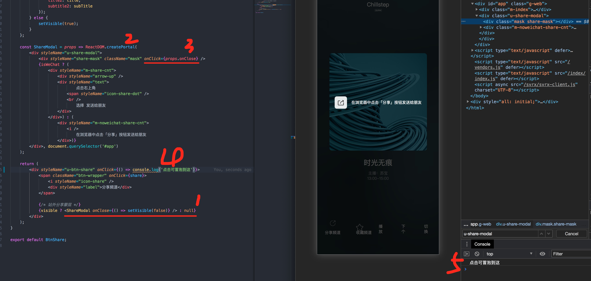

# React基础知识
> 收录了v15、v16通用的基础知识点（轻量级）。

[[toc]]

## React.createElement
`React.createElement` 可以创建并返回指定类型的 **新React元素**。
> 使用 `JSX` 编写的代码 会被 Babel 转换成调用 `React.createElement` 的形式。


### 用法
```js
React.createElement(
    type, // 可以是`div`，也可以是 React组件（React底层 通过 “首字母大小写” 区分）
    [props],
    [...children]
)
```

### 问题
#### React组件首字母大写
因为，`React.createElement` 对于 `type` 字段的 “大小写” 会 **会用来判断是 HTML标签，还是 React组件。**
> 否则会在 Babel转译 过程就开始错了。

#### 为什么要import React from 'react'
因为 React组件是 `JSX` 写的，而 `JSX` 本质上是 `React.createElement` 的语法糖。
> 所以使用了 JSX，就是在使用 React，所以就要引入 react


## 受控组件与非受控组件
### 受控组件
由 `state` 管理 value，由 `事件处理函数` 去修改 state。

```jsx
<input 
    value="myValue"
    onChange={ev => this.setState({ myValue: ev.target.value })}
/ >
```
因为 `value` 受控于 state(`myValue`)，所以如果 `myValue` 不变化，则 `<input>` 的值就不会改变。

<!-- `<input type="text">`、`<textarea>`这类标签都接受一个`value`属性，可以利用它实现受控组件。 -->


### 非受控组件
定义一个`defaultValue`而不是`value`，来给组件赋予初始值，但**不控制后续更新**。

我们可以使用`ref`去获取DOM节点的value值。
> you can use a `ref` to get from values from the DOM.

```js
this.input = React.createRef()

console.log(this.input.current.value) // this.input.current拿到DOM节点

<input ref={this.input} />
```
由上，可以通过ref来读取当前input的value。

> 不需要像 **受控组件** 一样去定义state挂在value上、编写onChange事件去取value从而改变state

### 受控组件 vs 非受控组件
在受控组件中，表单数据是由`React组件`来管理

在非受控组件中，表单数据是由`DOM节点`来处理。


## 触发Render的方式
 - 执行 `ReactDOM.render`
 - state、props发生改变（但可以通过 `shouldComponentUpdate` 返回 `false` 来阻止render；值依旧是会改变的）
 - forceUpdate


## 为什么React要用className？
因为`class`在JavaScript里是关键字，而JSX是JavaScript的扩展。

## ReactDOM.createPortal
> [React Portals](https://reactjs.org/docs/portals.html)

特点：
 - 可以挂载在 根节点 的直接下一层
 - “事件冒泡”是按照声明处位置的规则



## 不建议直接修改this.state
会导致 `PureComponent` 可能不会触发重新渲染。

```js
const newObj = this.state.obj;
newObj.id = 2;

this.setState({ obj: newObj }); // 由于 newObj、obj 引用地址相同，shadowEqual结果相同
```

## shallowEqual（浅比较）、deepEqual（深比较）
> 不管浅、深比较，步骤大致相同（除了对比 `key` 的 `value` 这一步）。

 1. 先比较 “基本数据类型”（通过 `is`）

 2. 比较两者是否为 `null`

 3. 比较两者 key值长度

 4. 遍历其中一个 obj 的 key（基准是另外一个 obj）
    - 检查 key 是否存在于 基准对象
    - 浅比较：**判断两个对象对应 key 的 value 是否相等**（通过 `is`）
    - 深比较：**判断两个对象对应 key 的 value 是否相等**（通过 递归调用`equal`）

```js
// is 方法 和 === 相比：修复了 NaN 和 +-0 的情况。
// 针对“基本数据类型”的判定是准确的
function is(x, y) {
    // 引用 / 值 相等
    if (x === y) {
        // 处理 +0 === 0 的情况（我们希望返回false）
        return x !== 0 || 1 / x === 1 / y
    } else {
        // 处理 NaN === NaN（我们希望返回 true）
        return x !== x && y !== y
    }
}

export default function equal(objA, objB) {
    // 1. 先比较 “基本数据类型 ” 的值（通过 is）
    // 对于 “引用数据类型”，这里会返回 false（因为误判，所以下面要“补充相关判定逻辑”）
    if (is(objA, objB)) return true;

    // --- 过滤掉 “基本数据类型” 后，接下来就是对象的比较 ---

    // 2. 比较两者是否为 null
    if (objA === null || objB === null) return false;

    // 3. 比较两者 key值长度
    if (Object.keys(objA).length !== Object.keys(objB).length) return false;

    // 4. 遍历其中一个 obj 的 key（基准是另外一个 obj）
    for (var key in objA) {
        // 5. 检查是否存在于 基准对象
        if (!objB.hasOwnProperty(key)) return false;

        // shallowEqual（浅比较）
        // 6. 判断两个对象对应 key 的 value
        // 【注意】与 “深比较” 的区别在这里，只比较一次，不用递归比较
        if (!is(objA[key], obj[key])) return false;

        // deepEqual（深比较）
        // 6. 递归调用，判断两对象对应 key 的 value
        // if (!equal(objA[key], objB[key])) return false;
    }

    return true;
}
```

## 为什么React组件的方法需要bind
**原因：“隐式绑定” 导致了 “React组件的方法” 丢失上下文**。
> 将 方法 作为 参数 传递给另一个函数时，会丢失上下文

```jsx
// 现象：“生命周期”、“render”、“生命周期内直接调用 `this.addCount`” 都可以正常读取 `this`。
class Home extends Component {
    constructor(props) {
        super(props);
        this.state = {
            name: 'heshiyu'
        }
    }

    componentDidMount() {
        // 生命周期内 可读取到 this
        console.log(this.state, 1);
        
        // 这样也可以读取到 this
        this.addCount();
    }

    addCount() {
        console.log(this.state, 2);
    }

    render() {
        // render内 可读取到 this
        console.log(this.state, 3); 
        return <button onClick={this.addCount}>Click</button>;
    }
}
```

经过 JSX编译 后：
```js
const Home = function (_Component) {
  _inherits(Deom, _Component);
  function Home() {
    _classCallCheck(this, Home);
    return  _possibleConstructorReturn(this, _Component.apply(this, arguments));
  }
  Home.prototype.addCount = function addCount() {
    console.log(this);
  }
  Home.prototype.render = function render() {
    this.addCount();
    // <-- 经过 JSX，会编译成 React.createElement
    return __WEBPACK_IMPORTED_MODULE_0_react___default.a.createElement(
      'button',
      // ↓ 注意这里，直接将 this.addCount 传给 onClick
      { onClick: this.addCount },
      'Click',
    )
  }
  return Demo;
}(__WEBPACK_IMPORTED_MODULE_0_react__["Component"])
```

等价于：
```js
var age = 1;
var obj = {
    age: 2,
    display: function () {
        console.log(this.age);
    }
}
function createElement({ onClick }){
   onClick(); // 实际上执行的是 onClick
}
// obj.display 以 “参数” 的形式传入 createElement，会丢失上下文
createElement({
    onClick: obj.display
});

// 输出: 1
```

### 解决方式
 1. 箭头函数
 2. `constructor` 内绑定
 3. `render` 内绑定（不推荐）


## extends
React 可以通过 `extends` 来继承另一个 class组件。

**特点：同名方法（包括生命周期）会被覆盖，不冲突的保留**

另外，在子组件调用父组件方法时，不用关心子组件的**this指向**。

> [Demo](https://jsbin.com/xixewox/edit?html,js,console,output)

## 参考链接
 - [React基础12 React中的this绑定](https://duola8789.github.io/2019/05/12/01%20%E5%89%8D%E7%AB%AF%E7%AC%94%E8%AE%B0/03%20React/React01%20%E5%9F%BA%E7%A1%80/React%E5%9F%BA%E7%A1%8012%20React%E4%B8%AD%E7%9A%84this%E7%BB%91%E5%AE%9A/)
 