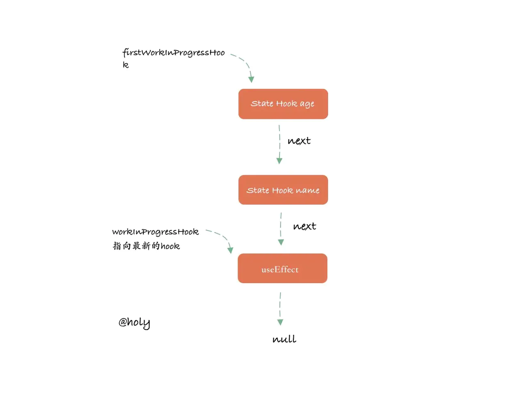
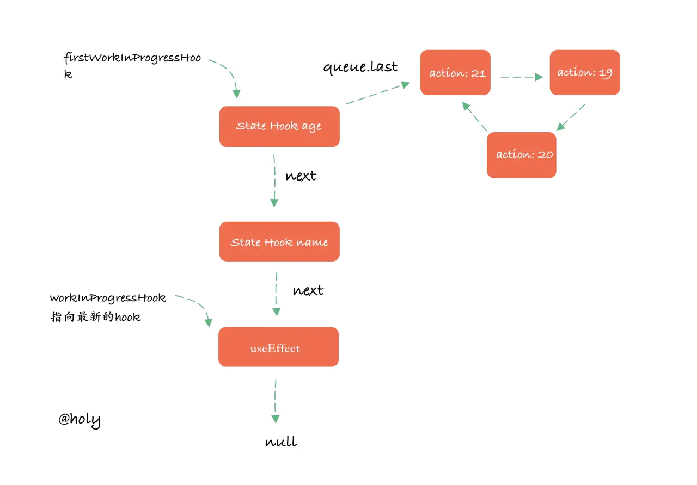
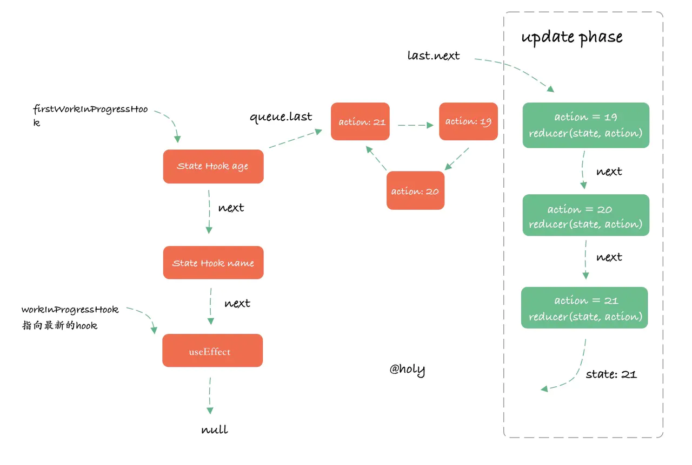

# React16基础知识
> react 16

[[toc]]

## 新特性
 - [生命周期](/skill/react/life-cycle/)
    - 设为`UN_SAFE`：`componentWillMount`、`componentWillUpdate`、`componentWillReceiveProps`
    - 推荐使用：`getDerivedStateFromProps`、`getSnapshotBeforeUpdate`
 - [Hooks](/skill/react/hooks/)
    - 主要是解决`状态逻辑复用问题`，将组件的 UI 与 状态 分离。
 - **Context API**
    - 新的Context API采用 声明式写法，并且可以透过 **`shouldComponentUpdate` 返回 false 的组件**继续向下传播
 - **代码分割**
    - `React.lazy` 提供了`动态 import 组件`的能力，实现代码分割
    - `Suspense` 作用：在等待组件时 suspend（暂停）渲染，并显示加载标识
 - **错误处理机制**
    - 新增生命周期`componentDidCatch`


## useCallback、useMemo的区别
`useCallback`一般会用来缓存函数的引用；`useMemo`缓存计算数据的值。

> 它们都是根据 `依赖项` 去进行缓存。前者是缓存callback，后者是缓存callback执行后返回的值。

### useCallback
用法：
```js
const handleCount = useCallback(() => setCount(count => count + 1), []) // 依赖项为空代表这个函数在组件的生命周期内都会 **永久缓存**
```

### useMemo
用法：
```js
const calcValue = useMemo(() => Array(10000).fill('').map(v => v), [count]); // 当count改变时，重新计算calcValue的值
```
> `useMemo`一般会 用来去缓存需要进行大量计算量的函数。

## 通过Hooks获取上一个指定的prop值
```js
// usePrevious.js
import { useRef, useEffect } from 'react';

const usePrevious = value => {
    const ref = useRef();
    useEffect(() => {
        ref.current = value;
    });

    return ref.current;
}
```

使用时：
```js
const prevCalcValue = usePrevious(calcValue);
```


## 函数组件 与 class组件
|方面| 函数组件 | class组件 |
|:--- |:---|:---|
| 定义方式 | 被定义为一个**纯函数**。<br />它接收一个props对象，并返回`React Element` | 被定义为一个**class**。<br />它继承于`React.Component`，并 **通过render函数** 返回`React Element` |
| render行为<br /> | 每次组件触发更新：<br />**拥有完全独立的函数作用域**，<br />返回相应的`React Element` | 每次组件触发更新：<br /> **调用`render()`**，<br />返回`React Element` <br />（对于同一处调用的class组件，**只有一个class实例**被创建/使用，后续的render**只会改变this.props、this.state的值**） |
| 状态 | 没有自身的state。<br />（**在v16.8添加了hooks，可以使用useState钩子去管理state**） | 拥有自身的state |
| 生命周期 | 没有生命周期。<br />（**在v16.8后可通过`useEffect`去模拟部分生命周期**） | 有 |

<!-- **定义方式**：
 - `函数组件`被定义为一个纯函数，它接收一个props对象，并返回一个`React Element`
 - `class组件`被定义为一个class，它继承于`React.Component`，并**通过render函数**去返回`React Element`

**render行为**：
 - 函数组件：每次组件触发更新，都会 **拥有完全独立的函数作用域**，返回相应的`React Element`
 - class组件：每次组件触发更新，都会调用`render()`，返回`React Element`
    - 对于同一处调用的class组件，**只有一个class实例**被创建/使用，后续的render**只会改变this.props、this.state的值**

**状态**：
 - 函数组件：没有自身的内部状态state。**在react16.8添加了hooks，可以使用useState钩子去管理state；使用useEffect钩子去执行副作用**
 - class组件：拥有自身内部state

**生命周期**：
 - 函数组件：没有生命周期。v16.8后可通过`useEffect`去模拟部分生命周期
 - class组件：有 -->

## React Hooks的优缺点
**优点：**
 - 状态逻辑复用
    - 通过组合`useState`、`useEffect`等去实现状态逻辑复用、避免分散在各个生命周期中
 - 函数式编程

**缺点：**
 - 调用顺序：
    - 要在组件的最顶层使用，**不能在class组件、循环、条件、回调内使用Hooks**
 - 依赖声明的关键性
    - 部分Hooks**需要根据依赖来判断是否需要重新渲染**

## 函数式编程
`函数式编程`的特点：
 - 函数是第一等公民
 - 没有副作用（不会影响外部变量）
 - 引用透明（输入相同，输出也相同）

## Hooks的状态管理
```js
function PersionInfo ({initialAge,initialName}) {
    const [age, setAge] = useState(initialAge);
    const [name, setName] = useState(initialName);

    return (
        <>
            Age: {age}, Name: {name}
            <button onClick={() => setAge(age + 1)}>Growing up</button>
        </>
    );
}
```
问题：
 - 多个`useState`，如何区分这两个状态？
 - 每次重新渲染，如何获取最新状态？
 - 为什么不能在 **循环、条件、嵌套** 里用 Hooks？
 - Hook的状态存在哪？


```ts
export type Hook = {
    memoizedState: any,

    baseState: any,
    baseUpdate: Update<any, any> | null,
    queue: UpdateQueue<any, any> | null,

    next: Hook | null, // 指向下一个Hook
}
```
**React认为Hook是一个链表（具有`next`属性）。** 所以我们在组件里用到的Hooks是通过 **链表** 连接起来的（上一个Hook的`next`指向下一个Hook），这些Hooks节点利用单链表的结构串联在一起。


#### 多个`useState`，如何区分两个状态？
答案：初次渲染时，每次调用Hooks方法，就会调用`mountState`。它内部会通过`mountWorkInProgressHook`去创建一个 Hook节点 ，并把它添加到 **Hooks链表** 上。




#### 每次重新渲染，如何获取最新状态？
答案：每个Hook节点都维护自身的 “`更新链表（queue）`”。通过queue来存放所有的历史更新操作。

在重新渲染时，会从 “`更新链表（queue）`” 的表头开始遍历，执行每一次更新，最后将最新的状态来返回，以保证每次重新渲染都能获得最新状态。





#### 为什么不能在嵌套、条件、循环里用Hooks
答案：重新渲染时，每次调用Hooks方法，就会调用`updateState`。它内部会通过`updateWorkInProgressHook`去获取当前对应的链表节点（基于 `初次渲染时生成的 Hooks链表`的next）。

如果在条件语句中使用Hook，若不符合条件未执行对应`useState`，就会导致从 Hooks链表 中获取信息不正确。
> 初次渲染：state1 => hook1, state2 => hook2, state3 => hook3...
>
> 再次渲染：state1 => hook1, state3 => hooks2，乱套！

#### Hook的状态存在哪？
答案：Hooks 链表会挂载到`FiberNode.memoizedState`
> 每个Fiber就是一个Virtual DOM，每个组件就对应Fiber树上对应的Fiber节点。

<!-- 


 - 不要在“循环、条件、嵌套”里使用Hooks
    - Don't call Hooks inside loops, conditions, or nested functions
 - 只在React 函数组件中使用Hooks
    - Only Call Hooks from React Functions


维护了一个指针`cursor`指向一个数组，如果 `render`函数内部 的调用顺序改变，`cursor`将不会匹配到正确的数据 


为什么需要确保 Hook 在每次渲染中都按照同样的顺序被调用？

因为memoizedState是按照Hooks定义的顺序来存放数据的，只能在最顶层使用Hook、不要在循环、条件、嵌套中调用Hooks。
> 页面初次渲染，每一个useState执行时都会将对应的setState绑定到对应的位置：
```js
function useState(initialValue: any) {
    memoizedState[cursor] = memoizedState[cursor] || initialValue
    const currentCursor = cursor  // <-- 记住cursor

    function setState(newState: any) {
        memoizedState[currentCursor] = newState // <-- 利用闭包，获得对应cursor
        cursor = 0
        render(<App />, document.getElementById('root'))
    }
    return [memoizedState[cursor++], setState] // 返回当前 state，并把 cursor 加 1
}
```


Hooks是作为一个单向链表存在。React维护两个Hook相关的链表：`current hook list`、`work in progress hook list`

React会在重复渲染时记住它的值，并提供最新的值给函数


useEffect会在每次渲染后都执行，React会在重新渲染之前，执行当前effect之前对上一个effect进行清除。
> 每次重新渲染都会生成新的effect替换掉之前的。（每个effect“属于”一次特定的渲染）
 -->


## 参考链接
 - [useCallback、useMemo 分析 & 差别](https://juejin.im/post/5dd64ae6f265da478b00e639)
 - [剖析useState的执行过程](https://zhuanlan.zhihu.com/p/64354455)
 - [React中useEffect的源码解读](https://www.cnblogs.com/vvjiang/p/12160791.html)
 - [React Hooks源码解析，原来这么简单～](https://juejin.im/post/5e5e66d6e51d4526e651c796#comment)
 - [React Hooks 进阶](https://github.com/SunShinewyf/issue-blog/issues/50)