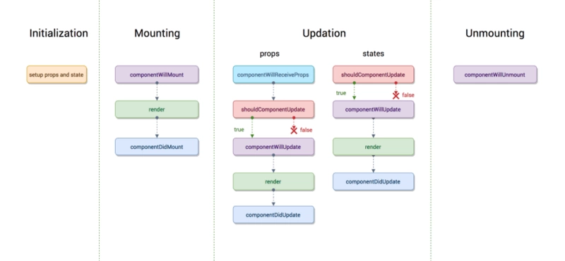
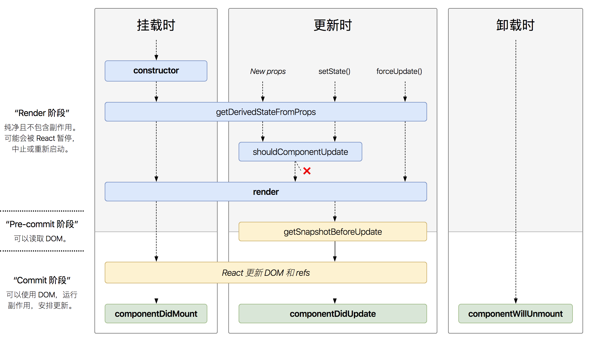

# 生命周期

## React 16以前

### 挂载
constructor -> componentWillMount -> render -> componentDidMount

### 更新
#### props值发生更新
componentWillReceiveProps -> shouldComponentUpdate -> componentWillUpdate -> render -> componentDidUpdate

#### state值发生更新
shouldComponentUpdate -> componentWillUpdate -> render -> componentDidUpdate

### 卸载
componentWillUnmount

## React 16及以后

### 挂载
constructor -> getDerivedStateFromProps -> render -> componentDidMount

### 更新
#### props、state值发生更新
getDerivedStateFromProps -> shouldComponentUpdate -> render -> getSnapshotBeforeUpdate -> componentDidUpdate

### forceUpdate()调用
getDerivedStateFromProps -> render -> getSnapshotBeforeUpdate -> componentDidUpdate

### 卸载
componentWillUnmount

## 删除三个生命周期钩子的原因
标记为不安全的3个生命周期钩子：`componentWillMount`、`componentWillReceiveProps`、`componentWillUpdate`。

官方解释原因有二：
 - 原因一：为未来做准备。
react v17会推出`Async Rendering`（即生命周期可被打断）。其中被打断的阶段是在`virtual dom构建阶段`，如果这三个不安全的生命周期一旦被打断，就**不能保证组件更新只会触发一次**了。

 - 原因二：错误使用。
很多react用户都存在出错误地使用这三个生命周期，导致之后的异步渲染产生极大的性能损耗。（如：在`componentWillMount`时请求接口，因为会立即触发render，导致首屏数据为空）

## 取代的两个生命周期
### getDerivedStateFromProps
执行时机：首次挂载、每次更新都会执行

使用：返回一个对象来更新当前state值，不更新时返回null

> 注意：因为是静态方法，所以不能用this

### getSnapshotBeforeUpdate
执行时机：每次DOM真正渲染前

## 生命周期说明
### shouldComponentUpdate(nextProps, nextState)
可以通过`shouldComponentUpdate`比较新、旧的props、state来决定**是否执行render方法**。（**但传下来的props依然是会更新的**）

## 参考链接
[React新生命周期图谱（官方文档）](http://projects.wojtekmaj.pl/react-lifecycle-methods-diagram/)

[React新生命周期-三个钩子删除原因](https://blog.csdn.net/zhangwx6/article/details/81667631)