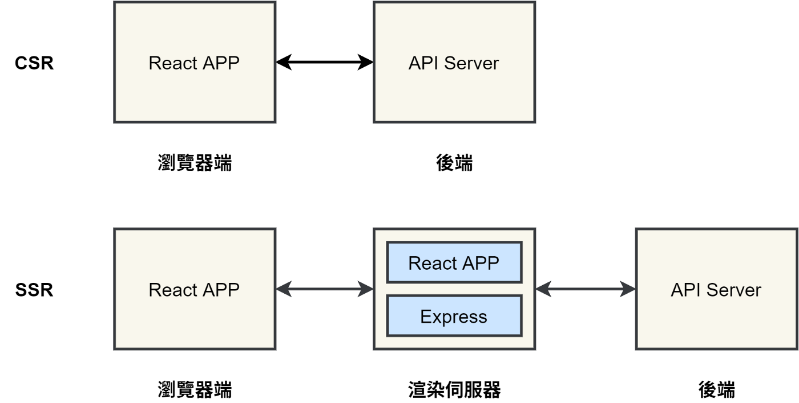
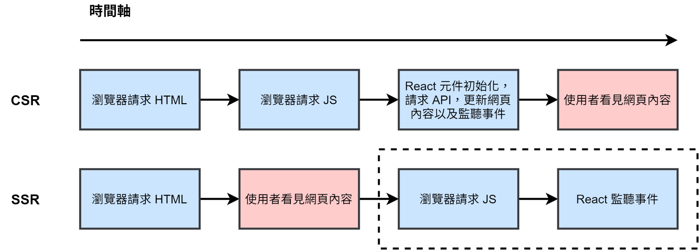

# React SSR

### CSR
用户请求服务器，服务器返回HTML文件。解析HTML后，需要加载执行其中的js，通过js渲染生成页面。同时js会完成交互事件绑定。

### SSR
用户请求服务器，服务器上直接生成HTML内容（不包括交互能力）并返回给浏览器。





不同点在于，SSR多了一个“渲染服务器”。它会在用户第一次请求HTML时，将内容事先渲染到HTML中，所以用户首屏就能看到一个包含完整内容的网页。

服务端路由：路由分析。服务端通过请求路径，找到路由组件，从而判断要展示什么样的页面

客户端路由：客户端拿到bundle.js，根据浏览器中的地址，找到路由组件，在浏览器上再判断当前要展示的组件，重新进行一次客户端渲染

### 服务端路由
`<StaticRouter>`：react-router专门为服务端渲染而提供的一个路由组件。

通过传入的location来分析当前需要的路由组件

```js
const App = () => {
  return 
    <Provider store={store}>
      <StaticRouter location={req.path} context={context}>
        <div>
          <Route path='/' component={Home}>
        </div>
      </StaticRouter>
    </Provider>
}

Return ReactDom.renderToString(<App/>)
```
最后通过`renderToString`将组件转成对应的HTML字符串。
> `renderToString`不会处理任何event listener，所以不管怎么点击按钮都没反应

### 客户端路由
`<BrowserRouter>`能匹配到当前浏览器所访问的路由组件

最后通过`render`挂载。
```js
const App = () => {
  return (
    <Provider store={store}>
      <BrowserRouter>
        <div>
          <Route path='/' component={Home}>
  		</div>
      </BrowserRouter>
    </Provider>
  )
}

ReactDom.render(<App/>, document.querySelector('#root'))
```

服务端渲染、客户端渲染的入口不一样，webpack配置也要分开：`webpack.client.js`、`webpack.server.js`。

### Node只是中间层
在SSR架构中，一般Node**仅用来做React代码的服务端渲染**，而Node需要的数据通常由API服务器单独提供。