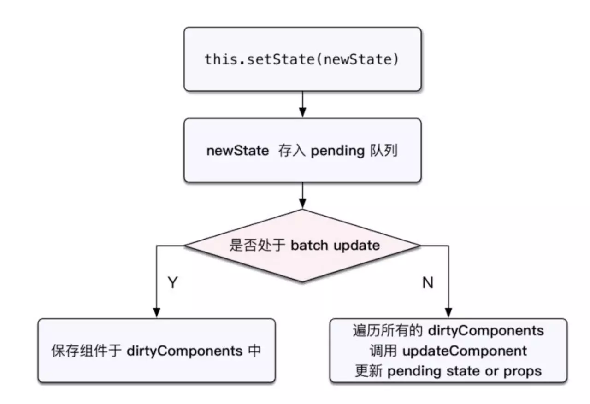

# setState
> setState是同步的还是异步的？在什么场景下是同步？什么场景下是异步？

## setState的更新机制
当调用`setState`时：
 - 把 `newState` 放入到 `当前组件实例` 下的更新队列

 - 判断：是否处于 `批量更新` 的过程
    - 若是，把 组件实例 push到 `dirtyComponents` 中，等待更新

 - 否则，进行 `批量更新`，设置 状态标识位，调用 `transaction.perform()`

 - 遍历`dirtyComponents`，调用`updateComponent`

 - 事务结束时，会将 所有临时state 合并、计算出最新state，调用生命周期方法来更新组件，`isBatchingUpdates = false`

 

:::tip
**事务（Transaction）** 把要执行的 method 用 Wrapper 封装起来，提供一个perform方法来调用method。
> 在Wrapper里定义 `initialize` 和 `close` 方法：它们 **分别** 会在 `指定方法` 执行前、执行后执行。
```
* <pre>
 *                       wrappers (injected at creation time)
 *                                      +        +
 *                                      |        |
 *                    +-----------------|--------|--------------+
 *                    |                 v        |              |
 *                    |      +---------------+   |              |
 *                    |   +--|    wrapper1   |---|----+         |
 *                    |   |  +---------------+   v    |         |
 *                    |   |          +-------------+  |         |
 *                    |   |     +----|   wrapper2  |--------+   |
 *                    |   |     |    +-------------+  |     |   |
 *                    |   |     |                     |     |   |
 *                    |   v     v                     v     v   | wrapper
 *                    | +---+ +---+   +---------+   +---+ +---+ | invariants
 * perform(anyMethod) | |   | |   |   |         |   |   | |   | | maintained
 * +----------------->|-|---|-|---|-->|anyMethod|---|---|-|---|-|-------->
 *                    | |   | |   |   |         |   |   | |   | |
 *                    | |   | |   |   |         |   |   | |   | |
 *                    | |   | |   |   |         |   |   | |   | |
 *                    | +---+ +---+   +---------+   +---+ +---+ |
 *                    |  initialize                    close    |
 *                    +-----------------------------------------+
 * </pre>
```
:::

## setState是同步的
`setState`本身的执行过程是**同步**的。
> 因为 **`合成事件、生命周期函数` 的执行顺序 在更新之前**，不能直接拿到更新后的值，形成了“异步”。

| 类型 | 方式 | 说明 |
| ----- |:---:|:---:|
| **合成事件**、<br/>**生命周期函数**<br/>（除了`componentDidUpdate`） | 会触发一个大事务 | 异步 |
| **原生事件**、<br/>**setTimeout** | 执行时 **不存在大事务**，会立即发起新的批量更新 | 同步 |

## 批量更新策略
现象：**在合成事件（或生命周期钩子函数）中，对同一个state进行多次调用setState，只执行最后一次**

原因：当调用`setState`时，react内部会创建一个更新队列（`updateQueue`）。在最终的performWork，相同key值会被覆盖，只有最后一次生效。

目的：**避免不必要的重新渲染**，从而提升性能。
```js
class App extends Component {

  state = { val: 0 }

  batchUpdates = () => {
    this.setState({ val: this.state.val + 1 })
    this.setState({ val: this.state.val + 1 })
    this.setState({ val: this.state.val + 1 })
 }

  render() {
    return (
      <div onClick={this.batchUpdates}>
        {`Counter is ${this.state.val}`} // 1
      </div>
    )
  }
}
```


## 总结
 - setState是异步还是同步的？
    - 同步的。但有时（合成事件、生命周期）表现出来是异步。

 - 为什么在setTimeout方法中调用setState表现出来是同步？
    - 因为setTimeout已经完成了原组件的更新流程，不会放入`dirtyComponents`

 - setState中传入一个Function，为何里面的state值是最新的？
    - 函数接收的state是上轮更新过的state。
    ```js
    this.setState(prevState => ({ count: prevState.count + 1 }))
    ```


## 参考链接
 - [【React进阶系列】 setState机制](https://segmentfault.com/a/1190000016805467#item-7)
 - [把setState整明白](https://www.jianshu.com/p/885743d7a094)
 - [React - setState源码分析（小白可读）](https://juejin.im/post/5aa25967518825558251f61f#heading-6)