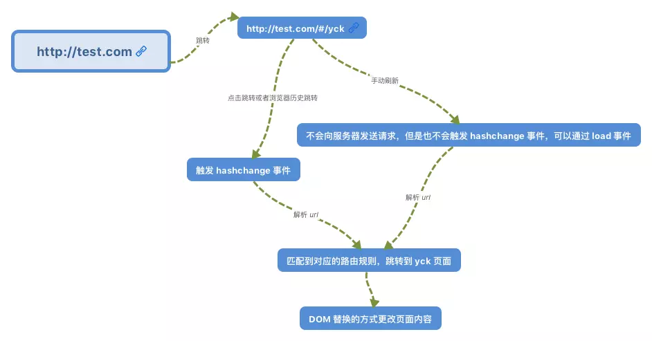
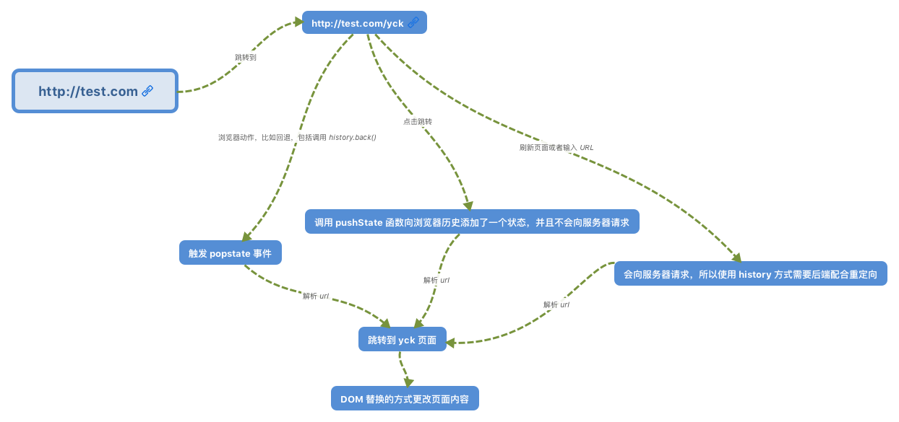

# Vue Router实现思路
前端路由的本质：`监听 URL 的变化`，然后`匹配路由规则`，`渲染相应的页面`，并且无须刷新。

[[toc]]

## 单页面路由的两种实现方式
### hash 模式
 - `#` 后面的哈希值发生变化（**不会向服务器请求数据**）
 - 触发 `hashchange`，解析url
 - 匹配对应的路由规则
 - 跳转页面

>  `手动刷新`不会向服务器发送请求，也不会触发 `hashchange` 事件，但可以通过load事件解析url



### history 模式
`history`是HTML5 新推出的功能，比之 Hash URL 更加美观。


 - 跳转时，调用`pushState`，创建新的历史记录条目，不会向服务器请求
 - 手动刷新，**会向服务器重新请求**
 - 回退（包括`histroy.back()`），会触发`popState`

## VueRouter 的大致步骤
```js
// ① 插件安装
Vue.use(VueRouter)

// ② VueRouter实例化
const router = new VueRouter({
    // ③ 指定路由方式
    mode: 'history',
    // ④ 路由匹配规则，生成路由映射表（该表可通过“构造函数内的路由匹配对象”来访问）
    routes: []
})

router.beforeEach((to, from, next) => {})
```


## 插件安装
调用 `Vue.use(VueRouter)`（让 `VueRouter` 可以使用 `Vue`），然后 `Vue` 会调用 `VueRouter` 的 `install` 函数。
 > 在`install`函数中，做了两件事：1、**给组件混入钩子函数**（`beforeCreate`、`destroyed`）；2、**全局注册两个路由组件**（`RouterView`、`RouterLink`）。


## VueRouter实例化
安装VueRouter插件后，会实例化`VueRouter`。

> VueRouter的构造函数中，会创建一个 **路由匹配对象**（`this.matcher`），并且根据 `mode` 采取不同的路由方式：`hash`、`history`。

**路由匹配对象**的作用：有权使用 **路由映射表** 的几个对象。

### 路由映射表
路由映射表：根据用户配置的路由规则（`path`、`name`、`children`），遍历生成的一份映射表（每条规则，就对应生成一条路由记录）。

> 路由映射表里的一些个对象：`pathList`、`pathMap`、`nameMap`。

## 路由初始化（beforeCreate）
路由初始化：当根组件调用 `beforeCreate` 时，会进行**路由跳转、改变URL**，然后**渲染对应的组件**。

### 路由跳转
获取当前路由所匹配的信息。

核心：**判断需要跳转的路由是否存在于记录中**，然后执行**各种导航守卫函数**，最后完成 `URL` 的改变、组件的渲染。

#### 导航守卫
 - 导航被触发

 - 在 **失活组件** 调用离开守卫

 - 调用 全局 `beforeEach`
    -   ```js
        router.beforeEach((to, from, next))
        ```

 - 在 组件内 调用`beforeRouteUpdate`
    -  ```js
        const Foo = {
            template: `...`,
            beforeRouteEnter (to, from, next) {...},
            beforeRouteUpdate (to, from, next) {...} // ← 调用它
        }
        ```

 - 在 路由配置里 调用`beforeEnter`
    -  ```js
        const router = new VueRouter({
            routes: [
                {
                    path: '/foo',
                    component: Foo,
                    beforeEnter: (to, from ,next) => {...}
                }
            ]
        })
        ```

 - 解析异步组件

 - 在 组件内 调用`beforeRouteEnter`
    -   ```js
        const Foo = {
            template: `...`,
            beforeRouteEnter (to, from, next) {...}, // ← 调用它
            beforeRouteUpdate (to, from, next) {...}
        }
        ```

 - 调用 全局 `beforeResolve` 导航守卫钩子
    -   ```js
        router.beforeResolve((to, from, next))
        ```

 - 调用 全局 `afterEach` 导航守卫钩子

 - 触发组件的渲染
