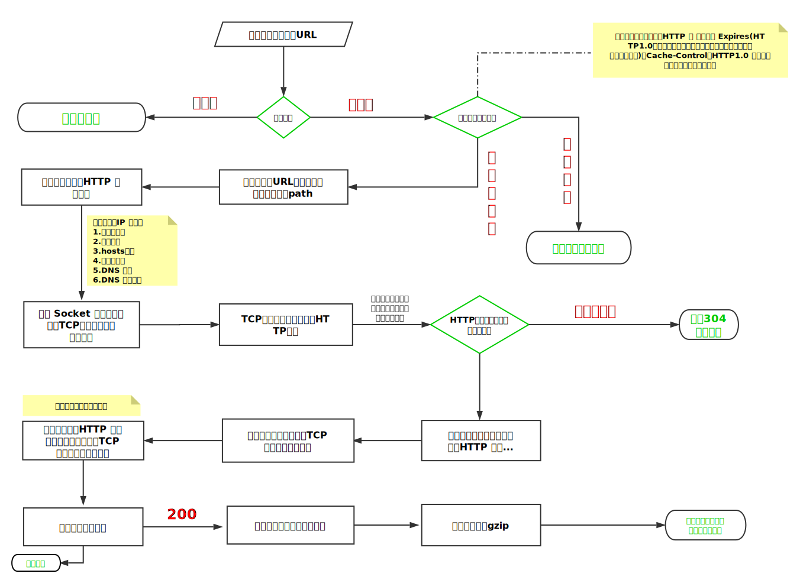

# 浏览器
[[toc]]

## 浏览器内核
 - Trident （IE内核）
 - Gecko （Firefox内核）
 - Presto（Opera，已废弃）
 - Webkit（Safari、Chrome28前）
 - Blink（Chrome28后）

## 浏览器缓存
先检查 **强缓存**，再检 查**协商缓存**

在上一次请求成功之后，再次对同一个资源进行请求时：
  - 浏览器会先检查是否命中 **强缓存**，主要是看`Expires`和`Cache-control`（分别代表资源的有效期以及缓存策略）
    - 若命中 **强缓存** ，直接从本地磁盘获取资源（**200**）
    - 若没有命中 **强缓存**，会组装请求报文，与服务器建立TCP链接，检查是否命中协商缓存。请求头会通过`If-Modified-Since`、`If-None-Match`携带`Last-Modified`、`ETag`的值。
        - 若命中 **协商缓存**，浏览器会组装响应报文，状态码为 **304**，让浏览器本地取资源即可。
        - 没有命中 **协商缓存**，响应全新的资源内容给浏览器，状态码为 **200**

> 若用户访问的资源仍处于强缓存中，需要对资源进行更新，如何解决？
>
> 解决：替换资源的url即可，因为html一般是不会被强缓存的。

 ## 输入URL，会发生什么？（完整的http过程）
 1、浏览器输入url

 2、浏览器检查`强缓存`（Expires、Cache-control）

 3、DNS解析url，获取主机ip

 4、组装HTTP报文

 5、发起TCP的3次握手

 6、TCP连接建立后，发送HTTP请求

 7、服务器接收并解析，检查`协商缓存`（ETag、Last-Modified）

 8、通过TCP返回响应报文

 9、浏览器缓存响应

 10、浏览器进行`解析HTML（构造DOM树）`、`下载资源`、`构造CSSOM树`、`执行JS脚本`
 
 > HTML解析器会根据HTML文档，从上往下进行解析
 > 
 > DOM的渲染，是在加载完`<head>`里的css、js后开始执行的
 > 
 > 所以，最好不要把js放在`<head>`(特别是操作DOM的js)
 > 
 > 对于没有声明defer、async的`<script>`就会按顺序直接加载、执行。`JS引擎`会抢夺`HTML解析器`的控制权。直到加载、执行完才会把控制权交给`渲染引擎`

