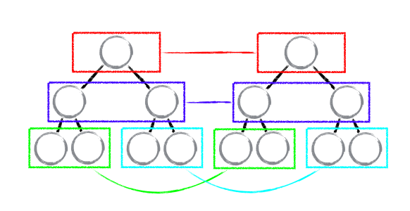
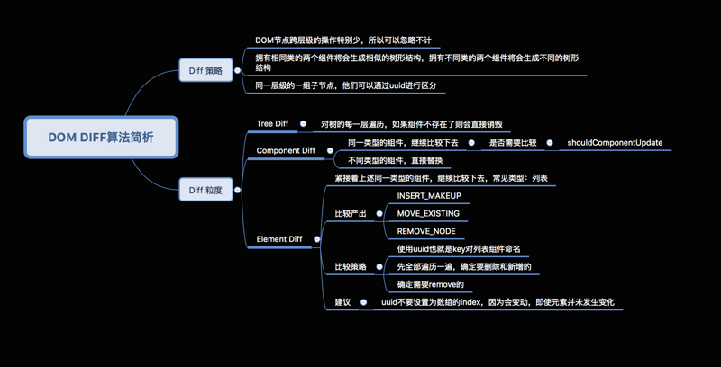
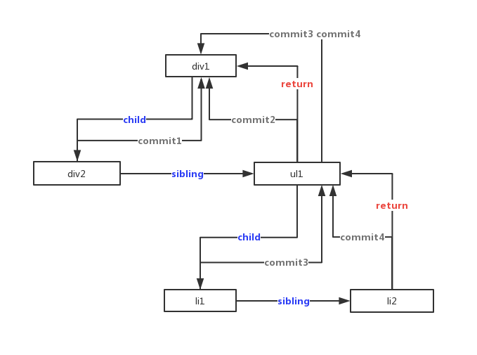
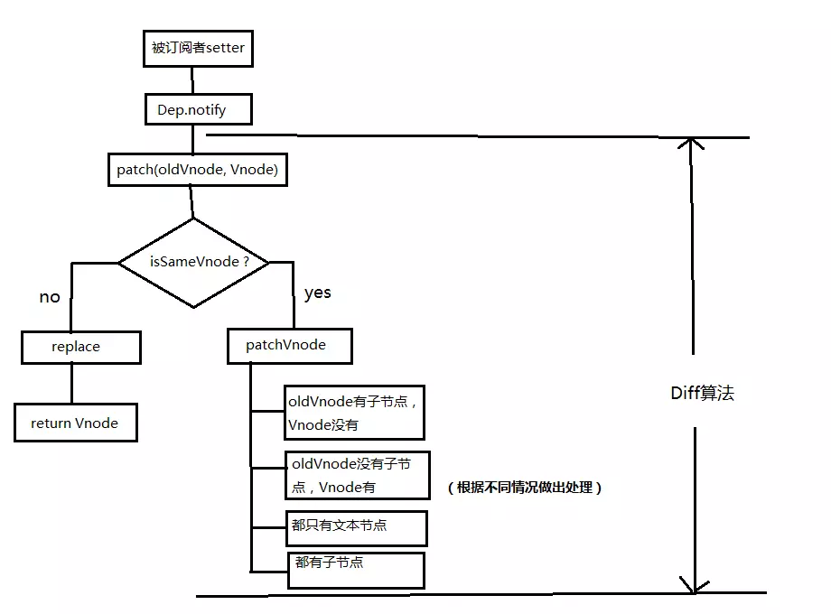
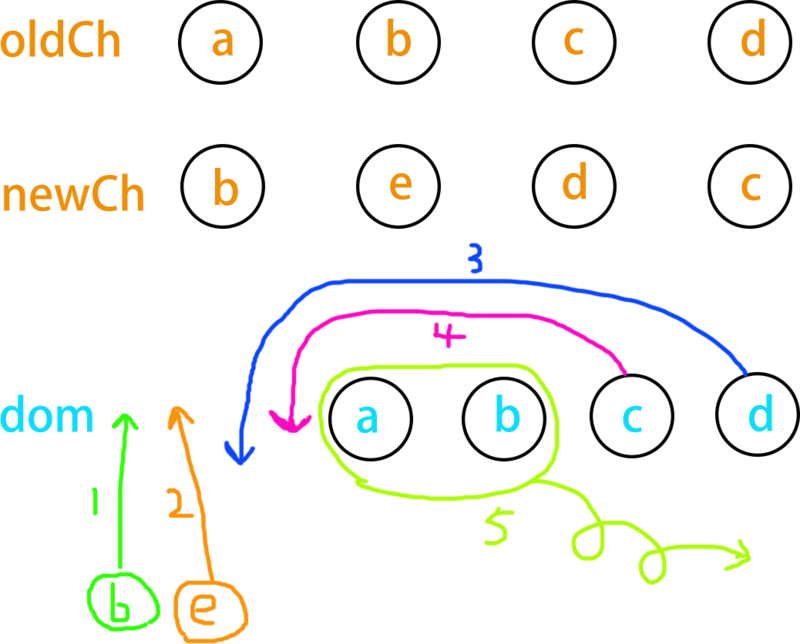

# Diff、React Diff、Vue Diff

[[toc]]

## 传统diff算法
> 算法复杂度O(n3)

通过**递归**，对 HTML DOM树里的节点 进行依次对比。

## 什么是Virtual DOM
渲染真实DOM的开销很大，直接渲染到真实DOM会引起整个DOM树的**重排**和**重绘**。

React、Vue都**采用Virtual DOM来实现对真实DOM的映射**，所以React Diff、Vue Diff算法的实质是 **对两个JavaScript对象的差异查找**。

真实DOM：
```html
<div id="reactID" className="myDiv">
    <div>1</div>
</div>
```

 - React Virtual DOM
```js
{
  type: 'div',
  props: {
      id: 'reactID',
      className: 'myDiv',
  },
  chidren: [
      {type: 'p',props:{value:'1'}}
  ]
}
```

 - Vue Virtual DOM
```js
// body下的 <div id="vueId" class="classA"><div> 对应的 oldVnode 就是
{
  el:  div  //对真实的节点的引用，本例中就是document.querySelector('#vueId.classA')
  tagName: 'DIV',   //节点的标签
  sel: 'div#vueId.classA'  //节点的选择器
  data: null,       // 一个存储节点属性的对象，对应节点的el[prop]属性，例如onclick , style
  children: [], //存储子节点的数组，每个子节点也是vnode结构
  text: null,    //如果是文本节点，对应文本节点的textContent，否则为null
}
```

## [React] Virtual DOM Diff
> 算法复杂度为O(n)

React diff（v16前）基于三个策略：
 - 忽略DOM节点的跨层级移动
 - 拥有相同类的两个组件将会生成相似的树形结构，拥有不同类的两个组件将会生成不同的树形结构
 - 同一层级的一组子节点，通过`key`值进行区分

基于以上三个策略，React分别对`tree diff`、`component diff`、`element diff`进行了算法优化。
> 即：不同层级不比、不同组件类型不比、不同key值不比

### tree diff
**比较范围：** 树之间。

**步骤：** 对树进行分层比较，两棵树只会对同一层次的节点进行比较。如果节点不存在了则会直接销毁。不会进一步比较。
> 所以只需对树进行一次遍历，便能完成整个DOM树的比较。


> React只会对相同颜色方框内的DOM节点进行比较（即同一个父节点下的所有子节点）。

**建议：**
尽量保持 DOM结构 的稳定，避免 移除/添加DOM节点 （可用 CSS 代替）

#### 对于跨层级的节点，只有 创建 和 删除 操作

> React diff 的执行情况： delete A -> create A -> create B -> create C。


### component diff
**比较范围：** 组件之间。

**步骤：**
 - 同一类型的组件（即：两节点是同一个组件类的两个不同实例），按照 `同层比较策略` 继续比较Virtual DOM tree（也可以指定`shouldComponentUpdate`无需比较）
 - 如果不是，则将该组件判断为`dirty component`，从而替换整个组件（因为React认为：不同类型的组件，DOM树相同的情况非常少）


> 当component D改变为component G时，React会认为 **D和G是不同类型的组件** ，就不会比较二者的结构。从而直接 “删除component D”，“重新创建component G以及其子节点”。

**建议：**
 - 当明确知道是 “同一类型的组件” 时，可以通过 `shouldComponentUpdate()` 来指定该组件是否需要diff
 - 对于类似的结构应尽量封装成组件，既减少代码量，又能减少 component diff 带来的性能损耗。


### element diff
**比较范围：** 同一层级下的节点之间。

React Element Diff 会进行 3 类操作：**插入、删除、移动**。

**步骤：**
 - 循环遍历 新集合的节点
 - 判断 **新旧集合是否存在相同的节点**（通过唯一的`key`值）；如果不存在，则直接 **插入**；
 - 否则，会比较 `该节点在 旧集合中的位置（child._mountIndex）` 与 `遍历已访问过的节点，在旧集合中最右的位置（lastIndex）`
 - `if (child._mountIndex >s lastIndex)`，说明 该节点在 旧集合中的位置 就比 上一个节点位置 的后面，并且该节点不会影响其他节点的位置，**不需要移动**；
 - 否则，进行**移动**


> React diff 的执行情况：B、D不作任何操作，A、C进行移动即可。

**建议：**
 - 同一层级下的子节点 需要设置 `key` 值
 - 尽量减少类似 “将最后一个节点 移动到 列表首部” 这样的操作

> React Element Diff 和 Vue 不太一样。Vue采用的是：由**两端至中间**，先是4种比较方式，都匹配不上，就是key比较。


### React更新阶段
实际上，只有在 **React更新阶段的DOM元素更新过程** 才会执行Diff算法。

React更新阶段会对ReactElement类型（Text节点、组件、DOM）判断，从而进行不同的操作。
 - Text节点：直接更新文案
 - 组件：结合策略二
 - DOM：**调用diff算法**（`this._updateDOMChildren`）


### 总结
)


## [React] Fiber Diff
React16改造了Virtal DOM的结构，引入了`Fiber`的链表结构。
> 因为以前的Virtual DOM Diff可能比较耗时，导致浏览器FPS降低。

### React Fiber
`Fiber节点`就相当于以前的 Virtual DOM节点 ，结构如下：
```js
const Fiber = {
  tag: HOST_COMPONENT,
  type: "div",
  return: parentFiber, // 当前节点的父节点
  child: childFiber, // 第一个子节点
  sibling: null, // 右边的第一个兄弟节点
  alternate: currentFiber, // 当前节点对应的新Fiber节点（带有新的props和state）
  stateNode: document.createElement("div")| instance,
  props: { children: [], className: "foo"},
  partialState: null,
  effectTag: PLACEMENT,
  effects: []
};
```

假设有这么一个DOM结构：
```html
<div>
    <div></div>
    <ul>
        <li></li>
        <li></li>
    </ul>
</div>
```
通过 **链表的形式** 去描述整棵树：


**Fiber数据结构选用链表**的好处：在遍历Diff时，即使中断了，但只需记住中断时的那个节点，就可在下一个时间片空闲时，继续Diff。

### Fiber Diff的大致过程
**从链表头开始遍历，碰到一个节点就和它自己的 `alternate` 比较，并记录下需要更新的东西（作为`commit`），并把这些更新通过 `return` 提交到当前节点的父节点。当遍历完整个链表时，再通过 `return` 回溯到根节点。这样就能把所有的更新全部带到根节点，最后更新到真实的DOM中。**

> Fiber Diff算法是基于 **节点的“插入、删除、移动”等操作都是在同一层级中进行** 这个前提的。


:::tip
从根节点开始：
 - div1通过 child 到div2
 - div2 和自己的 alternate 比较完，把更新 commit1 通过return 提交到 div1
 - div2 通过 sibling 到ul 1
 - ul1 和自己的 alternate 比较完，把更新 commit2 通过return 提交到 div1
 - ul1 通过 child 到 li1
 - li1 和自己的 alternate 比较完，把更新 commit3 通过return 提交到 ul1
 - li1 通过 sibling 到 li2
 - li2 和自己的 alternate 比较完，把更新 commit4 通过return 提交到 ul1
 - **遍历完成，开始回溯。li2 通过 return 回到 ul1**（注意是到 li2 才 return）
 - ul1 把 commit3 和 commit4 通过 return 提交到 div
 - ul1 通过 return 到 div1
 - div1 获取到所有更新 commit1、commit2、commit3、commit4，一次性更新到真实的DOM中
:::

<!-- 对于Diff，新老节点的对比，我们以新节点为标准，然后构建整个`currentInWorkProgress`。 -->

### Fiber Diff的入口函数
Fiber Diff是从 `reconcileChildren` 开始的 *（非首次渲染时）*
```js
export function reconcileChildren(
  current: Fiber | null,
  workInProgress: Fiber,
  nextChildren: any,
  renderExpirationTime: ExpirationTime,
) {
  // 如果首次渲染，通过mountChildFibers创建子节点的Fiber实例
  if (current === null) {
    workInProgress.child = mountChildFibers(
      workInProgress,
      null,
      nextChildren,
      renderExpirationTime,
    );
  } else {
  // 否则，通过reconcileChildFibers进行Diff
    workInProgress.child = reconcileChildFibers(
      workInProgress,
      current.child,
      nextChildren,
      renderExpirationTime,
    );
  }
}
```

`reconcileChildFibers`函数的作用：**构建`currentInWorkProgress`，然后得出`effect list`，为下一个阶段（commit）做准备**

```js
function reconcileChildFibers(
  returnFiber: Fiber, // 即将Diff的这层的父节点
  currentFirstChild: Fiber | null, // 当前层的第一个Fiber节点
  newChild: any, // 即将更新的vdom节点（可能是个TextNode、可能是ReactElement、可能是数组），不是Fiber节点
  expirationTime: ExpirationTime, // 过期时间（与diff无关）
): Fiber | null {
  // 主要的 Diff 逻辑
}
```

对于 `currentFirstChild` 会有 **4 种情况**：
 - TextNode
 - React Element（通过该节点是否有 `$$typeof` 区分）
 - 数组
 - 可迭代的children（跟数组的处理方式差不多）

> 注意：currentFirstNode是当前层的第一个Fiber节点。

### TextNode【待更新】
如果`currentFirstChild` 是 `TextNode`
 - `xxx` 也是 `TextNode`，那就代表这个节点可以复用
 - `xxx` 不是 `TextNode`

Demo：
```js
// before：当前 UI 对应的节点的 jsx
return (
  <div>
  // ...
      <div>
          <xxx></xxx>
          <xxx></xxx>
      </div>
  //...
    </div>
)

// after：更新成功后的节点对应的 jsx
return (
  <div>
  // ...
      <div>
          前端桃园
      </div>
  //...
    </div>
)
```


若`currentFirstNode`不是TextNode，就代表这个节点不能复用。会从`currentFirstNode`开始，**删除剩余的节点**。


### React Element【待更新】
对于`React Element`判断这个节点是否可以复用：
 - key相同
 - 节点的类型相同

同时满足以上两点，代表这个节点只是内容变化，不需要创建新的节点，是可以复用的。

如果节点类型不相同，就将节点从当前节点开始，把剩余的都删除。

### Array【待更新】
建议：在开发组件时，保持稳定的DOM结构有助于性能提升。


## [Vue] Virtual DOM Diff
Vue 和 React一样，只进行 **同层比较，忽略跨级操作** 。

> 不同层级不比，不同类型不比

当响应式属性 `setter` 执行 `Dep.notify()` 时，就会开始执行 `patch` 。
> 一边比较新、旧节点，一边给 `真实DOM` 打补丁。

```js
function patch (oldVnode, vnode) {
    // sameVnode 会当两节点的 key && sel（即元素的css选择器） 相同时，认为是同一类型节点。
    // 此时才需要 “深入比较”
    if (sameVnode(oldVnode, vnode)) {
        patchVnode(oldVnode, vnode)
    } else {
        // 不同类型节点，直接用新节点替换整个老节点
        const oEl = oldVnode.el
        let parentEle = api.parentNode(oEl)
        createEle(vnode)
        if (parentEle !== null) {
            api.insertBefore(parentEle, vnode.el, api.nextSibling(oEl))
            api.removeChild(parentEle, oldVnode.el)
            oldVnode = null
        }
    }
    return vnode
}
```
这和 React Diff 实现不同，react 对于 “同一类型节点” 的认定标准 是 “同一个Class实例化出来的节点元素”。

### patchVnode
两个节点值得比较时，会调用`patchVnode`
```js
patchVnode (oldVnode, vnode) {
    // 作用：让vnode.el引用到现在真实dom（即oldVnode.el）；同时当el发生变化时，vnode.el会同时变化
    const el = vnode.el = oldVnode.el
    let i, oldCh = oldVnode.children, ch = vnode.children
    // 情况一：引用一致，没有变化
    if (oldVnode === vnode) return
    // 情况二：仅为文本节点发生变化，直接修改
    if (oldVnode.text !== null && vnode.text !== null && oldVnode.text !== vnode.text) {
        api.setTextContent(el, vnode.text)
    }else {
        updateEle(el, vnode, oldVnode)
        // 情况三：新、旧节点都有子节点，且不一样，调用updateChildren比较（Vue diff核心）
        if (oldCh && ch && oldCh !== ch) {
            updateChildren(el, oldCh, ch)
        }else if (ch){
        // 情况四：只有新节点具有子节点，因为vnode.el引用了老的dom节点，createEle会在老dom上添加子节点
            createEle(vnode) //create el's children dom
        }else if (oldCh){
        // 情况五：只有老节点具有子节点，直接删除老节点
            api.removeChildren(el)
        }
    }
}
```

### updateChildren
当新、旧节点都 “具有不一样子节点” 时，调用 `updateChildren` 深入比较 **（Vue diff核心）**。

**步骤**：
 - `oldCh` 和 `newCh` 各有 2 个头尾指针：`StartIdx` 和 `EndIdx`
 - 依次进行4次比较：**旧头新头、旧尾新尾、旧头新尾、旧尾新头** 是否为 “同一类型节点”。若是，则证明 **这一对节点值得比较**，开始 `patchVnode`
 - 若 4 次都匹配不上，开始比较`key`值
 - 会从 用 `key` 值生成的对象 `oldKeyToIdx` 中查找匹配节点
 - 最后变量会往中间靠拢，当 `StartIdx` > `EndIdx` 时结束比较。


**总结遍历过程，有3种DOM操作**：
> oldVnode 对应的 Dom 总是存在，newVnode 的 dom 是不存在的。所以节点的移动只能采取 “移动到 旧尾后/旧头前”。
 - 当 **旧头新尾** 是 “同一类型节点”，说明 newVnode 右移了，所以 “旧头” 需要移动到 “旧尾” 后边
 - 当 **旧尾新头** 是 “统一类型节点”，说明 newVnode 左移了，所以 “旧尾” 需要移动到 “旧头” 前边
 - 当 某个节点 `newVnode` 有，但 `oldVnode` 没有，将 该节点 插入到 `旧头` 前边

**结束时，分2种情况**：
 - `oldStartIdx > oldEndIdx`，表示`oldCh`先遍历完，此时`newStartIdx`和`newEndIdx`之间的vnode是新增的。此时，调用`addVnodes`，将 新节点 插入到 子节点 的末尾
 - `newStartIdx > newEndIdx`，表示`newCh`先遍历完，此时`oldStartIdx`和`oldEndIdx`之间的vnode在新的节点里已经不存在了。此时，调用`removeVnodes`将它们从DOM里删除。

### 总结Vue Diff流程


#### Demo
当下面的结构的子节点的内容发生改变时：
```html
<!-- 没有设置 key -->
<div class="parent">
    <!-- before -->
    <div class="a">a</div>
    <div class="b">b</div>
    <div class="c">c</div>
    <div class="d">d</div>

    <!-- after：变成了 b e d c -->
    <div class="b">b</div>
    <div class="e">e</div>
    <div class="d">d</div>
    <div class="c">c</div>
</div>
```

两组子节点如果发生改变，那 diff算法 的步骤也是不一样的。

### 没有设置key
对于 class 为 `parent` 这组节点：
 - 执行`patch`
 - 先从父节点开始，比较其 `oldVnode` 、 `newVnode` ，发现 **值得比较**。
 - 传入父节点的新、旧Vnode节点，执行 `patchVnode`
 <!-- - 先是将真实dom（`oldVnode.el`）赋值给`vnode.el`、`el`。作用是当el发生变化，`vnode.el`会同时变化 -->
 - 判断情况一：引用不一致，发生了变化
 - 判断情况二：不为文本节点，继续判断
 - 判断情况三：新、旧子节点都有各自且不同的子节点，调用 `updateChildren` 比较（Vue diff核心，即头尾的4次比较）
 - 开始遍历 新集合 中的节点
 - 对于`b`节点：
    - 依次比较`旧头新头`、`旧尾新尾`、`旧头新尾`、`旧尾新头`，发现都不值得比较；
    - 开始比较`key`
    - 发现`key`值不存在，执行`insertBefore`，将`新头`插入到`旧头`前面
    - `newStartIdx++`，新头下标继续往后。为`e`节点
 - 对于`e`节点：
    - 依次比较`旧头新头`、`旧尾新尾`、`旧头新尾`、`旧尾新头`，发现都不值得比较；
    - 开始比较`key`
    - 发现`key`值不存在，执行`insertBefore`，将`新头`插入到`旧头`前面
    - `newStartIdx++`，新头下标继续往后。为`d`节点
 - 对于`d`节点：
    - 发现`旧尾新头`为同一类型节点，**值得比较**，说明 newVnode左移；
    - 开始执行`patchVnode`，发现引用一致没有变化，将`旧尾`插入到`旧头`前面
    - `newStartIdx++`、`oldEndIdx--`，新头下标继续往后、旧尾下标往前。此时新头为`c`，旧尾为`c`
 - 对于`c`节点：
    - 发现`旧尾新头`为同一类型节点，**值得比较**，说明 newVnode左移；
    - 开始执行`patchVnode`，发现引用一致没有变化，将`旧尾`插入到`旧头`前面
    - `newStartIdx++`、`oldEndIdx--`，新头下标继续往后、旧尾下标往前。
 - 此时`newStartIdx > newEndIdx`，表示`newCh`先遍历完，此时`oldStartIdx`、`oldEndIdx`之间的节点`a`、`b`已经不存在了，调用`removeVnodes`将它们从DOM里删除



### 设置了key
> 若设置了key值，b元素将得到复用。

 - 执行`patch`
 - 先从父节点开始，比较其`oldVnode`、`newVnode`，发现**值得比较**。
 - 传入父节点的新、旧Vnode节点，执行`patchVnode`
 <!-- - 先是将真实dom（`oldVnode.el`）赋值给`vnode.el`、`el`。作用是当el发生变化，`vnode.el`会同时变化 -->
 - 判断情况一：引用不一致，发生了变化
 - 判断情况二：不为文本节点，继续判断
 - 判断情况三：新、旧子节点都有各自且不同的子节点，调用`updateChildren`比较（Vue diff核心，即头尾的4次比较）
 - 开始遍历 新集合 中的节点
 - 对于`b`节点：
    - 依次比较`旧头新头`、`旧尾新尾`、`旧头新尾`、`旧尾新头`，发现都不值得比较；
    - **开始比较`key`**（`key`值设置与否，不同在于这一步！！）
    - 发现`key`值在旧集合中，存在一个同`key`的下标，将旧集合中的该元素设为`elmToMove`
    - 判断`elmToMove`和`新头`节点的选择器`sel`（因为`key`已经为相同）
    - 发现`sel`相同，表明他们**值得比较**
    - 将旧集合对应节点设为`null`，并将`elmToMove`节点插入到`旧头`前
    - `newStartIdx++`，新头下标继续往后。为`e`节点
 - 对于`e`节点：
    - 依次比较`旧头新头`、`旧尾新尾`、`旧头新尾`、`旧尾新头`，发现都不值得比较；
    - 开始比较`key`
    - 发现`key`值在旧集合中不存在，直接将`新头`插入到`旧头`前
    - `newStartIdx++`，新头下标继续往后。为`d`节点
 - 对于`d`节点：
    - 发现`旧尾新头`为同一类型节点，**值得比较**；
    - 开始执行`patchVnode`，发现引用一致没有变化，将`旧尾`插入到`旧头`前面
    - `newStartIdx++`、`oldEndIdx--`，新头下标继续往后、旧尾下标往前。此时新头为`c`，旧尾为`c`
 - 对于`c`节点：
    - 发现`旧尾新头`为同一类型节点，**值得比较**；
    - 开始执行`patchVnode`，发现引用一致没有变化，将`旧尾`插入到`旧头`前面
    - `newStartIdx++`、`oldEndIdx--`
    - 此时`newStartIdx > newEndIdx`，表示`newCh`先遍历完，对于`oldStartIdx`、`oldEndIdx`之间的节点`a`、`b`已经不存在了，调用`removeVnodes`将它们从DOM里删除


### vue updateChildren源码
```js
updateChildren (parentElm, oldCh, newCh) {
    let oldStartIdx = 0, newStartIdx = 0
    let oldEndIdx = oldCh.length - 1
    let oldStartVnode = oldCh[0]
    let oldEndVnode = oldCh[oldEndIdx]
    let newEndIdx = newCh.length - 1
    let newStartVnode = newCh[0]
    let newEndVnode = newCh[newEndIdx]
    let oldKeyToIdx
    let idxInOld
    let elmToMove
    let before
    while (oldStartIdx <= oldEndIdx && newStartIdx <= newEndIdx) {
            if (oldStartVnode == null) {   //对于vnode.key的比较，会把oldVnode = null
                oldStartVnode = oldCh[++oldStartIdx] 
            }else if (oldEndVnode == null) {
                oldEndVnode = oldCh[--oldEndIdx]
            }else if (newStartVnode == null) {
                newStartVnode = newCh[++newStartIdx]
            }else if (newEndVnode == null) {
                newEndVnode = newCh[--newEndIdx]
            }else if (sameVnode(oldStartVnode, newStartVnode)) {
                patchVnode(oldStartVnode, newStartVnode)
                oldStartVnode = oldCh[++oldStartIdx]
                newStartVnode = newCh[++newStartIdx]
            }else if (sameVnode(oldEndVnode, newEndVnode)) {
                patchVnode(oldEndVnode, newEndVnode)
                oldEndVnode = oldCh[--oldEndIdx]
                newEndVnode = newCh[--newEndIdx]
            }else if (sameVnode(oldStartVnode, newEndVnode)) {
                patchVnode(oldStartVnode, newEndVnode)
                api.insertBefore(parentElm, oldStartVnode.el, api.nextSibling(oldEndVnode.el))
                oldStartVnode = oldCh[++oldStartIdx]
                newEndVnode = newCh[--newEndIdx]
            }else if (sameVnode(oldEndVnode, newStartVnode)) {
                patchVnode(oldEndVnode, newStartVnode)
                api.insertBefore(parentElm, oldEndVnode.el, oldStartVnode.el)
                oldEndVnode = oldCh[--oldEndIdx]
                newStartVnode = newCh[++newStartIdx]
            }else {
               // 使用key时的比较
                if (oldKeyToIdx === undefined) {
                    oldKeyToIdx = createKeyToOldIdx(oldCh, oldStartIdx, oldEndIdx) // 有key生成index表
                }
                idxInOld = oldKeyToIdx[newStartVnode.key]
                if (!idxInOld) {
                    api.insertBefore(parentElm, createEle(newStartVnode).el, oldStartVnode.el)
                    newStartVnode = newCh[++newStartIdx]
                }
                else {
                    elmToMove = oldCh[idxInOld]
                    if (elmToMove.sel !== newStartVnode.sel) {
                        api.insertBefore(parentElm, createEle(newStartVnode).el, oldStartVnode.el)
                    }else {
                        patchVnode(elmToMove, newStartVnode)
                        oldCh[idxInOld] = null
                        api.insertBefore(parentElm, elmToMove.el, oldStartVnode.el)
                    }
                    newStartVnode = newCh[++newStartIdx]
                }
            }
        }
        if (oldStartIdx > oldEndIdx) {
            before = newCh[newEndIdx + 1] == null ? null : newCh[newEndIdx + 1].el
            addVnodes(parentElm, before, newCh, newStartIdx, newEndIdx)
        }else if (newStartIdx > newEndIdx) {
            removeVnodes(parentElm, oldCh, oldStartIdx, oldEndIdx)
        }
}
```


## 四种Diff算法总结
 - **传统Diff**：
    - 通过**递归**，对 HTML DOM树里的节点 进行依次对比。

 - **React Virtual DOM Diff**：
    - 基于三个策略 **（不同层级、不同组件类型、不同key值都视作 “不同节点”）**
    - 依次根据 不同细粒度 （`tree`、`component`、`element`） 进行Diff
        - **tree diff**：对树进行 **同层比较**。
            - 【做法：如果是不同节点，则会直接销毁，不会进一步比较】
        - **component diff**：根据组件 **是否为同一类型**，采取不同做法。
            - 【做法：对于 “同一类型的组件”，按照 `同层比较策略` 继续比较（也可通过`shouldComponentUpdate()`来判断是否需要diff）】
            - 【做法：对于 “不同类型的组件”，则替换整个组件】
        - element diff：根据新节点的 `key` 值，及其 `在旧集合位置` ，采取不同做法。
            - 【做法：若 `“旧集合中不存在相同节点”`，则插入；
            - 【做法：若 `“旧集合中存在相同节点”`，比较 `当前节点在旧集合中的位置` 与 `访问过的节点，在旧集合中最右的位置`：若当前节点在旧集合中的位置靠后，则不需移动；否则移动】

 - **Fiber Diff**：
    - 从链表头开始遍历
    - 对于每个节点，都与其 `alternate` 比较，并记录下需要更新的东西（作为`commit`），并把这些更新通过 `return` 提交到当前节点的父节点。
    - 当遍历完整个链表时，再通过 `return` 回溯到根节点。
    - 最后，所有的更新 都会带到 根节点，从而更新 真实的DOM 。

 - **Vue Virtual DOM Diff**：
    - Vue只作 **同层比较**，且对于 **不同类型的节点** 会直接用新节点替换
    - 先让 `vnode.el` 引用真实dom（为了同步变化）后，开始比较`oldVnode`、`vnode`
    - 依次判断 **5类情况**：
        - 1、引用是否一致；【做法：不需改变】
        - 2、新旧都为文本节点【做法：只需修改text】
        - 3、新旧节点都有子节点，而且它们不一样【做法：执行`updateChildren`】**（Vue Diff核心）**；
        - 4、只有新节点有子节点；【做法：在老节点上添加新节点】
        - 5、只有旧节点有子节点，新节点没有子节点。【做法：直接删除老节点】
    - 在`updateChildren`的过程中，`oldCh`、`newCh`会进行 **头尾两端的相互比较** （即：旧头新头、旧尾新尾、旧头新尾、旧尾新头）。若设置`key`，会多了一步“查找匹配节点”
    - 最后指针会往中间靠拢，直到结束

:::tip
 - 对于“同一类型”这个说法，React会认为“两节点是同一个组件类的不同实例、相同HTML标签”这类”是属于同一类型；Vue会认为“两节点的key && sel相同”时是属于同一类型。

 - 另外，vue中在使用相同标签名元素的 **过渡切换** 时，**需用不同key值作区分**。否则vue只会替换其内部属性而不会触发过渡效果。

 - 真实 DOM 慢就慢在 **会导致浏览器重排、重绘**

 - React的优势在于 “以最小的代价更新 DOM”
:::

## 参考链接
 - [React 源码剖析系列 － 不可思议的 react diff](https://zhuanlan.zhihu.com/p/20346379)
 - [谈谈React中Diff算法的策略及实现](https://cloud.tencent.com/developer/article/1402610)
 - [React diff 策略](http://www.ptbird.cn/react-diff-from-code.html)
 - [详解 React 16 的 Diff 策略](https://cloud.tencent.com/developer/article/1477707)
 - [React16性能改善的原理（二）](https://segmentfault.com/a/1190000018488975)