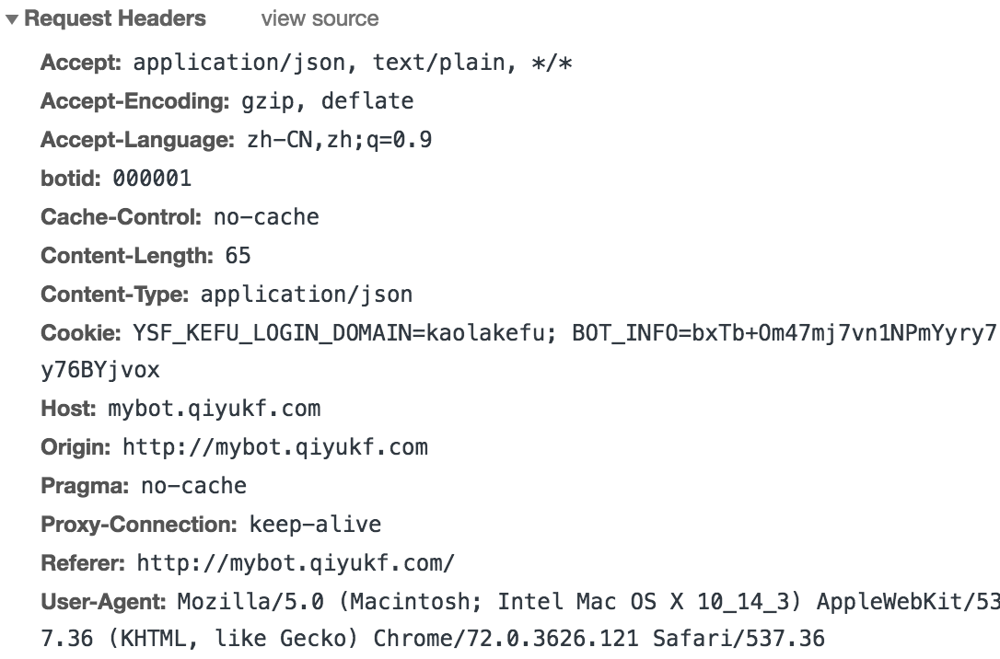

# HTTP
> 与HTTP协议相关：请求头、响应头、状态码、报文格式、请求方式、GET和POST的区别、完整的http过程

[[toc]]

## 请求头（常用）
 - `Accept`：可接受的响应内容类型
    - application/json
    - text/plain
    - \*/\*
 - `Accept-Charset`：可接受的字符集
 - `Accept-Encoding`：声明浏览器支持的压缩方式（可以提高前端性能）
    - `gzip`（支持更广，对**document、css、js**效果最佳）
    - （响应头）`Content-Encoding`指的是`服务端`最终采用的压缩方式
 
 - `Cache-Control`：用来指定当前的请求会使用到缓存机制
 - `Connection`：浏览器想要优先使用的连接类型（例：keep-alive、Upgrade）
    - `keep-alive`表示复用TCP连接（1.1默认，1.0需指定）
    - `Upgrade`表示希望升级到websocket协议
 - `Cookie`：由之前服务器通过Set-Cookie设置的Cookie
 - `Content-Type`：请求的MIME（互联网媒体类型）类型
    - 【text】text/html（HTML格式）、text/plain（纯文本格式）、text/xml（XML格式）
    - 【image】image/gif、image/jpeg、image/png
    - 【application】application/json、application/xml、application/x-www-form-urlencoded
    - 【file】multipart/form-data（文件上传）
 - `Host`：表示服务器的域名、端口号
 - `Origin`：表示发起请求的源，也指明该请求是一个CORS（跨域资源共享）请求
    - 该请求要求服务器在响应中，加入一个`Access-Control-Allow-Origin`的属性，表示`允许访问的请求地址`
 - `Referer`：表示该请求是从哪里链接过来的
 - `User-Agent`：表示浏览器的身份标识字符串

### Origin和Referer的区别
  - Origin
    - 表明该请求从哪里发起（协议、域名）
    - 一般只存在于CORS跨域请求中
  - Referer
    - 请求的原始资源的URI（协议、域名、参数）
    - 可以用来预防`CSRF攻击`

## 响应头（常用）
 - `Access-Control-Allow-Origin`：指定哪些网站可以跨域资源共享
 - `Access-Contol-Allow-Credentials`：指定请求可以携带Cookie
 - `Cache-Control`：浏览器缓存机制
 - `Connection`：针对该连接所预期的选项
 - `Content-Encoding`：服务端压缩资源的方式
 - `ETag`：浏览器缓存机制
 - `Expires`：浏览器缓存机制（Cookie的生存周期，若为0或负值，则关闭页面时清除）
 - `Last-Modified`：浏览器缓存机制
 - `Location`：重定向
 - `Server`：服务器的名称（nginx）
 - `Set-Cookie`：用来在浏览器种cookie（一旦被种下，当浏览器访问url就会自动带上这个cookie）
 - `Vary`：进行一些缓存判断（**在执行 浏览器缓存机制 时会读取**）

## 状态码
 - 100：continue，让浏览器继续发送请求体
----
 - 200：ok，正常返回
----
 - 301：永久性重定向
 - 302：临时性重定向
    - 相同点：以上两个都会跳转，搜索引擎会抓取最新内容
    - 不同点：搜索引擎会保存 `新地址（301）` / `旧地址（302）`
 - 304：Not Modified，响应内容没有改变（在协商缓存 - 有效后触发）
----
 - 400：Bad Request，服务器无法理解请求格式
 - 401：Unauthorized，请求的身份未验证
 - 403：Forbidden，拒绝访问
 - 404：Not Found，找不到匹配资源
----
 - 500：常见服务端错误
 - 503：服务端暂时无法处理请求

## 报文格式
 - 请求行
   - 请求方式、请求URL、HTTP协议/版本
 - 请求头
 - 空行
 - 请求体

## 请求方式
 `HEAD`、`GET`、`POST`、`PUT`、`DELETE`、`OPTIONS`

 - `HEAD`: 只请求页面的首部
 - `GET`: 请求服务器上的某一资源
 - `POST`: 向服务器提交数据
 - `PUT`: 修改某一个资源
 - `DELETE`: 删除某一个资源
 - `OPTIONS`: CORS的预检请求

 还有两种不常用：`TRACE`、`CONNECT`

## GET和POST区别
 在直观上：
   - GET：接在URL后，用`?`分割URL与参数，用`&`分割参数与参数
   - POST：放在请求体中

 在本质上：
   **没有区别**（底层实现都是`基于TCP/IP协议`）
   小区别：
   - GET产生`一个TCP数据包`（浏览器会把`HTTP请求头`、`请求体`一并发出）
   - POST产生`两个TCP数据包`（浏览器先发`HTTP请求头`，服务器响应`100`，浏览器再发送`请求体`）

## HTTP和HTTPS的区别
 `http`是无状态的超文本传输协议，是明文传输的；**它是基于TCP/IP的**。
  - 标准端口：80
  - 不需要ca证书

 `https`是由SSL + http协议构建的加密传输协议
  - 标准端口：443
  - 需要ca证书
  - 增加cpu、带宽消耗
  - 首次连接比较慢

## HTTPS的实现原理
HTTPS 在证书验证上使用的是 `非对称加密`， 在 数据传输上 使用的是 `对称加密`。

`非对称加密`：浏览器和服务器同时拥有公钥和私钥（公钥用来加密、私钥用来解密）。公钥在网络中传输。
 - 优点：安全

`对称加密`：浏览器和服务端使用同一个密钥进行加密和解密。
 - 优点：加密快

### 为什么数据是对称加密？
原因：1、非对称加密的加解密效率非常低；2、只有服务端保存了私钥

### 证书验证阶段
 - 浏览器发起 HTTPS 请求
 - 服务端返回 HTTPS 证书（包含公钥）
 - 浏览器验证 HTTPS 证书是否合法（如果不合法提示警告）

### 数据传输阶段
 - 浏览器会生成一个 随机数（用作后续请求的“对称密钥”）
 - 通过 公钥 加密这个 随机数（即“对称密钥”） ，发送给服务端
 - 服务端通过 私钥 解密随机数（取出“对称密钥”）
 - 通过传入的 随机数（即“对称密钥”），对数据进行 对称加密
 - 浏览器根据本地存储的 随机数（即“对称密钥”） 进行解密

;

## HTTP2.0
 HTTP2.0大幅度提高了web性能。

 `HTTP2.0`和`HTTP1.1`的区别：
  - 多路复用
  - 二进制分帧
  - 报文头压缩
  - 服务器推送

## HTTP1.0如何复用TCP连接
 HTTP1.1默认连接是`持久连接`，客户端会在一个TCP连接中发起多个HTTP请求。

 HTTP1.1以前的版本默认都是`非持久连接`，需要在HTTP请求头指定`connection: Keep-Alive`
