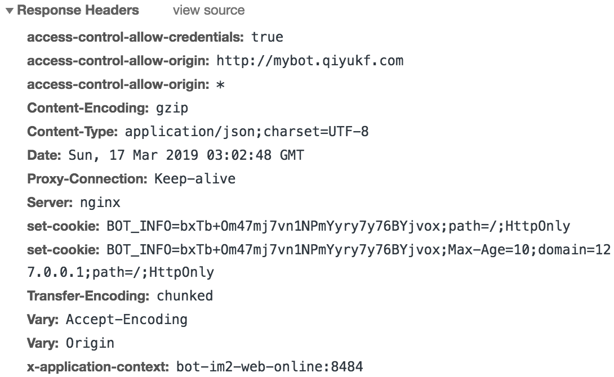

# HTTP
> 与HTTP协议相关：请求头、响应头、状态码、报文格式、请求方式、GET和POST的区别、完整的http过程

[[toc]]

## 请求头（常用）
 - `Accept`：可接受的响应内容类型
    - application/json
    - text/plain
    - \*/\*
 - `Accept-Charset`：可接受的字符集
 - `Accept-Encoding`：声明浏览器支持的压缩方式（可以提高前端性能）
    - `gzip`（支持更广，对**document、css、js**效果最佳）
    - （响应头）`Content-Encoding`指的是`服务端`最终采用的压缩方式
 
 - `Cache-Control`：指定当前请求所用到缓存机制
 - `Connection`：浏览器想要优先使用的连接类型（例：keep-alive、Upgrade）
    - `keep-alive`表示复用TCP连接（1.1默认，1.0需指定）
    - `Upgrade`表示希望升级到 websocket协议
 - `Cookie`：由之前服务器通过Set-Cookie设置的Cookie
 - `Content-Type`：请求的MIME（互联网媒体类型）类型
    - 【text】text/html（HTML格式）、text/plain（纯文本格式）、text/xml（XML格式）
    - 【image】image/gif、image/jpeg、image/png
    - 【application】application/json、application/xml、application/x-www-form-urlencoded
    - 【file】multipart/form-data（文件上传）
 - `Host`：表示服务器的域名、端口号
 - `Origin`：表示发起请求的源，也指明该请求是一个**CORS（跨域资源共享）请求**
    - 对于CORS请求，服务端需要在响应头下发 `Access-Control-Allow-Origin` 属性，以表示`允许跨域访问的请求源`
 - `Referer`：表示该请求是从哪里链接过来的
 - `User-Agent`：表示浏览器的身份标识字符串


### Origin和Referer的区别
  - Origin
    - 表明该请求从哪个域名发起（只包含: 协议、域名）
    - 一般只存在于 `CORS跨域请求`
  - Referer
    - 该请求 **从哪个域名的哪个路径下的哪个参数** 发起（包含: 协议、域名、**参数**）
    - 一般用来预防 `CSRF攻击`

## 响应头（常用）
 - `Access-Control-Allow-Origin`：指定哪些网域名可以跨域资源共享
 - `Access-Contol-Allow-Credentials`：请求是否可以携带Cookie
 - `Cache-Control`：本次资源响应所用到的缓存机制
 - `Connection`：针对该连接所预期的选项
 - `Content-Encoding`：服务端压缩资源的方式
 - `Expires`：浏览器缓存机制（资源的存活周期，若为0或负值，则关闭页面时清除）
 - `ETag`：浏览器缓存机制（资源内容的唯一标识）
 - `Last-Modified`：浏览器缓存机制（资源的上次修改时间）
 - `Location`：重定向
 - `Server`：服务器的名称（nginx）
 - `Set-Cookie`：用来在浏览器种cookie（一旦被种下，当浏览器访问url就会自动带上这个cookie）
 - `Vary`：进行一些缓存判断（**在执行 浏览器缓存机制 时会读取**）



## 状态码
 - 100：continue，让浏览器继续发送请求体
----
 - 200：ok，正常返回
----
 - 301：永久性重定向
 - 302：临时性重定向
    - 相同点：以上两个都会跳转，搜索引擎会抓取最新内容
    - 不同点：搜索引擎会保存 `新地址（301）` / `旧地址（302）`
 - 304：Not Modified，响应内容没有改变（在协商缓存 - 有效后触发）
----
 - 400：Bad Request，服务器无法理解请求格式
 - 401：Unauthorized，请求的身份未验证
 - 403：Forbidden，拒绝访问
 - 404：Not Found，找不到匹配资源
----
 - 500：常见服务端错误
 - 503：服务端暂时无法处理请求（负载过大）

## 报文格式
 - 请求行
   - 请求方式、请求URL、HTTP协议/版本
 - 请求头
 - 空行
 - 请求体


## 请求方式
 `HEAD`、`GET`、`POST`、`PUT`、`DELETE`、`OPTIONS`

 - `HEAD`: 只请求页面的首部
 - `GET`: 请求服务器上的某一资源
 - `POST`: 向服务器提交数据
 - `PUT`: 修改某一个资源
 - `DELETE`: 删除某一个资源
 - `OPTIONS`: CORS的预检请求

 还有两种不常用：`TRACE`、`CONNECT`

## GET和POST区别
 在直观上：
   - GET：接在URL后，用`?`分割URL与参数，用`&`分割参数与参数
   - POST：放在请求体中

 在本质上：
   **没有区别**（底层实现都是`基于TCP/IP协议`）
   小区别：
   - GET产生`一个TCP数据包`（浏览器会把`HTTP请求头`、`请求体`一并发出）
   - POST产生`两个TCP数据包`（浏览器先发`HTTP请求头`，服务器响应`100`，浏览器再发送`请求体`）

## HTTP和HTTPS的区别
 `http`是无状态的超文本传输协议，是明文传输的；**它是基于TCP/IP的**。
  - 标准端口：80
  - 不需要ca证书

 `https`是由SSL + http协议构建的加密传输协议
  - 标准端口：443
  - 需要ca证书
  - 增加cpu、带宽消耗
  - 首次连接比较慢

## HTTPS的实现原理
HTTPS 在 **证书验证阶段** 使用的是 `非对称加密`， 在 **数据传输阶段** 使用的是 `对称加密`。

`非对称加密`：利用 公钥 加密（浏览器）、利用私钥 解密（服务器）。
  > 公钥会在网络中传输。
 - 优点：安全

`对称加密`：浏览器和服务端使用同一个密钥进行加密和解密。
 - 优点：加密快

### 为什么数据是对称加密？
**原因：** 1、非对称加密的加解密效率非常低；2、只有服务端保存了私钥

### 证书验证阶段
 - 浏览器 发起 HTTPS 请求
 - 服务端 返回 HTTPS 证书（包含公钥）
 - 浏览器 验证 HTTPS 证书是否合法（如果不合法提示警告）

### 数据传输阶段
 - 浏览器会生成一个 `随机数`
 - 通过 公钥 **加密这个 `随机数`** ，发送给服务端
 - 服务端通过 私钥 解密 `随机数`
 - 通过这个 `随机数`（即“对称密钥”），**对数据进行 对称加密**
 - 浏览器根据本地存储的 `随机数` 进行解密


## HTTP2.0
HTTP2.0是 建立在https基础上 的下一代http传输协议，具有安全、高效的特点。
> 2015年正式发布 ，目前国内外一些大厂基本都有使用http2.0承担部分请求，但是目前仍然未广泛普及

### 特点
 - 二进制分帧层
 - 多路复用
 - HTTP头部压缩
 - 服务器推送

#### 二进制分帧层
链接 > 数据流 > 消息 > 帧（最小通信单位）

:::tip
链接(Connection): 一个TCP链接，包含若干个数据流(Stream)。所有通信都在一个TCP链接上完成

数据流(Stream): 一个双向通信的数据流，包含若干条消息(Message)

消息(Message): 对应 HTTP1.1 的请求/响应，包含若干个数据帧(Frame)。
 - HTTP/1.1 中，一个消息（可理解为请求报文）由请求行、请求头、空行、请求体组成；
 - HTTP/2 中，一个消息由 Header Frame + 若干个 Data Frame组成

数据帧(Frame): 最小通信单位，以 **二进制压缩格式** 存放内容。
:::


#### 多路复用
用 同一个TCP链接 传输多个资源。

 - 对于 HTTP/1.1，为了提升性能，可能需要“减少请求数”
 - 对于 HTTP/2 已不再需要。

:::tip
因为请求数越多，TCP连接就越多，服务器、浏览器就需要更多线程来处理，出现资源排队加载。
> 如: 雪碧图合成一张大图；合并JS和CSS等措施
:::


##### HTTP头部压缩
 - 对于 HTTP/1.1，头部带有大量信息，每次都要重复发送。
 - 对于 HTTP/2，使用encoder来减少需要传输的header大小。(**需要双方各自缓存一份头部字段**)

##### 服务器推送
服务器提前推送“必需的资源”给客户端，以提高页面整体的加载速度。

 - 对于 HTTP1.1，浏览器需要等到HTML下载并解析到需要加载的资源时，才发起资源请求。
 - 对于 HTTP2，服务端可以先推送 客户端可能会请求到的资源（不用等到解析HTML时再发送），

### 如何升级
> 要求：只支持https；nginx的最低版本是1.10.0；openssl的最低版本是1.0.2

```bash
# before
listen 443 ssl;

# after
listen 443 ssl http2;
```

## HTTP/1.0、HTTP/1.1、HTTP/2在TCP连接的区别
HTTP/1.0 默认 **非持久连接**。每次请求都需建立一次TCP连接
> 要实现持久连接，需要在HTTP请求头指定`connection: Keep-Alive`

HTTP/1.1 默认 **持久连接**。在同一个TCP连接下，客户端可以发起多次HTTP请求，并且**受同一域名下请求个数的限制**（Chrome是6个，多的会出现加载排队现象）

HTTP/2.0 可**多路复用**。在同一个TCP连接下，客户端可以发起并行请求，无个数限制
> 所有请求都是基于流，有更高的并发量


## 参考链接
 - [理解TCP/IP协议栈之HTTP2.0](https://network.51cto.com/art/202007/620592.htm)
 - [深入理解http2.0协议，看这篇就够了！](https://juejin.cn/post/6844903984524705800)
 - [HTTP/2 中的帧定义](https://halfrost.com/http2-http-frames-definitions/)
 - [怎样把网站升级到http/2](https://zhuanlan.zhihu.com/p/29609078)