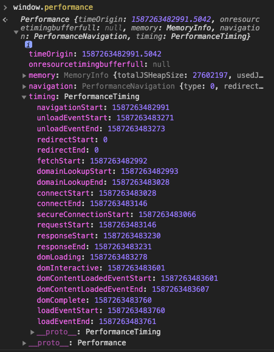
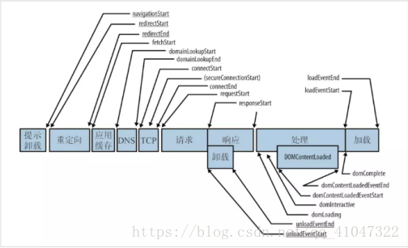

# Web性能优化
> 根据业务情况，定义Web性能指标。然后 选取数据参考点、收集数据 ，随后分析每个关键指标反映的数据，最后采取优化手段。

[[toc]]

## Web性能指标
 - **白屏时间**
    - 输入URL - 开始解析渲染DOM的时间
 - **首屏时间**
    - 输入URL - 首屏内容渲染完成的时间
 - **用户可操作性时间**
    - 输入URL - 点击事件有反应
 - **总下载时间**
    - 输入URL - window.onload的触发节点

### 常规统计方法
当不兼容`window.performance`时，可使用常规统计方法（如：IE8）
```html
<!DOCTYPE html>
<html>
<head>
    <meta charset="utf-8">
    <title>白屏 &</title>
    <script>
        // 不兼容 performance.timing 的浏览器
        window.pageStartTime = Date.now()
    </script>
        <!-- 页面 CSS 资源 -->
        <link rel="stylesheet" href="xx.css">
        <link rel="stylesheet" href="zz.css">
        <script>
            // 白屏结束时间
            window.firstPaint = Date.now()
            // 由此计算：白屏时间（支持window.performance）
            console.log(performance.timing.domLoading - performance.timing.navigationStart)
            // 由此计算：白屏时间（不支持window.performance）
            console.log(window.firstPaint - window.pageStartTime)
        </script>
</head>
<body>
    <h1>Hello World</h1>
    <script type="text/javascript">
        // 首屏屏结束时间
        window.firstPaint = Date.now()
        // 由此计算：首屏时间
        console.log(firstPaint - performance.timing.navigationStart || window.pageStartTime)
    </script>

    <!-- 首屏不可见内容 -->
    <div class=""></div>
    <!-- 首屏不可见内容 -->
    <div class=""></div>
</body>
</html>
```

### window.performance
`window.performance`可以获取 **当前页面与性能相关的信息**。

 - memory：JavaScript对内存的占用
 - navigation：和网页导航相关的数据
 - timing（重要）：包含了 **网络、解析等一系列的时间数据**




<!--  -->


几个重要的时间属性：
 - `navigationSart`：上一个文档unload的时刻（若上一个文档为空，值为`fetchStart`）
 - `fetchStart`：浏览器已经准备好去使用HTTP请求抓取文档之时（下一步是检查缓存之前）
 - `domLoading`：开始解析DOM的时刻
 - `domContentLoadedEventEnd`：DOM解析完成的时刻（代表`DOMContentLoaded`事件完成）
 - `loadEventStart`：load事件触发的时刻
 - `loadEventEnd`：load事件结束的时刻

#### 相关时间计算
 - DNS查询耗时 = domainLookupEnd - domainLookupStart
 - TCP链接耗时 = connectEnd - connectStart
 - request请求耗时 = responseEnd - requestStart
 - 解析dom树耗时 = domComplete - domInteractive

 - **白屏时间 = domLoading - fetchSart**
 - **DomReady（用户可操作时间） = domContentLoadedEventEnd - fetchSart**
    - 即：DOM解析耗时 + 同步JS加载耗时（如defer脚本）
 - **总下载时间 = loadEventEnd - fetchSart**
 - **页面完全加载时间 = loadEventStart - fetchStart**
    - 即：首次渲染时间 + DOM解析耗时 + 同步JS执行耗时 + 资源加载耗时

> 注意，对于前端性能监测，一般会忽略 `发起首个请求之前` 的耗费时间


#### 静态资源的时间计算
`window.performance.getEntries()`用来统计静态资源相关的时间信息。

#### DOMContentLoaded vs load
> DOMContentLoaded指页面元素加载完毕，可正常交互，**但资源（如图片）可能还未加载完成**；load指页面上 **所有资源都加载完成**。

### Chrome Devtools Performance的性能监测
`Chrome DevTools Performance功能`也可以分析 **运行时性能表现**，对问题进行定位、分析和优化。

 - FPS图表：有红条，说明帧存在严重问题
    > FPS（Frame Per Second）用来分析动画的一个主要性能指标（保持60FPS左右，用户体验不错）

 - CPU图表：与Summary面板里的颜色相互对应。如果看到某个处理占用了大量时间，可能就是一个找到性能瓶颈的线索。

 - Main图表：Loading、Scripting、Rendering、Painting

> 1、Hover到FPS、CPU图表可以看得到这个时间点的截图。这被曾为scrubbing，用来分析动画的各个细节
>
> 2、Hover到Frames图表中，可以看到这个帧的FPS
> 
> 3、实时FPS面板：Command + Shift + P -> Show Rendering -> FPS meter


## 传统意义上的优化手段
### 代码方面
 - 懒加载、按需加载
 - 减少DOM元素数量
 - 减少DOM访问
 - 使用css内联样式、放到页面顶部
 - 将js适当defer/async、放到页面底部

### 工程方面
 - 合理拆包，代码分割
 - 打包，缩减代码体积

### 请求方面
 - 减少DNS查询
 - 减少HTTP请求（因为数据在网络中的传输最大可消耗80%时间）
    - 充分利用“强缓存/协商缓存”
    - 雪碧图
 - 减小cookie大小
 - 使用`gzip`的压缩方式
 - 使用CDN
 - 使用SSR

<!-- ## 前端框架的优化手段 -->
<!-- ### React
 - Key：使用Key值可在 `Element Diff阶段` 尽可能复用旧节点
 - shouldComponentUpdate：使用`shouldComponentUpdate()`可在`Component Diff阶段`，尽可能节省 **对于同一类型组件的Diff时间损耗**
 - PureComponent、useMemo
 - 避免使用匿名函数：尽量避免每次渲染都声明不同引用
 - 减少DOM数量：使用`<></>`或`React.Fragment`
 - 异步加载/懒加载：使用`React.lazy()`、`React.Suspense`或第三方包`react-loadable`
 - SSR
 - 通过时间分片Fiber -->

<!-- ### Vue
 - Key：使用过Key值可在`Vue Diff阶段` 尽可能复用旧节点
 - v-if和v-show：`v-if`是真正的条件渲染，适合不需频繁切换条件的场景；`v-show`只是切换display属性，适合频繁切换条件的场景
 - js事件的销毁：手动移除原生js事件的监听，以免造成内存泄露。
 - Object.freeze：对于纯粹的数据展示，可适当冻结对象，禁止Vue劫持数据
 - 懒加载：图片、路由
 - SSR -->

## 懒加载实现
原理：通过监听`scroll`事件，以及元素的`getBoundingClientReact()`来判断它的“进入视窗状态”，实时赋值`src`属性。

```html


```

```css
img {
    display: inline-block;
    width: 100%;
    height: 300px; /* 要设置img的高度 */
    background: red;
}
```

```js
let viewHeight = document.documentElement.clientHeight // 获取可视区域的高度

function lazyload() {
    let lazyElems = document.querySelectorAll('img[data-original][lazyload]');

    Array.prototype.forEach.call(lazyElems, (item, index) => {
        if (!item.dataset.original) return;
        let rect = item.getBoundingClientRect() // 获得元素相对于视窗上、下、左、右的举例
        if (rect.top < viewHeight && rect.bottom >= 0) { // 表示 元素顶部/元素底部 开始进入到视窗
                var img = new Image()
                img.src = item.dataset.original
                img.onload = function() {
                    item.src = img.src // 当这个“匿名”img标签加载完src后，执行这里
                }
            item.removeAttribute("data-original"); //移除属性，下次不再遍历
            item.removeAttribute("lazyload");
        }
    })
}

lazyload();

document.addEventListener('scroll', lazyload); 
```

## 预加载的实现
原理：将所需资源提前请求加载到本地，这样后面在需要用到时就直接**从缓存取资源**。

1、使用`display: none`

2、使用`Image`对象
```js
let image = new Image();
image.src = "images.1.png"
```

3、`<link>`的`preload`
```html
<link rel="preload" href="test.mp4" as="video" type="video/mp4">
```
这种方式有资源的类型要求。

和懒加载的区别：预加载是提前加载、懒加载是延迟加载。


## 参考链接
 - [前端性能监控方案（首屏、白屏时间等）](https://juejin.im/post/5df4294d518825128306cd5c#comment)
 - [Web 性能优化-首屏和白屏时间](https://lz5z.com/Web%E6%80%A7%E8%83%BD%E4%BC%98%E5%8C%96-%E9%A6%96%E5%B1%8F%E5%92%8C%E7%99%BD%E5%B1%8F%E6%97%B6%E9%97%B4/)
 - [全新Chrome Devtools Performance使用指南](https://segmentfault.com/a/1190000011516068)
 - [React性能优化的8种方式了解一下？](https://juejin.im/post/5d63311be51d45620821ced8)
 - [Vue 项目性能优化 — 实践指南（网上最全 / 详细）](https://juejin.im/post/5d548b83f265da03ab42471d#heading-2)
 - [前端性能优化--懒加载和预加载](https://segmentfault.com/a/1190000018275268?utm_source=tag-newest)
