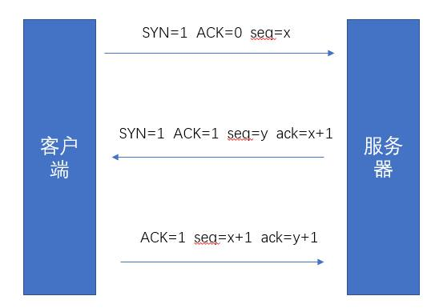

# 其他
> 这里会搜集一些有关Web的零碎知识

[[toc]]

## 渐进增强、优雅降级
渐进增强是指，针对`低版本浏览器`进行构建（先保证最基本的功能），然后再针对`高级浏览器`进行改进。

优雅降级是指，一开始就构建`完整的功能`，然后再针对`低版本浏览器`进行兼容。

## 正向代理、反向代理

### 正向代理
系统内部要**访问外部网络**时，统一**通过一个代理服务器把请求转发出去**。那在外部网络看起来这个请求就**只是代理服务器发起的访问**。

> 此时代理服务器实现的就是**正向代理**

```js
// 在vue里的config/index.js中dev对象的proxyTable上设置，来解决开发时跨域问题
dev: {
    proxyTable: {
        '/api': {
            target: 'http://192.168.5.2',
            changeOrigin: true
        }
    }
}
```

### 反向代理
当**外部请求**进入内部系统时，代理服务器把该请求**转发到系统中的某台指定的服务器**上。那在外部请求看起来和它交互的**只有这个代理服务器**。

> 此时代理服务器实现的就是反向代理。

 - 浏览器对域名解析后，实际上得到的是 **反向代理服务器的IP**，而不是直接的**服务器IP**。（然后通过`Nginx`再把**具体的http请求**转发到某台指定的服务器上。）

:::tip
**跨域原理**：通过把`本地的一个url前缀`映射到`要跨域访问的web服务器`上。
 - 对于浏览器来说，访问的是同源服务器上的一个url；
 - 对于Nginx来说，通过检测URL前缀，把HTTP请求转发到后面真实的物理服务器上
:::

 ```js
 // 客户端 部分
 192.168.72.49 8081.max.com
 192.168.72.49 8082.max.com
 --------------------------

 // 服务端 部分
 server {
     listen 80;
     server_name 8081.max.com // 根据这个字段进行匹配

     location / {
         proxy_pass http://192.168.72.49:8081 //再根据这个字段进行转发
     }
 }

 server {
     listen 80;
     server_name 8082.max.com

     location / {
         proxy_pass http://192.168.72.49:8082
     }
 }
 ```
 [Nginx配置Demo](./NginxDemo.md)

<!-- 
## 与后台保持不断的通信的方法
 - 短轮询：客户端周期性地向服务器发起HTTP请求（一个request对应一个response）
 - 长轮询：客户端发起HTTP请求，服务器并不是每次都立即响应（等待数据更新后才响应，否则保持该连接直到超时）（一个request对应一个response）
 - WebSocket

## WebSocket
WebSocket是一种协议，和HTTP协议一样位于应用层，都是TCP/IP协议的子集。
 - HTTP是单向通信协议（只有客户端发起HTTP请求，服务端才会返回数据）
 - WebSocket是双向通信协议（建立连接后，客户端、服务器都可以主动向对方发送或接受数据）
它建立前需要借助HTTP协议，建立连接后，持久连接的双向通信就和HTTP协议无关了。 -->

## TCP三次握手、四次挥手
 三次握手：
  - `客户端`发送`SYN=1`给`服务端`
  - `服务端`收到`SYN=1`后，会给`客户端`发送`SYN=1、ACK=1`
  - `客户端`收到`SYN=1、ACK=1`后，会给`服务端`发送`ACK=1`



 四次挥手：
  - `客户端`会发送`FIN=1`给`服务端`
  - `服务端`收到`FIN=1`后，会发送`ACK=1`给`客户端`
  - `服务端`再发送`FIN=1`给`客户端`
  - `客户端`收到`FIN=1`，发送`ACK=1`给`服务端`


## DNS
 顺序：
  - 1、本地host文件
  - 2、本地DNS解析器
  - 3、本地DNS服务器
  - 4、根域名服务器
  - 5、顶级域名服务器
  - 6、权威域名服务器

## Base64
> 最近听说对于存储图片有两种方式，一种是最常见的url，另一种是base64

**base64编码** 可以将 一张图片数据 编码成 一串字符串，这个字符串可以替代图像地址。
 - 每一张图片都有 **固定的base64编码**，所以不用上传到服务器

### 意义
最大好处：减少https请求

### 使用方法
```html


// css同理 
```

### 适用范围
1、图片足够小

2、复用性高，且基本不会被更新

3、无法被制作成css sprites

### 如何转为base64编码？
1、在线地址：
 http://www.pjhome.net/web/html5/encodeDataUrl.htm

2、在chrome直接拖入一张图片，F12，Source，点击图片即可

## WebAssembly
### 目前状况
WebAssembly在2017年受到主流浏览器的支持，并发布了MVP版本（Minimum Viable Product，最简可行产品），单并非最终版本。

### MVP版本的特点（4个基本技能要求）
 * 编译
    
    能够将许多不同的语言编译成WebAssembly

 * 快速执行

   编译成WebAssembly后的应用能够快速执行

 * 压缩
    
    为了加速载入速度

 * 线性内存分配

    和JavaScript使用内存的方式有区别，它能够直接管理使用的内存

### 未来WebAssembly的“新技能”
包括：多线程、隐式HTTP缓存、64位寻址、分层编译器等等；

一旦以上功能全部就位，WebAssembly就可以和JavaScript互操作了，包括JS和WebAssembly之间的快速调用、简单的数据交换、ES模块集成、工具链集成和向后兼容性。

目前WebAssembly还不支持高阶的语言功能，包括垃圾回收、异常处理、调试一级尾调用（Tail calls）。