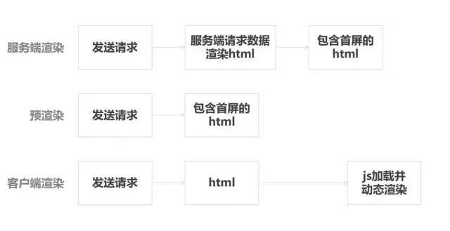

# 浏览器/服务端渲染
## 浏览器渲染
用户访问URL，请求并解析HTML文件，前端根据路由动态渲染页面。

 好处：
  - 可实现局部更新
  - 可实现懒加载
  - 减轻服务端的压力

 缺点：
  - **首屏时间过长**，往返时延（RTT）较大
  - SEO不友好，爬虫无法获取页面中有效数据

## 服务端渲染
用户访问URL，直接由服务端渲染好页面直接返回给浏览器显示。

 好处：
  - 加载速度快（服务端在内网进行请求，数据响应快）
  - 对SEO搜索引擎友好
 
 缺点：
  - 对于Vue只支持`beforeCreate`、`created`两个钩子函数
  - 需要处于Node.js server运行环境
  - 更多的服务器负载

## 预渲染
预渲染可以达到了类似服务端渲染的效果。实现成本较低，效果提升明显的。

区别：预渲染发生在 **构建时**，服务端渲染发生在 **服务器处理请求** 时。

## 三者比较

## 参考链接
 - [优化向：单页应用多路由预渲染指南](https://juejin.im/post/59d49d976fb9a00a571d651d)