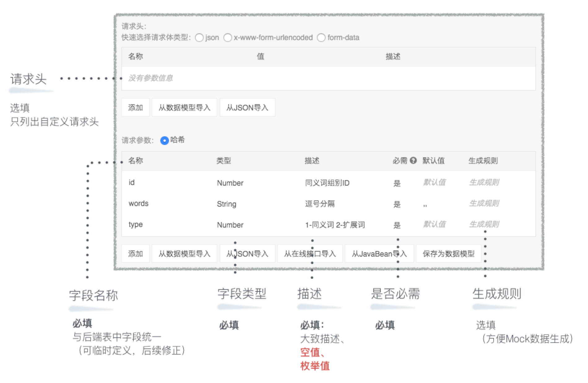
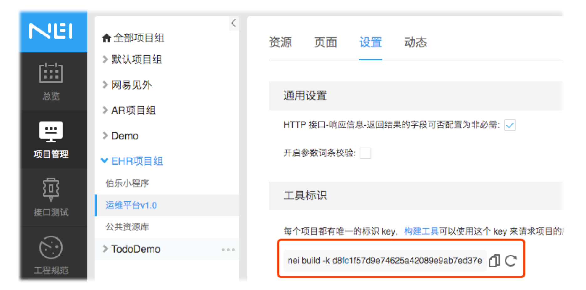
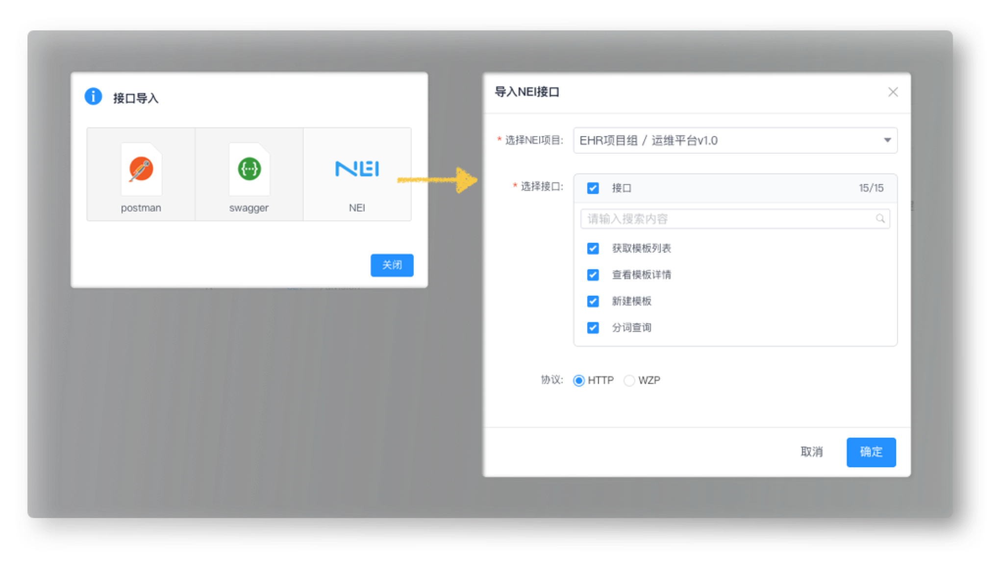

:::warning
前言：本规范的应用范围为EHR的新项目（从2020年Q1起）；大部分老项目的接口也将计划在Q3前逐步迁移至NEI，可先酌情参考。

当规范约定先行时，可避免开发过程中产生不必要的问题，从而提高开发效率。
:::

大致流程：


[[toc]]

## ① 基本要求
### 时间上
在后端完成 **开发方案** 之后。
> 需明确时间点：x月x号 上/下午


### 内容上
每个接口只需定义3个部分：**基本属性、请求/响应信息、接口状态**。（**后端主导，前端填写**）

 - 基本属性


 - 请求/响应信息


 - 接口状态
)

> 养成好习惯，及时更新接口状态


## ② RESTful API规范


## ③ 状态码
### 常用状态码
```js
// 状态码枚举
export const ServerCode = {
    SUCCESS: 200,
    CONTINUE: 400,
    WRONG_PARAM: 401,
    WRONG_REQUEST: 402,
    FORBIDDEN: 403,
    WRONG_URL: 404,
    NO_LOGIN: 406,
    TIME_OUT: 408,
    WRONG_SERVER: 500,
    WRONG_REALIZE: 501,
    WRONG_GATEWAY: 502,
    BAD_SERVER: 503,
    GATEWAY_TIME_OUT: 504,
    WRONG_VERSION: 505
};

// 状态码描述枚举
export const ServerCodeMap = {
    [ServerCode.SUCCESS]: '成功',
    [ServerCode.CONTINUE]: '继续', // 传递指定“继续参数”即可成功
    [ServerCode.WRONG_PARAM]: '参数格式出错',
    [ServerCode.WRONG_REQUEST]: '请求出错',
    [ServerCode.FORBIDDEN]: '拒绝访问',
    [ServerCode.WRONG_URL]: '请求地址出错',
    [ServerCode.NO_LOGIN]: '未登录',
    [ServerCode.TIME_OUT]: '请求超时',
    [ServerCode.WRONG_SERVER]: '服务器内部错误',
    [ServerCode.WRONG_REALIZE]: '服务未实现',
    [ServerCode.WRONG_GATEWAY]: '网关错误',
    [ServerCode.BAD_SERVER]: '服务不可用',
    [ServerCode.GATEWAY_TIME_OUT]: '网关超时',
    [ServerCode.WRONG_VERSION]: 'HTTP版本不受支持'
};

// 重定向状态码
export const RedirectMap = {
    [ServerCode.FORBIDDEN]: '#/403',
    [ServerCode.NO_LOGIN]: '#/login'
};
```
### 注意事项
目前前端有2种提示形式：
 - `400`，可扩展至`400101`、`400102`等来表示业务上更多种可能的情况
 - `402`，一般需后端提供`msg`字段


## ④ [前端] 接口Mock
- **NEI**：**接口编辑平台**（开发人员使用）
- **GoTest**：**接口测试平台**（QA人员使用）

> NEI：[https://nei.netease.com/project?pid=51981](https://nei.netease.com/project?pid=51981)
> 
> GoTest：[https://gotest.hz.netease.com/web/#/home/project/api?projectId=175](https://gotest.hz.netease.com/web/#/home/project/api?projectId=175)

### NEI安装
```
npm install -g nei
```

### NEI使用方式
| 方式 | 优势 | 劣势 |
| ----- |:---:|:---:|
| 本地服务器 | 本地数据改起来更灵活 | 1、需本地启动服务器；2、遇到NEI接口更新，需手动update才能同步 |
| 线上NEI平台 | 无需构建本地服务器，随时和NEI上的接口保持同步； | 有可能存在网络延迟（待商榷） |

#### 本地Mock
 - 通过CMD指令，进入项目文件夹。

 - 构建Mock工程 **（仅首次需要）**
    ```
    nei build -k 项目标识
    # “项目标识”可在"EHR项目组/设置/工具标识"中查看
    ```

    

 - 启动
    ```
    nei server
    ```

 - 接口有更新时
    ```
    nei update -w
    ```

#### 线上Mock
直接修改：`src/config/webpack-dev-server.config.js` -> `proxy` -> `'/mock'.target`的值为：

https://nei.netease.com/api/apimock-v2/{projectId}
> “EHR项目组”的projectId为：ba3e753ea4e356a8b856fff749e8ce15

### 注意事项
#### 1、提测前，前端主开发应将接口一键导入到GoTest
)

#### 2、接口更新时，前端主动更新NEI接口
若已提测，则需将该接口重新导入GoTest。

*如果想了解更多NEI相关知识，可点击：*[NEI详细教程](https://github.com/x-orpheus/nei-toolkit/blob/master/doc/%E4%BD%BF%E7%94%A8NEI%E8%BF%9B%E8%A1%8C%E5%89%8D%E5%90%8E%E7%AB%AF%E5%B9%B6%E8%A1%8C%E5%BC%80%E5%8F%91.md)

## ⑤ [后端] 接口自测
三条准则：
 - `Controller层面`无明显错误
    - 例如请求方式正确，参数类型正确，返回字段齐全以及类型正确

 - `Servic层面`跑通基本功能（例如：增删改查）
    - 增删改查内部遇到复杂逻辑按实际情况自测;

 - `数据库`
    - 校对默认值和字数限制微增大;

## ⑥ 接口联调
### 联调方式
| 联调方式 | 前端 | 后端 | 部署 |
| ----- |:---:|:---:|:---:|
| 1、部署联调 | 服务器 | 服务器 | 至少每天一次 |
| 2、本地联调 | 本地 | 服务器 | / |

不推荐采用`2、本地联调`，原因：
 - 联调应当在 **前、后端确保各自的开发质量后** 进行
 - 本地环境的不稳定性
 - 部分特殊情景无法模拟

## ⑦ 接口测试
### 测试策略
接口测试策略共分为3大方面：**测试分析、测试分类、测试工具**。


