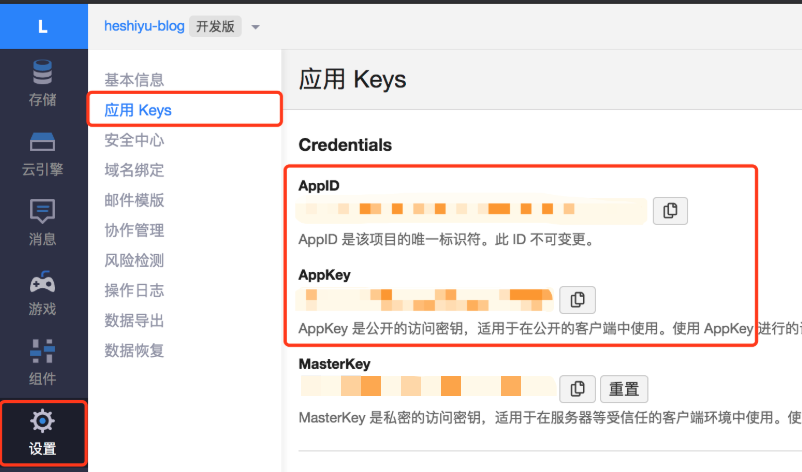
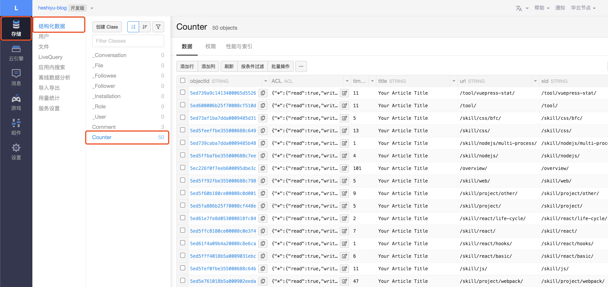

# Vuepress-阅读量统计
> 主要是通过 Valine、LeanCloud 这两款工具实现。

[[toc]]

## 准备工作
```
yarn add leancloud-storage -S

yarn add valine -S
```

 - [Valine](https://valine.js.org/) 是一款基于LeanCloud的快速、简洁且高效的无后端评论系统。
    - 在这里，我们只用到它的 **统计阅读量** 功能。

 - [LeanCloud](https://www.leancloud.cn/) 可以为软件的开发提供后端支持。


### 注册LeanCloud
打开[LeanCloud](https://leancloud.cn/dashboard/login.html#/signin)，进行注册。

### 创建应用
开发版已能满足大部分日常需求。


### 获取AppID、AppKey


### 编写自定义组件
在 `.vuepress/components` 下新增 `Valine.vue` 组件：

> Vuepress默认会自动全局注册该目录下的所有组件：

```vue
<template>
    <div class="u-valine">
      <span class="leancloud-visitors"
            data-flag-title="Your Article Title">
        <span class="stat update-time">
            {{$page.lastUpdated}}
        </span>

        <span class="stat read-count">
            
            <span class="leancloud-visitors-count"></span>
        </span>
      </span>
    </div>
</template>

<script>
export default {
    name: 'Valine',

    mounted() {
        // valine库里面存在window变量；HTML会通过NodeJS进行服务端渲染来产生
        // 通过动态导入来解决“NodeJS环境下对window变量未定义”的问题
        import('valine').then(module => {
            const Valine = module.default

            if (typeof window !== 'undefined') {
                const isDev = window.location.hostname.includes('localhost');
                if (isDev) return; // 不统计本地开发时的阅读量

                document.getElementsByClassName('leancloud-visitors')[0].id = window.location.pathname
                this.window = window
                window.AV = require('leancloud-storage')

                this.valine = new Valine()
                this.initValine()
            }
        })
    },

    methods: {
        initValine () {
            let path = window.location.pathname
            document.getElementsByClassName('leancloud-visitors')[0].id = path

            this.valine.init({
                el: '#vcomments',
                appId: 'leancloud上的AppId',// your appId
                appKey: 'leancloud上的AppKey',// your appKey
                notify: false,
                verify: false,
                path,
                visitor: true,
                avatar: 'mm',
                placeholder: 'write here'
            })
        }
    },

    watch: {
        $route (to, from) {
            if (from.path !== to.path) {
                this.initValine()
            }
        }
    }
}
</script>

<style scoped>
.icon {
    width: 14px;
    margin-right: 4px;
    vertical-align: middle;
    opacity: 1;
}

.leancloud-visitors-count {
    vertical-align: middle;
}

.stat {
    font-size: 12px;
    opacity: .6;
}

.stat::after {
    content: "|";
    opacity: .4;
    margin: 0 6px;
}

.stat:last-child::after {
    content: " ";
}
</style>

```

### 引用组件
在`.md`文件中使用 `<Valine />` 即可。

### 在后台查看统计
次日即可登录[LeanCloud](https://leancloud.cn/dashboard/login.html#/signin)进行查看。




## 踩坑
### window is not defined
**原因：** 
 - `valine`库里面存在 `window变量`
 - Vuepress在 build 过程中，利用NodeJS进行服务端渲染，生成我们网页上阅读到的HTML文件
 - NodeJS环境下没有 `window`变量

**解决：** 通过 **动态导入** 来解决。（见 [组件的mouted钩子](#编写自定义组件) 实现）


### 统一引入组件
**原因：** 在每个`*.md`文件都手动引入`<Valine />`比较繁琐

**解决：** 
 - 继承默认主题，并在 `Page.vue` 下引入 `<Valine />`，然后调整样式
 - 要在`<Valine />`组件内部监听`$route`变化，从而初始化`valine`对象，否则组件内的统计数不会更新
 - 对于不必展示评论组件的文章，可以维护一个`config`，并在`<Page />`组件内监听`$route`变化进行条件渲染

**效果：**


`Page.vue`
```vue
<template>
  <main class="page">
    <slot name="top" />

    <!-- 阅读量统计模块 -->
    <Valine v-show="visibleValine" class="u-valine-wrap" />

    <Content class="theme-default-content" />

    <!-- 博文共同编辑模块 -->
    <!-- <PageEdit /> -->

    <PageNav v-bind="{ sidebarItems }" />

    <slot name="bottom" />
  </main>
</template>

<script>
import PageEdit from '@theme/components/PageEdit.vue'
import PageNav from '@theme/components/PageNav.vue'
import { HIDE_VALINE_PATHS } from './../config.js'

export default {
    components: { PageEdit, PageNav },
    props: ['sidebarItems'],

    data() {
        return {
            visibleValine: true
        }
    },

    watch: {
        $route: {
            handler (to, from) {
                let isHide = HIDE_VALINE_PATHS.includes(to.path)
                this.visibleValine = !isHide
            },
            immediate: true
        }
    }
}
</script>

<style lang="stylus">
@require '../styles/wrapper.styl'

.page
  padding-bottom 2rem
  display block

.u-valine-wrap {
    position: relative;
    top: 142px;
    left: 48px;
    max-width: 840px;
    height: 20px;
    margin: 0 auto;
}

</style>
```